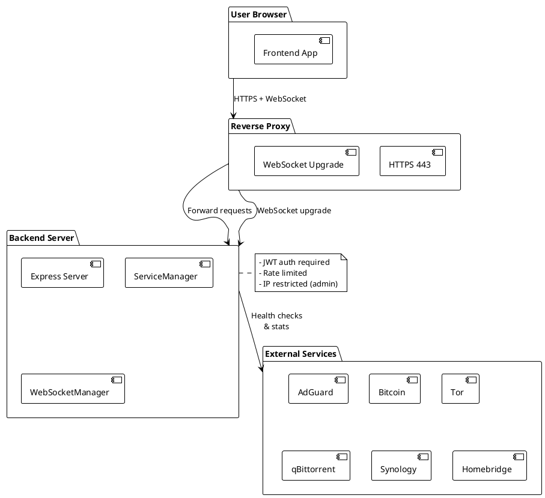
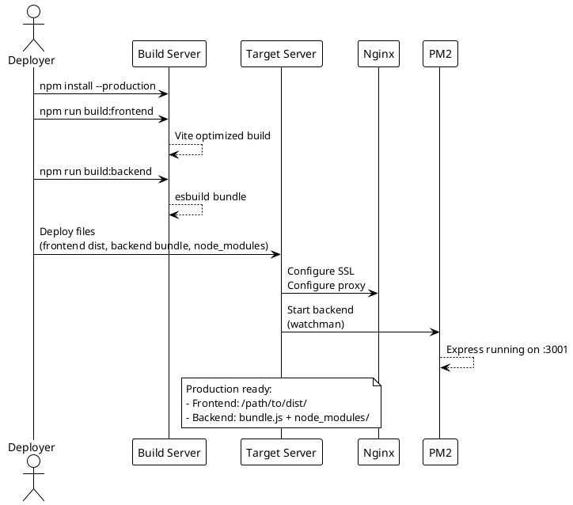
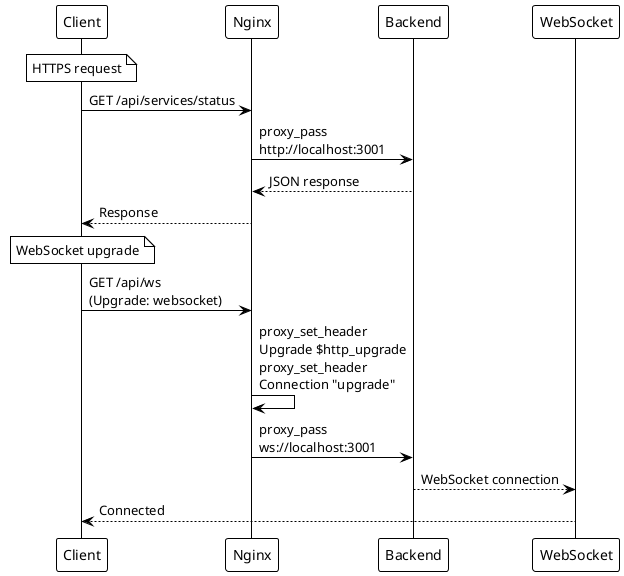

# Deployment Guide

> [!abstract] Overview
> This guide covers deploying Watchman in a production environment.

## Prerequisites

- Node.js 18+ on target server
- Nginx (or similar reverse proxy)
- SSL certificate (Let's Encrypt recommended)
- PM2 or systemd for process management

## Build

### 1. Install Production Dependencies

```bash
npm install --production
```

### 2. Build Frontend

```bash
npm run build:frontend
```

This creates optimized static files in `apps/frontend/dist/`.

### 3. Build Backend

```bash
npm run build:backend
```

## Environment Configuration

Set production environment variables:

```bash
# Required
AUTH_USERNAME=admin
AUTH_PASSWORD_HASH=<bcrypt-hash>
JWT_SECRET=<min-32-characters-strong-secret>
FRONTEND_URL=https://your-domain.com
NODE_ENV=production

# Service configurations as needed
```

> [!warning] Production Requirements
>
> - `FRONTEND_URL` must use HTTPS
> - `JWT_SECRET` must be at least 32 characters
> - All origins in `FRONTEND_URL` must be HTTPS

## Nginx Configuration

```nginx
server {
    listen 443 ssl;
    server_name your-domain.com;

    ssl_certificate /path/to/cert.pem;
    ssl_certificate_key /path/to/key.pem;

    # Frontend static files
    location / {
        root /path/to/Watchman/apps/frontend/dist;
        try_files $uri $uri/ /index.html;
    }

    # Backend API proxy
    location /api/ {
        proxy_pass http://localhost:3001;
        proxy_http_version 1.1;
        proxy_set_header Upgrade $http_upgrade;
        proxy_set_header Connection 'upgrade';
        proxy_set_header Host $host;
        proxy_set_header X-Real-IP $remote_addr;
        proxy_set_header X-Forwarded-For $proxy_add_x_forwarded_for;
        proxy_set_header X-Forwarded-Proto $scheme;
        proxy_cache_bypass $http_upgrade;
    }

    # WebSocket proxy
    location /ws {
        proxy_pass http://localhost:3001;
        proxy_http_version 1.1;
        proxy_set_header Upgrade $http_upgrade;
        proxy_set_header Connection "upgrade";
        proxy_set_header Host $host;
    }

    # Health check (no auth)
    location /health {
        proxy_pass http://localhost:3001;
    }
}
```

## Process Management

### PM2

```bash
pm2 start apps/backend/server.js --name watchman-backend
pm2 save
pm2 startup
```

### systemd

```ini
[Unit]
Description=Watchman Backend
After=network.target

[Service]
Type=simple
User=www-data
WorkingDirectory=/path/to/Watchman
ExecStart=/usr/bin/node apps/backend/server.js
Restart=on-failure
Environment=NODE_ENV=production

[Install]
WantedBy=multi-user.target
```

## Security Checklist

- [ ] HTTPS enabled with valid certificate
- [ ] `FRONTEND_URL` set to HTTPS origin
- [ ] `JWT_SECRET` is strong (32+ characters)
- [ ] Password hash uses bcrypt with cost >= 10
- [ ] CORS restricted to frontend origin
- [ ] Rate limiting enabled (default tiers)
- [ ] IP whitelist configured for admin endpoints
- [ ] Environment variables not committed to repo
- [ ] `NODE_ENV=production` set

## Monitoring

- Backend logs: `apps/backend/logs/`
- Health endpoint: `https://your-domain.com/health`
- API docs: `https://your-domain.com/api/docs`

## PlantUML Diagrams

### Production Architecture



### Build and Deploy Pipeline



### Nginx Proxy Configuration



## Related

- [[docs/guides/setup|Setup Guide]]
- [[docs/security/index|Security]]
- [[docs/reference/environment-variables|Environment Variables]]
