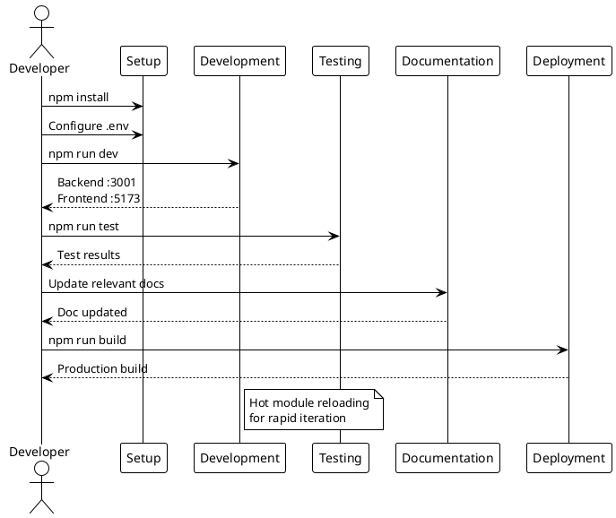
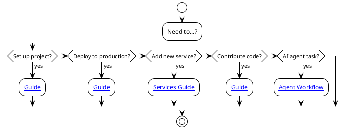

# Guides

> [!abstract] Overview
> Step-by-step guides for common Watchman development and deployment tasks.

## Guide Index

```dataview
TABLE WITHOUT ID file.link AS "Guide", date AS "Date", status AS "Status"
FROM "docs/guides"
WHERE type = "guide"
SORT file.name ASC
```

## Available Guides

| Guide                           | Description         |
| ------------------------------- | ------------------- | ------------------------------------ |
| [[docs/guides/setup             | Setup Guide]]           | Local development environment setup  |
| [[docs/guides/deployment        | Deployment Guide]]      | Production deployment instructions   |
| [[docs/guides/running-the-desktop-app | Desktop App]]   | Build and run the Electron desktop application |
| [[docs/guides/adding-services   | Adding Services]]       | How to add a new service integration |
| [[docs/guides/contributing      | Contributing]]          | Contribution guidelines and workflow |
| [[docs/guides/ai-agent-workflow | AI Agent Workflow]]     | Comprehensive AI agent instructions  |
| [[docs/guides/monitoring-upgrade-plan | Monitoring Upgrade Plan]] | Phase-by-phase rollout of ADR-019 (two-tier health + per-service methodology) |
| [[docs/guides/devcontainer | Devcontainer Guide]] | Hardened apple/container sandbox for Claude Code or OpenAI Codex |

> [!note] Superseded guides
> `running-the-setup-wizard` and `deploying-to-raspberry-pi` were removed as part of [[docs/adr/019-revert-split-deploy-and-remove-time-series|ADR-019]] (revert split deploy). The setup wizard Connect step and Pi deployment are no longer part of the architecture.

## AI Agent Resources

AI agents working on Watchman should read:

1. **Start here**: [[docs/guides/ai-agent-workflow|AI Agent Workflow]] - Complete workflow guide
2. **Code patterns**: [[docs/reference/code-patterns|Code Patterns]] - Standard patterns
3. **Testing**: [[docs/testing/index|Testing Index]] - Test requirements

## Related

- [[docs/getting-started.md|Getting Started]]
- [[docs/reference/scripts|Scripts Reference]]

## PlantUML Diagrams

### Development Workflow



### Guide Selection


