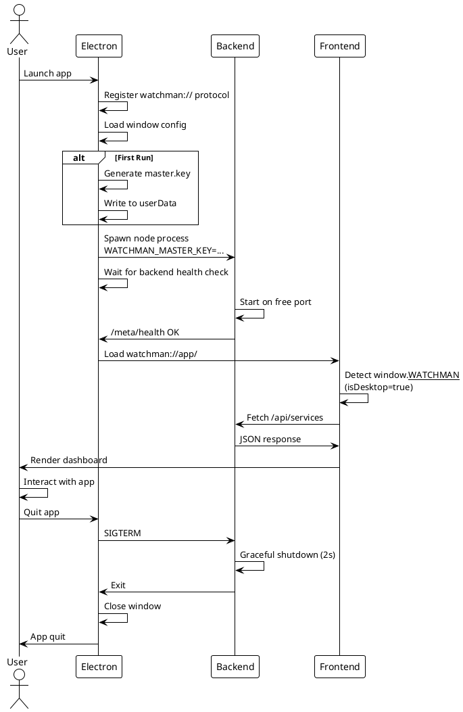
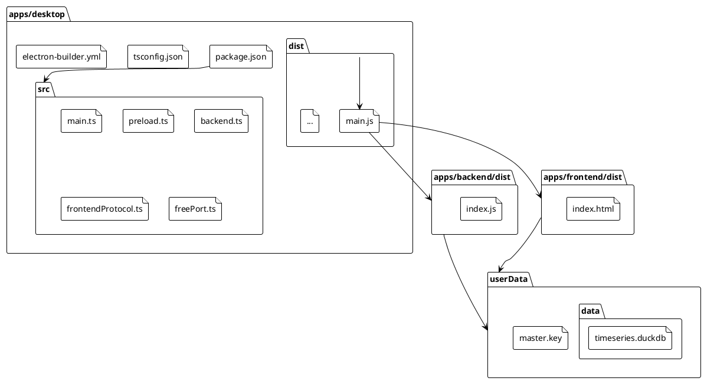

# Running the Watchman Desktop Application

> [!abstract] Overview
> The Watchman desktop application is built with Electron and packages the React frontend with an auto-spawned Node.js backend. This guide covers development, testing, and building for distribution.

## Quick Start

### Run in Development Mode

```bash
npm run electron:dev
```

This command:
1. Pre-builds the backend and frontend
2. Starts Electron in development mode
3. Opens the dashboard on `watchman://app/`

The app will reload on backend/frontend code changes.

### Run in Production Mode (Packaged)

```bash
npm run electron:prod
```

Builds the backend + frontend and launches the Electron app against the built artifacts.

### Build Distributable Package

```bash
npm run dist
```

This command:
1. Builds frontend and backend
2. Runs electron-builder for all platforms (macOS dmg, Windows nsis, Linux AppImage+deb)
3. Outputs to `apps/desktop/out/`

## Data and Configuration

### Master Key

On first run, Watchman auto-generates a **per-installation master key**:

- **Location**: `<userData>/master.key` (platform-specific)
  - **macOS**: `~/Library/Application Support/io.watchman.desktop/master.key`
  - **Windows**: `%AppData%\io.watchman.desktop\master.key`
  - **Linux**: `~/.config/io.watchman.desktop/master.key`
- **Format**: Base64-encoded 32-byte AES key
- **Permissions**: Mode `0600` (user-only read/write)
- **Purpose**: Encrypts all service credentials stored in DuckDB

> [!warning] Master Key Loss
> If this file is deleted, all encrypted service credentials become unrecoverable. Back it up if you frequently reconfigure services. Key rotation requires re-entering all service credentials on the new installation.

### Data Directory

All time-series metrics and service configuration:

- **Location**: `<userData>/data/` (same base as master key)
- **Contents**:
  - `timeseries.duckdb` — DuckDB database (metrics, service config)
  - `timeseries.duckdb.wal` — DuckDB write-ahead log (temporary)

## Development Workflow

### Attach to External Backend (Dev Mode)

To develop the frontend independently or test the backend separately, skip the auto-spawned backend:

```bash
WATCHMAN_SKIP_BACKEND_SPAWN=1 npm run electron:dev
```

Then start your backend manually:

```bash
cd apps/backend
npm run dev
```

The frontend will connect to `http://localhost:3001` (or your configured backend URL).

### Override Backend Node Path

If your system `node` is not in `PATH`, specify it explicitly:

```bash
WATCHMAN_BACKEND_NODE=/usr/local/bin/node npm run electron:dev
```

### Override Frontend Dev URL

For testing a custom frontend server:

```bash
WATCHMAN_DEV_URL=http://localhost:5173 npm run electron:dev
```

## Building for Distribution

### macOS (arm64 + x64 Universal)

```bash
npm run dist
```

Outputs:
- `apps/desktop/out/Watchman-<version>.dmg` — Universal DMG installer
- `apps/desktop/out/mac/` — unsigned binaries

### Windows (NSIS)

Requires running on Windows or cross-compile setup.

```bash
npm run dist
```

Outputs:
- `apps/desktop/out/Watchman Setup <version>.exe` — NSIS installer

### Linux (AppImage + deb)

```bash
npm run dist
```

Outputs:
- `apps/desktop/out/watchman-<version>.AppImage` — Portable AppImage
- `apps/desktop/out/watchman-<version>.deb` — Debian package

## Environment Variables

### Desktop-Specific

| Variable                    | Description                                   | Default             |
| --------------------------- | --------------------------------------------- | ------------------- |
| `WATCHMAN_BACKEND_NODE`     | Path to `node` executable for backend spawn   | `node` (from PATH)  |
| `WATCHMAN_SKIP_BACKEND_SPAWN` | Skip backend auto-spawn; attach externally   | `0` (auto-spawn)    |
| `WATCHMAN_DEV_URL`          | Frontend URL override (dev mode only)         | `watchman://app/`   |

### Inherited from Backend

The desktop app respects standard backend env vars:

| Variable             | Description                                  | Default              |
| -------------------- | -------------------------------------------- | -------------------- |
| `PORT`               | Backend port (will be overridden to free port) | `3001`               |
| `NODE_ENV`           | Node environment (defaults to `production`)  | `production`         |
| `DATA_DIR`           | Data directory (auto-set to `<userData>/data`) | `./data`             |
| `WATCHMAN_MASTER_KEY` | Master key (auto-provisioned if missing)     | (auto-generated)     |

> [!note] Not Applicable
> Server config like `FRONTEND_URL`, `AUTH_*`, and service env vars are managed via the Setup Wizard when the desktop app starts for the first time.

## Troubleshooting

### Backend Fails to Start

1. Check that `node --version` works in your terminal (system Node.js must be available)
2. Verify the free port acquisition: backend logs should show the allocated port
3. Check for port conflicts: is another service using the selected free port?
4. Review `WATCHMAN_BACKEND_NODE` — ensure it points to a valid Node.js binary

### Frontend Can't Connect to Backend

1. Confirm backend is running: check for `BACKEND_V2_PORT` in console logs
2. Verify health check passes: `curl http://127.0.0.1:<port>/meta/health`
3. Check for CORS errors: the backend must emit `Access-Control-Allow-Origin: watchman://...` headers
4. If using external backend, ensure `WATCHMAN_SKIP_BACKEND_SPAWN=1` and backend is running on expected port

### Master Key Missing After Reinstall

Each installation has its own master key. If you reinstall:
- Old installation: master key stays in old `userData`
- New installation: new master key generated
- **Important**: Old credentials are encrypted with the old key and cannot be recovered

Migration steps:
1. Before reinstalling, export service configs (if available in UI)
2. Reinstall
3. Re-enter service credentials in Setup Wizard

### Crashes on Startup

1. Check the Console app (macOS) or Event Viewer (Windows) for crash logs
2. Verify frontend and backend builds are present: `apps/frontend/dist/` and `apps/backend/dist/`
3. Clear userData and restart (will regenerate master key on next run, but you'll lose saved config):
   ```bash
   rm -rf ~/Library/Application\ Support/io.watchman.desktop/  # macOS
   ```

## Related

- [[docs/adr/016-electron-desktop-wrapper|ADR-016]] — Electron wrapper architecture and rationale
- [[docs/guides/setup|Setup Guide]] — Initial configuration and service setup
- [[docs/features/ui-configuration|UI Configuration Feature]] — Service management and secrets
- [[docs/reference/scripts|Scripts Reference]] — All npm commands
- [[docs/reference/environment-variables|Environment Variables]] — Full reference

## PlantUML Diagrams

### Desktop App Lifecycle



### File Structure


