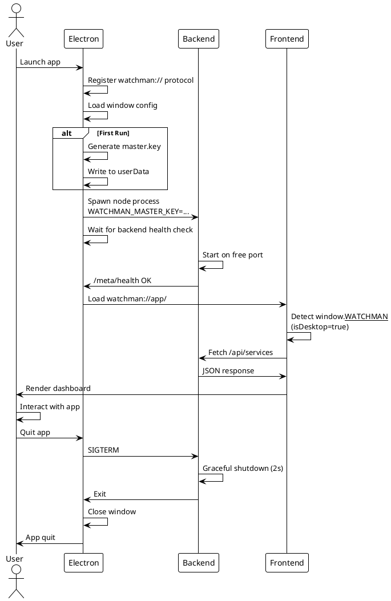
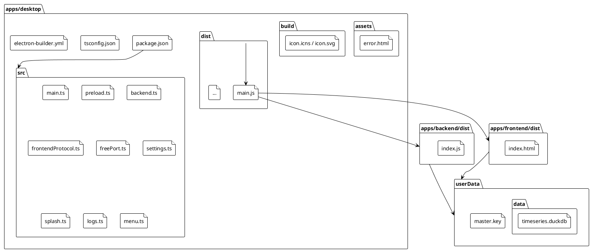

# Running the Watchman Desktop Application

> [!abstract] Overview
> The Watchman desktop application is built with Electron and packages the React frontend with an auto-spawned Node.js backend. This guide covers development, testing, and building for distribution.

## Quick Start

### Run in Development Mode

```bash
npm run electron:dev
```

This command:

1. Pre-builds the backend and frontend
2. Starts Electron in development mode
3. Opens the dashboard on `watchman://app/`

The app will reload on backend/frontend code changes.

### Run in Production Mode (Packaged)

```bash
npm run electron:prod
```

Builds the backend + frontend and launches the Electron app against the built artifacts.

### Build Distributable Package

```bash
npm run dist
```

This command:

1. Builds frontend and backend
2. Runs electron-builder for all platforms (macOS dmg, Windows nsis, Linux AppImage+deb)
3. Outputs to `apps/desktop/out/`

## Native Desktop Experience

The shell behaves like a first-class native app, not a wrapped web page:

- **Boot splash** — a themed splash window appears immediately on launch and
  narrates startup (`Starting backend…` → `Loading…`) while the bundled backend
  comes up, then swaps in the dashboard once `/meta/health` is green.
- **macOS chrome** — on macOS the window uses an inset title bar
  (`titleBarStyle: 'hiddenInset'`) with under-window vibrancy. The renderer tags
  `<html data-desktop="macos">` (via `useDesktopChrome`) so the topbar clears the
  traffic lights and becomes a window drag region; interactive controls opt out
  with `-webkit-app-region: no-drag`.
- **Window state** — size and position are persisted to
  `<userData>/settings.json` (debounced, clamped to the visible work area) and
  restored on the next launch.
- **Application & dock menus** — a full native menu (App / File / Edit / View /
  Go / Window / Help). The **Go** menu navigates the SPA via ⌘1–⌘5; **Help → Open
  Logs** opens the session log. Menu/dock actions reach the renderer over a
  `menu:action` IPC channel handled by `DesktopChrome`.
- **Error / recovery screen** — if the backend never becomes healthy, the window
  loads `assets/error.html` with **Retry** and **Open logs** buttons instead of
  failing silently.
- **Health watchdog** — after load, the main process polls the backend; a run of
  failures fires a native notification and a `backend:lost` event (surfaced as a
  toast), and a `backend:restored` event clears it.
- **App icon** — `apps/desktop/build/icon.icns` (rendered from `icon.svg`).

> [!note] Browser build unaffected
> All of the above is gated on the desktop bridge (`window.__WATCHMAN__` /
> `window.watchmanDesktop`). In the plain web build the hooks no-op, so the
> frontend renders identically in a browser.

## Security (desktop)

The shell follows the same trusted-network model as the backend
([[docs/adr/017-remove-authentication-frontend-v2-migration|ADR-017]] /
[[docs/adr/025-trusted-network-security-model-and-audit-remediation|ADR-025]]) and
adds renderer hardening:

- `contextIsolation: true`, `sandbox: true`, `nodeIntegration: false`.
- A **Content-Security-Policy** is attached to every `watchman://` response
  (`script-src 'self'`; `connect-src` allows only the loopback backend over
  HTTP/WS). Dev (Vite) loads from its own origin and is unaffected.
- A **navigation allow-list** (`will-navigate`) pins the window to
  `watchman://`, `file:`, and loopback; external links are bounced to the system
  browser. `window.open` is denied and opened externally.
- All web **permission requests are denied** (camera/mic/geolocation/etc.);
  notifications are fired natively from the main process.

## Data and Configuration

### Master Key

On first run, Watchman auto-generates a **per-installation master key**:

- **Location**: `<userData>/master.key` (platform-specific)
  - **macOS**: `~/Library/Application Support/io.watchman.desktop/master.key`
  - **Windows**: `%AppData%\io.watchman.desktop\master.key`
  - **Linux**: `~/.config/io.watchman.desktop/master.key`
- **Format**: Base64-encoded 32-byte AES key
- **Permissions**: Mode `0600` (user-only read/write)
- **Purpose**: Encrypts all service credentials stored in DuckDB

> [!warning] Master Key Loss
> If this file is deleted, all encrypted service credentials become unrecoverable. Back it up if you frequently reconfigure services. Key rotation requires re-entering all service credentials on the new installation.

### Data Directory

All time-series metrics and service configuration:

- **Location**: `<userData>/data/` (same base as master key)
- **Contents**:
  - `timeseries.duckdb` — DuckDB database (metrics, service config)
  - `timeseries.duckdb.wal` — DuckDB write-ahead log (temporary)

### Desktop State & Logs

Files written by the Electron shell itself (separate from the backend's data):

- `<userData>/settings.json` — desktop settings (currently window bounds).
  Quarantined to `settings.json.corrupt-<ts>` rather than clobbered if it ever
  fails to parse.
- `<userData>/logs/watchman-desktop.log` — combined backend stdout/stderr for
  the current session (truncated each launch). Opened by **Help → Open Logs** and
  the error screen's **Open logs** button.

## Development Workflow

### Attach to External Backend (Dev Mode)

To develop the frontend independently or test the backend separately, skip the auto-spawned backend:

```bash
WATCHMAN_SKIP_BACKEND_SPAWN=1 npm run electron:dev
```

Then start your backend manually:

```bash
cd apps/backend
npm run dev
```

The frontend will connect to `http://localhost:3001` (or your configured backend URL).

### Override Backend Node Path

If your system `node` is not in `PATH`, specify it explicitly:

```bash
WATCHMAN_BACKEND_NODE=/usr/local/bin/node npm run electron:dev
```

### Override Frontend Dev URL

For testing a custom frontend server:

```bash
WATCHMAN_DEV_URL=http://localhost:5173 npm run electron:dev
```

## Building for Distribution

`npm run dist` builds for the **host** platform/arch. Because the bundled backend
carries a native (`@duckdb`) binding, build each platform on that platform (or a
matching cross-build) so `stage-backend.mjs` installs the correct binding. macOS
is the primary, fully-exercised target.

### macOS (arm64)

```bash
npm run dist
```

Outputs:

- `apps/desktop/out/Watchman-<version>-arm64.dmg` — DMG installer
- `apps/desktop/out/Watchman-<version>-arm64-mac.zip` — zip alternative
- `apps/desktop/out/mac-arm64/Watchman.app` — unsigned `.app` bundle

The build is **ad-hoc signed** (no paid Apple Developer ID), so the first launch
needs a one-time right-click → Open to clear Gatekeeper.

> [!important] Backend is staged, and the target is arm64-only
> Because the backend's runtime dependencies are hoisted to the repo-root
> `node_modules`, `npm run package` first runs `scripts/stage-backend.mjs`, which
> materialises a complete **production** dependency tree from the backend's
> standalone lockfile into `apps/backend/.bundle` (gitignored). electron-builder
> bundles that, not the sparse workspace `node_modules` — otherwise the packaged
> backend can't resolve `dotenv` et al. and exits with code 1.
>
> The backend ships an arch-specific `@duckdb` prebuilt binding
> (`darwin-arm64`), so the mac target is **arm64-only**; an x64/universal build
> would need the backend staged with the x64 binding too (not yet wired).

### Release artifacts & checksums

```bash
packaging/release/make-release.sh            # build, then assemble
packaging/release/make-release.sh --no-build # assemble from existing out/
```

This builds the app, writes a `*.sha256` next to each `.dmg`/`.zip`, and drops a
version-stamped `README.md` (from `packaging/release/README.md`) into
`apps/desktop/out/`. GitHub Releases upload is configured via the `publish` block
in `apps/desktop/electron-builder.yml` — run electron-builder with `--publish` and
a `GH_TOKEN` to upload.

### Windows (NSIS)

Requires running on Windows or cross-compile setup.

```bash
npm run dist
```

Outputs:

- `apps/desktop/out/Watchman Setup <version>.exe` — NSIS installer

### Linux (AppImage + deb)

```bash
npm run dist
```

Outputs:

- `apps/desktop/out/watchman-<version>.AppImage` — Portable AppImage
- `apps/desktop/out/watchman-<version>.deb` — Debian package

## Environment Variables

### Desktop-Specific

| Variable                      | Description                                 | Default            |
| ----------------------------- | ------------------------------------------- | ------------------ |
| `WATCHMAN_BACKEND_NODE`       | Path to `node` executable for backend spawn | `node` (from PATH) |
| `WATCHMAN_SKIP_BACKEND_SPAWN` | Skip backend auto-spawn; attach externally  | `0` (auto-spawn)   |
| `WATCHMAN_DEV_URL`            | Frontend URL override (dev mode only)       | `watchman://app/`  |

### Inherited from Backend

The desktop app respects standard backend env vars:

| Variable              | Description                                    | Default          |
| --------------------- | ---------------------------------------------- | ---------------- |
| `PORT`                | Backend port (will be overridden to free port) | `3001`           |
| `NODE_ENV`            | Node environment (defaults to `production`)    | `production`     |
| `DATA_DIR`            | Data directory (auto-set to `<userData>/data`) | `./data`         |
| `WATCHMAN_MASTER_KEY` | Master key (auto-provisioned if missing)       | (auto-generated) |

> [!note] Not Applicable
> Server config like `FRONTEND_URL`, `AUTH_*`, and service env vars are managed via the Setup Wizard when the desktop app starts for the first time.

## Troubleshooting

### Backend Fails to Start

1. Check that `node --version` works in your terminal (system Node.js must be available)
2. Verify the free port acquisition: backend logs should show the allocated port
3. Check for port conflicts: is another service using the selected free port?
4. Review `WATCHMAN_BACKEND_NODE` — ensure it points to a valid Node.js binary

### Frontend Can't Connect to Backend

1. Confirm backend is running: check for `BACKEND_V2_PORT` in console logs
2. Verify health check passes: `curl http://127.0.0.1:<port>/meta/health`
3. Check for CORS errors: the backend must emit `Access-Control-Allow-Origin: watchman://...` headers
4. If using external backend, ensure `WATCHMAN_SKIP_BACKEND_SPAWN=1` and backend is running on expected port

### Master Key Missing After Reinstall

Each installation has its own master key. If you reinstall:

- Old installation: master key stays in old `userData`
- New installation: new master key generated
- **Important**: Old credentials are encrypted with the old key and cannot be recovered

Migration steps:

1. Before reinstalling, export service configs (if available in UI)
2. Reinstall
3. Re-enter service credentials in Setup Wizard

### Crashes on Startup

1. Check the Console app (macOS) or Event Viewer (Windows) for crash logs
2. Verify frontend and backend builds are present: `apps/frontend/dist/` and `apps/backend/dist/`
3. Clear userData and restart (will regenerate master key on next run, but you'll lose saved config):
   ```bash
   rm -rf ~/Library/Application\ Support/io.watchman.desktop/  # macOS
   ```

## Related

- [[docs/adr/016-electron-desktop-wrapper|ADR-016]] — Electron wrapper architecture and rationale
- [[docs/adr/029-desktop-native-experience-and-distribution|ADR-029]] — Native desktop polish, hardening, and distribution layer
- [[docs/guides/setup|Setup Guide]] — Initial configuration and service setup
- [[docs/features/ui-configuration|UI Configuration Feature]] — Service management and secrets
- [[docs/reference/scripts|Scripts Reference]] — All npm commands
- [[docs/reference/environment-variables|Environment Variables]] — Full reference

## PlantUML Diagrams

### Desktop App Lifecycle



### File Structure


