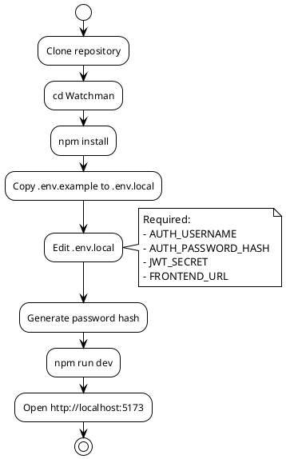
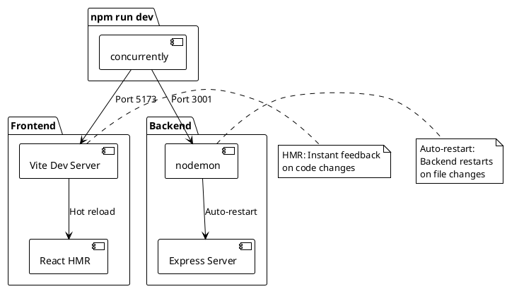

# Setup Guide — Development Mode (Option C)

> [!abstract] Overview
> This guide walks you through setting up Watchman for local development with hot reload.
>
> **Looking for other startup modes?** See [[docs/getting-started|Getting Started]] for:
> - Option A: macOS Desktop
> - Option B: Production Server
> - Option C: Development (this guide)

> [!tip] Running Claude CLI in --dangerously-skip-permissions mode?
> Use the optional hardened devcontainer instead of running directly on your host. It isolates Claude from your host filesystem and LAN using iptables default-deny egress and a non-root container user. See [[docs/guides/devcontainer|Devcontainer Guide]] for setup instructions.

## Prerequisites

- **Node.js 18+** - Runtime environment
- **npm** - Package manager
- **Git** - Version control

## Installation

### 1. Clone the Repository

```bash
git clone <YOUR_REPO_URL>
cd Watchman
```

### 2. Install Dependencies

```bash
npm install
```

This installs dependencies for all workspaces (frontend, backend, shared packages).

### 3. Configure Environment

Copy the example environment file:

```bash
cp apps/backend/.env.example apps/backend/.env.local
```

Edit `.env.local` and set required values:

```bash
# Required
AUTH_USERNAME=admin
AUTH_PASSWORD_HASH=$2b$10$your_password_hash_here
JWT_SECRET=your-super-secret-jwt-key-min-32-characters
FRONTEND_URL=http://localhost:5173

# Optional - add service configs as needed
ADGUARD_MAIN_URL=http://192.0.2.1
ADGUARD_MAIN_AUTH=your-adguard-auth-token
```

> [!tip] Generating Password Hash
> Use bcrypt to generate a password hash:
>
> ```bash
> node -e "console.log(require('bcrypt').hashSync('yourpassword', 10))"
> ```

### 4. Start Development Server

```bash
npm run dev
```

This starts both frontend and backend concurrently with hot reload:

- **Frontend (Vite)**: `http://localhost:5173` — Hot Module Reload (HMR) enabled, instant feedback on code changes
- **Backend (Fastify)**: `http://localhost:3001` — Auto-restart via nodemon on file changes
- **API Docs (Swagger)**: `http://localhost:3001/api/docs` — Interactive OpenAPI documentation

### 5. Verify Setup

- Open `http://localhost:5173` in your browser
- Check `http://localhost:3001/health` for backend status
- Visit `http://localhost:3001/api/docs` for interactive API docs

## Development Workflow

### Running Individual Services

```bash
# Frontend only
npm run dev:frontend

# Backend only
npm run dev:backend
```

### Code Quality

```bash
# Lint
npm run lint

# Fix lint issues
npm run lint:fix

# Format code
npm run format

# Check formatting
npm run format:check
```

### Testing

```bash
# Backend unit/integration tests
npm run test

# Frontend component tests
npm run test:frontend

# Run all (backend + frontend concurrently)
npm run test:all

# Watch mode (backend tests + auto-rerun on changes)
npm run test:watch

# E2E tests (Playwright smoke tests)
npm run test:e2e
```

## Project Structure

```
Watchman/
├── apps/
│   ├── frontend/           # React + TypeScript + Vite
│   └── backend/            # Node.js + Express
├── packages/
│   └── shared/             # Shared packages
├── docs/                   # Documentation
├── tests/                  # Integration/E2E tests
├── tools/                  # Dev scripts
└── package.json            # Root workspace config
```

## Related

- [[docs/guides/deployment|Deployment Guide]]
- [[docs/reference/environment-variables|Environment Variables]]
- [[docs/guides/contributing|Contributing Guide]]

## PlantUML Diagrams

### Setup Process



### Development Server Architecture


