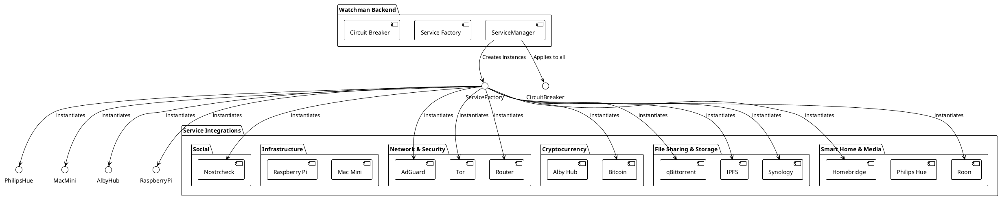
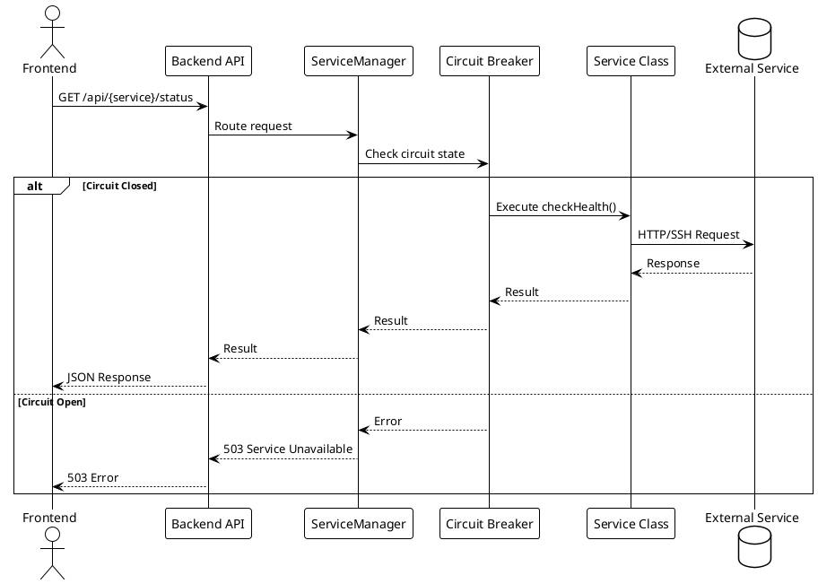

# Service Integrations

> [!abstract] Overview
> Watchman integrates with 14+ self-hosted service types. Each integration extends [[apps/backend/src/domain/BaseService.ts|BaseService]] and implements `checkHealth()` and `getStats()` methods. Services are registered via [[apps/backend/src/config/ServiceRegistry.ts|ServiceRegistry]] using keys like `${kind}:${instanceId}` (e.g., `qbittorrent:1`, `qbittorrent:2` for multi-instance support).

## Integration Index

```dataview
TABLE WITHOUT ID file.link AS "Service", date AS "Date", status AS "Status"
FROM "docs/integrations"
WHERE type = "integration"
SORT file.name ASC
```

## Service Categories

### Network & Security

| Service                     | Protocol       | Description |
| --------------------------- | -------------- | ----------- | ------------------------------ |
| [[docs/integrations/adguard | AdGuard Home]] | HTTP API    | DNS-level ad blocker           |
| [[docs/integrations/tor     | Tor]]          | SOCKS/HTTP  | Tor relay monitoring           |
| [[docs/integrations/router  | Router]]       | SSH/HTTP    | Network router (Beryl/Telenet) |

### Cryptocurrency

| Service                     | Protocol   | Description |
| --------------------------- | ---------- | ----------- | ----------------- |
| [[docs/integrations/bitcoin | Bitcoin]]  | RPC/Tor     | Bitcoin full node |
| [[docs/integrations/albyhub | Alby Hub]] | HTTP API    | Lightning wallet  |

### File Sharing & Storage

| Service                         | Protocol      | Description |
| ------------------------------- | ------------- | ----------- | ------------------------- |
| [[docs/integrations/qbittorrent | qBittorrent]] | HTTP API    | BitTorrent client         |
| [[docs/integrations/ipfs        | IPFS]]        | HTTP API    | Decentralized file system |
| [[docs/integrations/synology    | Synology]]    | HTTP API    | NAS monitoring            |

### Smart Home & Media

| Service                         | Protocol      | Description |
| ------------------------------- | ------------- | ----------- | ----------------- |
| [[docs/integrations/homebridge  | Homebridge]]  | HTTP API    | Smart home bridge |
| [[docs/integrations/philips-hue | Philips Hue]] | HTTP API    | Smart lighting    |
| [[docs/integrations/roon        | Roon]]        | TCP/HTTP    | Music server      |

### Infrastructure

| Service                          | Protocol       | Description |
| -------------------------------- | -------------- | ----------- | ------------------- |
| [[docs/integrations/macmini      | Mac Mini]]     | SSH         | macOS server        |
| [[docs/integrations/raspberry-pi | Raspberry Pi]] | SSH         | Raspberry Pi device |

### Social

| Service                        | Protocol     | Description    |
| ------------------------------ | ------------ | -------------- | ------------------- |
| [[docs/integrations/nostrcheck | Nostrcheck]] | WebSocket/HTTP | Nostr relay checker |

## PlantUML Diagrams

### Service Integration Overview



### Service Communication Patterns



### Multi-Instance Service Pattern

```plantuml
@startuml
!theme plain

database "Environment Variables" as Env

package "Service: qBittorrent" {
    [QBITTORRENT_1_*] as QB1
    [QBITTORRENT_2_*] as QB2
    [QBITTORRENT_3_*] as QB3
}

package "Service: Synology" {
    [SYNOLOGY_1_*] as SY1
    [SYNOLOGY_2_*] as SY2
}

Env --> QB1 : Instance 1 config
Env --> QB2 : Instance 2 config
Env --> QB3 : Instance 3 config

Env --> SY1 : Instance 1 config
Env --> SY2 : Instance 2 config

note right of QB1, QB2, QB3
  Each instance is a separate
  service class instance with
  its own configuration
end note
@enduml
```

## Adding a New Service

See [[docs/guides/adding-services|Adding Services Guide]] for step-by-step instructions.

## Related

- [[docs/features/service-monitoring|Service Monitoring]]
- [[docs/api/index|API Documentation]]
- [[docs/architecture/backend-architecture|Backend Architecture]]
