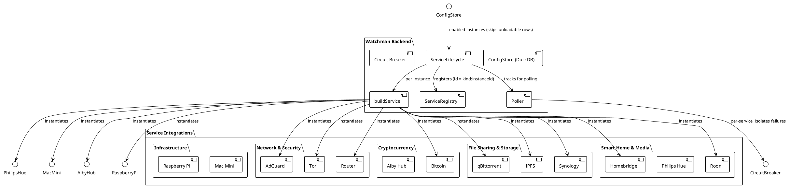
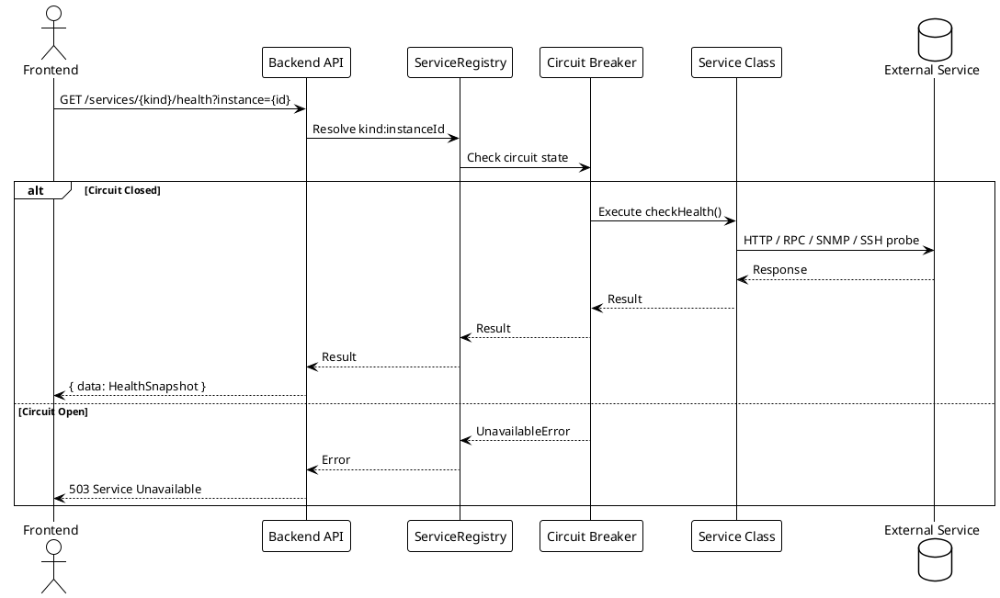
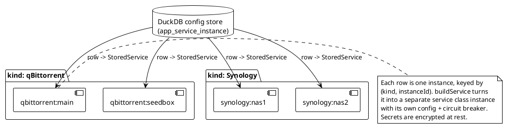

# Service Integrations

> [!abstract] Overview
> Watchman integrates with 13 self-hosted service types. Each integration extends [[apps/backend/src/domain/BaseService.ts|BaseService]] and implements `checkHealth()` and `getStats()` methods. Services are registered via [[apps/backend/src/domain/ServiceRegistry.ts|ServiceRegistry]] using keys like `${kind}:${instanceId}` (e.g., `qbittorrent:main`, `qbittorrent:seedbox` for multi-instance support). Instances are configured in the DuckDB config store via the `/config` API or the Settings UI — not via environment variables (legacy `{SERVICE}_*` env vars are imported once on first boot, then ignored; see [[docs/adr/015-ui-driven-service-configuration|ADR-015]]).

## Integration Index

```dataview
TABLE WITHOUT ID file.link AS "Service", date AS "Date", status AS "Status"
FROM "docs/integrations"
WHERE type = "integration"
SORT file.name ASC
```

## Service Categories

### Network & Security

| Service                                     | Protocol         | Description                    |
| ------------------------------------------- | ---------------- | ------------------------------ |
| [[docs/integrations/adguard\|AdGuard Home]] | HTTP API         | DNS-level ad blocker           |
| [[docs/integrations/tor\|Tor]]              | HTTP/ControlPort | Tor relay monitoring           |
| [[docs/integrations/router\|Router]]        | ICMP/TCP/SNMP    | Network router (Beryl/Telenet) |

### Cryptocurrency

| Service                                 | Protocol | Description       |
| --------------------------------------- | -------- | ----------------- |
| [[docs/integrations/bitcoin\|Bitcoin]]  | RPC/ZMQ  | Bitcoin full node |
| [[docs/integrations/albyhub\|Alby Hub]] | HTTP API | Lightning wallet  |

### File Sharing & Storage

| Service                                        | Protocol | Description               |
| ---------------------------------------------- | -------- | ------------------------- |
| [[docs/integrations/qbittorrent\|qBittorrent]] | HTTP API | BitTorrent client         |
| [[docs/integrations/ipfs\|IPFS]]               | HTTP API | Decentralized file system |
| [[docs/integrations/synology\|Synology]]       | SNMP/DSM | NAS monitoring            |

### Smart Home & Media

| Service                                        | Protocol     | Description       |
| ---------------------------------------------- | ------------ | ----------------- |
| [[docs/integrations/homebridge\|Homebridge]]   | HTTP API     | Smart home bridge |
| [[docs/integrations/philips-hue\|Philips Hue]] | Hue API v2   | Smart lighting    |
| [[docs/integrations/roon\|Roon]]               | TCP/Roon API | Music server      |

### Infrastructure

| Service                                          | Protocol | Description         |
| ------------------------------------------------ | -------- | ------------------- |
| [[docs/integrations/macmini\|Mac Mini]]          | SSH/ICMP | macOS server        |
| [[docs/integrations/raspberry-pi\|Raspberry Pi]] | SSH/GPIO | Raspberry Pi device |

## PlantUML Diagrams

### Service Integration Overview



### Service Communication Patterns



> [!note] Polling vs. on-demand
> The aggregate `GET /services` endpoint serves the latest snapshot published by
> the background [[apps/backend/src/infra/scheduler/poller.ts|Poller]]; it only
> probes live before the first poll completes. One service's failed probe is
> isolated (`Promise.allSettled`) and never blocks the others' results.

### Multi-Instance Service Pattern



> [!info] Configuration source of truth
> Instances live as rows in the DuckDB `app_service_instance` table, managed
> through the `/config` API and the Settings UI. Legacy `{SERVICE}_{N}_*`
> environment variables are imported **once** on first boot, then ignored. A row
> that can't be loaded (e.g. secrets that no longer decrypt after a master-key
> rotation) is skipped and surfaced via `GET /config/load-errors` rather than
> blocking the other instances.

## Adding a New Service

See [[docs/guides/adding-services|Adding Services Guide]] for step-by-step instructions.

## Related

- [[docs/features/service-monitoring|Service Monitoring]]
- [[docs/api/index|API Documentation]]
- [[docs/architecture/backend-architecture|Backend Architecture]]
