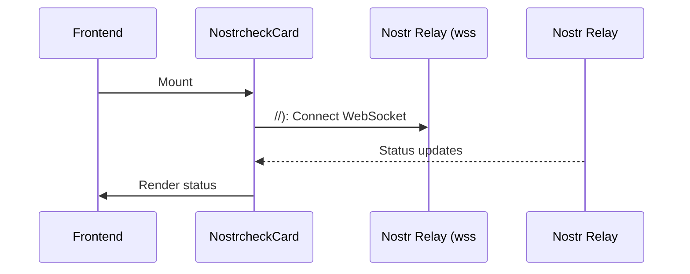

# Nostrcheck Integration

> [!abstract] Overview
> Monitors a Nostr relay checker service, displaying relay availability and status information via WebSocket in real-time.

## Configuration

```bash
NOSTRCHECK_RELAY_URL=wss://relay.yourdomain.com
NOSTRCHECK_WEB_URL=https://relay.yourdomain.com
NOSTRCHECK_ENABLED=true
```

## How It Works

Nostrcheck is a **WebSocket-based** service integration that differs from other services:

1. **No REST API** - Instead of HTTP endpoints, it uses WebSocket for real-time updates
2. **Frontend-driven** - Frontend connects directly to the configured relay via WebSocket
3. **Always available** - Uses a special pattern where it's enabled via `NOSTRCHECK_ENABLED=true`
4. **Service class** - Uses config-based approach in `[[apps/backend/config.js|config.js]]` rather than factory pattern

### Service Configuration

Unlike other services that use the factory pattern, Nostrcheck is configured directly in [[apps/backend/config.js]]:

```javascript
nostrcheck: {
  relayUrl: process.env.NOSTRCHECK_RELAY_URL || null,
  webUrl: process.env.NOSTRCHECK_WEB_URL || null,
  enabled: process.env.NOSTRCHECK_ENABLED === "true",
}
```

The service is included in `ENABLED_SERVICES` list as `nostrcheck`.

## Frontend Component

[[apps/frontend/src/components/NostrcheckCard.tsx|NostrcheckCard.tsx]]

The frontend component:

- Connects to the WebSocket URL from backend config
- Displays real-time relay status
- Shows connection state (connecting, connected, disconnected)

## Real-Time Updates

Unlike other services that poll REST endpoints, Nostrcheck uses WebSocket:



## Related

- [[docs/features/real-time-updates|Real-Time Updates]]
- [[docs/integrations/index|Service Integrations]]
- [[docs/guides/adding-services|Adding Services Guide]]
