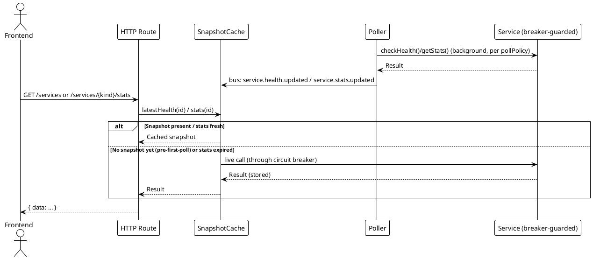
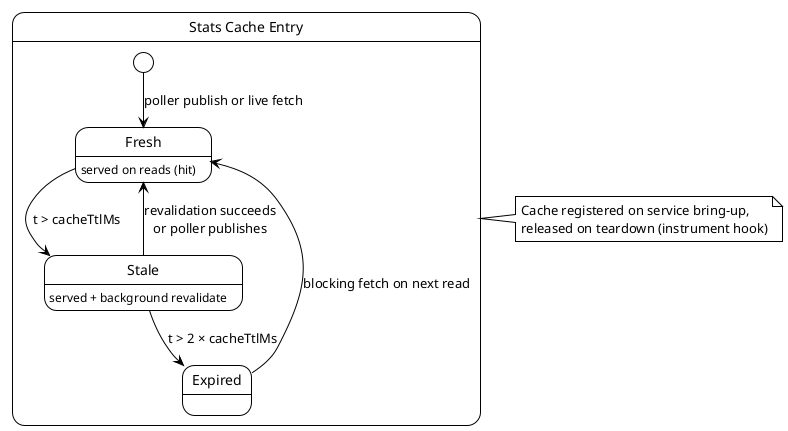

# Caching Strategies

> [!abstract] Overview
> Watchman serves HTTP reads from poller-published state: a latest-health snapshot map plus per-instance stale-while-revalidate (SWR) stats caches honoring each instance's `cacheTtlMs`. Outbound probes are additionally guarded by per-instance circuit breakers.

## Read Path (wired 2026-06-12)

[[apps/backend/src/application/SnapshotCache.ts|SnapshotCache.ts]] sits between the HTTP layer and live services:

- **Health** — the latest poller-published health result per service is kept in memory (fed from `service.health.updated` and health-scope `service.error` bus events). `GET /services` and `GET /services/{kind}/health` serve this state; a live probe happens only before the first poll completes (e.g. right after startup or registration). Stats-scope errors do not overwrite health state.
- **Stats** — each service instance gets its own SWR cache (`createSwrCache`) with `ttlMs = staleMs = cacheTtlMs` (the per-instance "Advanced" setting, default 10 000 ms). The cache is updated from `service.stats.updated` poller publishes and read through by `GET /services/{kind}/stats`, so dashboard reads do not trigger extra probes while fresh.
- **Lifecycle** — caches are registered on service bring-up and dropped on teardown via the `ServiceLifecycle` `instrument` hook; per-cache stats appear in `GET /metrics` under `cache["{kind}:{instanceId}:stats"]`.

## SWR Cache Implementation

[[apps/backend/src/infra/cache/swr.ts|swr.ts]] — `lru-cache` based, SWR pattern: serve stale data immediately while revalidating in the background.

| Parameter | Default | Description                                    |
| --------- | ------- | ---------------------------------------------- |
| `ttlMs`   | 30000   | Fresh data TTL (milliseconds)                  |
| `staleMs` | 30000   | Stale window after TTL expires                 |
| `max`     | 500     | Max cache entries (LRU eviction when exceeded) |

(For the wired per-instance stats caches, `ttlMs` and `staleMs` are both set to the instance's `cacheTtlMs`.)

### SWR Behavior

- **Fresh**: Return cached value immediately (hit counter)
- **Stale**: Return cached value AND revalidate in background; revalidation errors emit `cache:revalidate.failed` event (stale counter)
- **Expired**: Fetch fresh value; block on result (miss counter)

## Circuit Breakers

[[apps/backend/src/infra/circuitBreaker/guardedService.ts|guardedService.ts]] wraps every service instance's polled calls in two breakers — `{id}:health` and `{id}:stats` (separate, so a stats-only failure such as bad credentials cannot blind the health check). Policy: opens after 5 consecutive failures, half-opens after 60 s, one trial call. While open, calls return a `CIRCUIT_OPEN` (503) result without touching the network, so a hard-down service is probed at the breaker's reset cadence instead of full poll rate. Breaker state is visible in `GET /metrics` `breakers`.

## EventBus Integration

`createSwrCache` accepts an optional `EventBus` parameter. When provided, revalidation failures (stale-branch fetches) emit the `cache:revalidate.failed` event:

```typescript
{
  key: string; // Cache key
  error: string; // Error message (from Error.message or String(err))
}
```

## Cache Statistics

`SwrCache.stats()` returns:

```typescript
{
  hits: number; // Fresh requests served from cache
  misses: number; // Requests that missed and fetched new data
  stale: number; // Requests served stale data with background revalidation
  revalidations: number; // Background revalidation attempts from stale state
}
```

`GET /metrics` exposes `{ size, hits, misses }` per registered cache.

## Considerations

- In-memory cache is per-process (not shared across instances)
- LRU eviction is bounded by `max` (default 500 entries)
- Stale-branch revalidation failures do not block the caller; the error is emitted to the EventBus
- A service's cache and breakers are released on config delete/disable (no stale `/metrics` entries)

## PlantUML Diagrams

### Read Path Flow



### Per-Instance Stats Cache Lifecycle



## Related

- [[docs/performance/index|Performance]]
- [[docs/performance/request-optimization|Request Optimization]]
- [[docs/adr/025-trusted-network-security-model-and-audit-remediation|ADR-025]]
