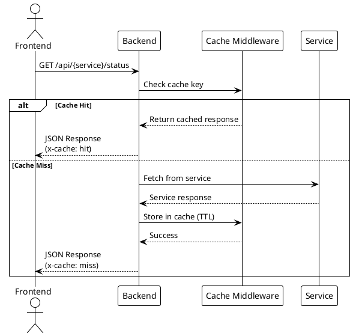
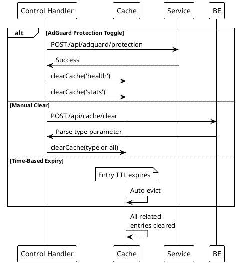

# Caching Strategies

> [!abstract] Overview
> Watchman uses in-memory LRU caching with stale-while-revalidate (SWR) semantics to reduce load on external services and improve response times.

## Implementation

[[apps/backend/src/infra/cache/swr.ts|swr.ts]]

Uses `lru-cache` for in-memory caching with SWR pattern: serve stale data immediately while revalidating in the background.

## SWR Cache Policy

| Parameter   | Default | Description                                      |
| ----------- | ------- | ------------------------------------------------ |
| `ttlMs`     | 30000   | Fresh data TTL (milliseconds)                   |
| `staleMs`   | 30000   | Stale window after TTL expires                  |
| `max`       | 500     | Max cache entries (LRU eviction when exceeded)  |

### SWR Behavior

- **Fresh**: Return cached value immediately (hit counter)
- **Stale**: Return cached value AND revalidate in background; revalidation errors emit `cache:revalidate.failed` event (stale counter)
- **Expired**: Fetch fresh value; block on result (miss counter)

## EventBus Integration

`createSwrCache` accepts an optional `EventBus` parameter. When provided, revalidation failures (stale-branch fetches) emit the `cache:revalidate.failed` event:

```typescript
{
  key: string;      // Cache key
  error: string;    // Error message (from Error.message or String(err))
}
```

> [!note]
> No call sites currently use this integration, but it is available for future observability or remediation logic.

## Cache Statistics

`SwrCache.stats()` returns:

```typescript
{
  hits: number;           // Fresh requests served from cache
  misses: number;         // Requests that missed and fetched new data
  stale: number;          // Requests served stale data with background revalidation
  revalidations: number;  // Background revalidation attempts from stale state
}
```

## Considerations

- In-memory cache is per-process (not shared across instances)
- LRU eviction is bounded by `max` (default 500 entries)
- For multi-instance deployments, consider shared cache (e.g., Redis) to avoid stale divergence
- Stale-branch revalidation failures do not block the caller; the error is emitted to the EventBus

## PlantUML Diagrams

### Cache Flow



### Cache TTL Expiration

```plantuml
@startuml
!theme plain

state "Cache Entry Lifecycle" as CLC {

    [*] --> Fresh : Request at t=0

    state Fresh {
        [*] --> Active : Entry created
        Active : Serving requests
    }

    state "TTL Timer" {
        [*] --> T30s : Health: 30s countdown
        T30s --> Expired : t > 30s

        [*] --> T60s : Stats: 60s countdown
        T60s --> Expired : t > 60s
    }

    Active --> T30s : Health request
    Active --> T60s : Stats request

    T30s --> Fresh : Request before expiry\n(reset timer)
    T60s --> Fresh : Request before expiry\n(reset timer)

    Expired --> [*] : Entry evicted
}

note right of Expired
  Next request causes
  fresh service fetch
end note
@enduml
```

### Cache Invalidation Events



## Related

- [[docs/performance/index|Performance]]
- [[docs/performance/request-optimization|Request Optimization]]
