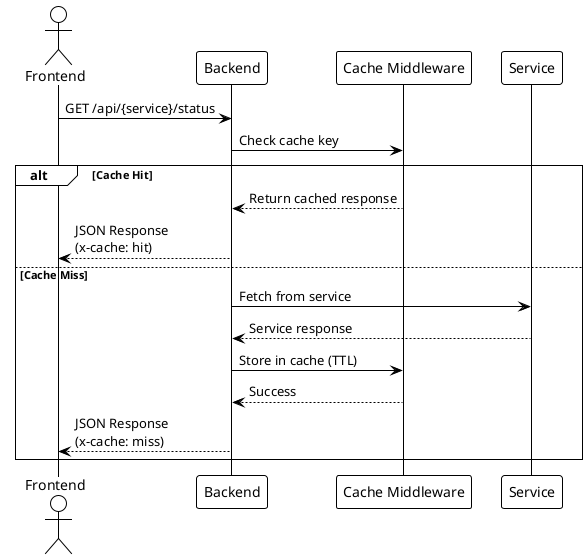
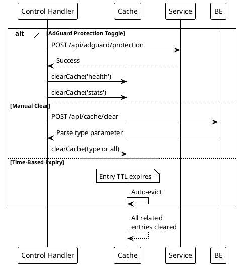

# Caching Strategies

> [!abstract] Overview
> Watchman uses in-memory caching with TTL to reduce load on external services and improve response times.

## Implementation

[[apps/backend/middleware/cache.js|cache.js]]

Uses `node-cache` for in-memory caching.

## Cache Tiers

| Cache Type | TTL        | Applied To                        |
| ---------- | ---------- | --------------------------------- |
| Health     | 30 seconds | `/api/{service}/status` endpoints |
| Stats      | 60 seconds | `/api/{service}/stats` endpoints  |

## Middleware

| Middleware              | Purpose                       |
| ----------------------- | ----------------------------- |
| `healthCacheMiddleware` | Caches health check responses |
| `statsCacheMiddleware`  | Caches statistics responses   |
| `clearCache(type)`      | Clears cache by type or all   |

Behavior notes (from [[apps/backend/middleware/cache.js]]):

- Default cacheable methods are `GET` and `HEAD`
- Allowed methods are configurable via middleware `methods` option
- Middleware exits early (safe pass-through) when a cache key cannot be derived
- `X-Cache-TTL` reports remaining TTL in seconds (not epoch milliseconds)

## Cache Invalidation

Cache is cleared on control actions:

- After `POST /api/adguard/protection`
- After `POST /api/cache/clear`
- Manual cache clear endpoint

## Cache Key Strategy

Cache keys are derived from:

- Request path
- Query parameters
- Service identifier

## Considerations

- In-memory cache is per-process (not shared across instances)
- Cache size is unbounded (monitor in production)
- For multi-instance deployments, consider Redis

## PlantUML Diagrams

### Cache Flow



### Cache TTL Expiration

```plantuml
@startuml
!theme plain

state "Cache Entry Lifecycle" as CLC {

    [*] --> Fresh : Request at t=0

    state Fresh {
        [*] --> Active : Entry created
        Active : Serving requests
    }

    state "TTL Timer" {
        [*] --> T30s : Health: 30s countdown
        T30s --> Expired : t > 30s

        [*] --> T60s : Stats: 60s countdown
        T60s --> Expired : t > 60s
    }

    Active --> T30s : Health request
    Active --> T60s : Stats request

    T30s --> Fresh : Request before expiry\n(reset timer)
    T60s --> Fresh : Request before expiry\n(reset timer)

    Expired --> [*] : Entry evicted
}

note right of Expired
  Next request causes
  fresh service fetch
end note
@enduml
```

### Cache Invalidation Events



## Related

- [[docs/performance/index|Performance]]
- [[docs/performance/request-optimization|Request Optimization]]
