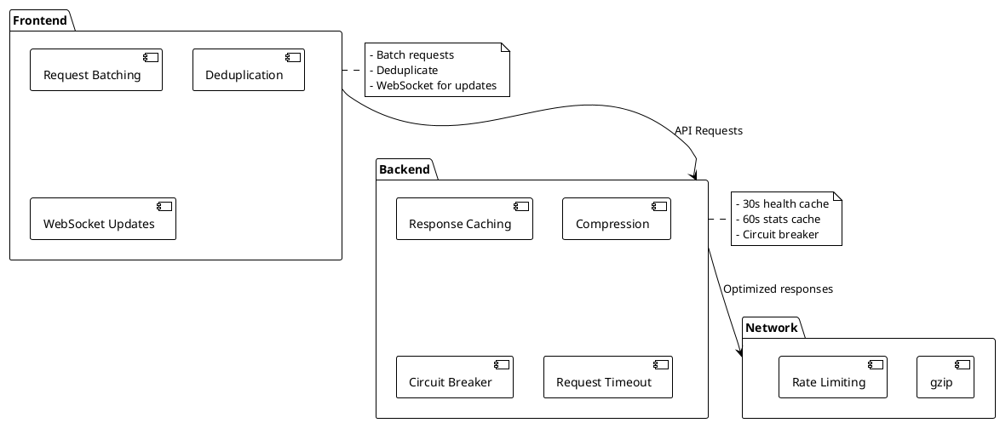
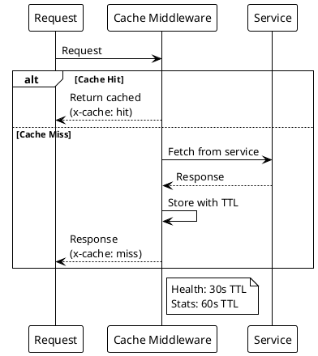

# Performance

> [!abstract] Overview
> Watchman implements several performance optimizations to ensure responsive monitoring dashboard.

## Performance Index

```dataview
TABLE WITHOUT ID file.link AS "Document", date AS "Date", status AS "Status"
FROM "docs/performance"
WHERE type = "performance"
SORT file.name ASC
```

## Documents

| Document                                | Description            |
| --------------------------------------- | ---------------------- | ------------------------------------------- |
| [[docs/performance/caching-strategies   | Caching Strategies]]   | In-memory response caching with TTL         |
| [[docs/performance/request-optimization | Request Optimization]] | Frontend request batching and deduplication |

## Optimization Summary

| Technique         | Layer    | Description                                |
| ----------------- | -------- | ------------------------------------------ |
| Response caching  | Backend  | In-memory cache with 30s/60s TTL           |
| Request batching  | Frontend | Deduplicates concurrent identical requests |
| WebSocket updates | Both     | Eliminates polling overhead                |
| Compression       | Backend  | gzip compression for responses             |
| Circuit breaker   | Backend  | Prevents cascading failures                |
| Request timeout   | Backend  | Prevents hanging requests                  |

## Related

- [[docs/architecture/index|Architecture]]
- [[docs/features/real-time-updates|Real-Time Updates]]

## PlantUML Diagrams

### Performance Optimization Layers



### Caching Architecture


