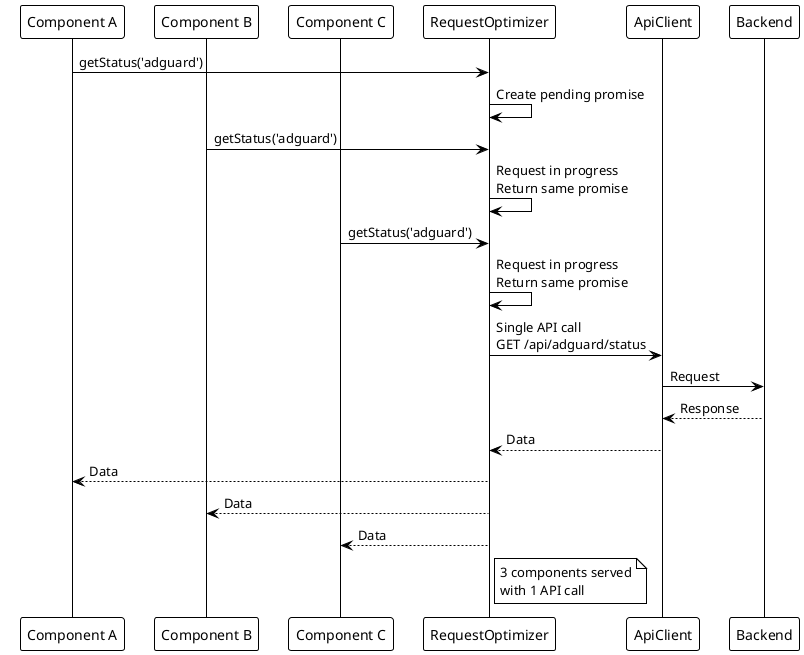
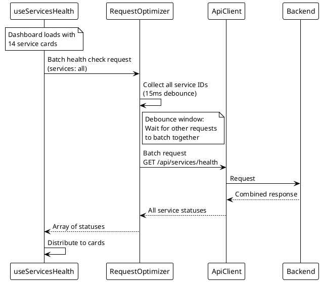

# Request Optimization

> [!abstract] Overview
> Watchman frontend uses request optimization to batch and deduplicate API calls, reducing network overhead.

## Implementation

[[apps/frontend/src/services/RequestOptimizer.ts|RequestOptimizer.ts]]

### Features

- **Request Deduplication**: Identical concurrent requests are merged into a single API call
- **Request Batching**: Multiple health check requests can be batched together
- **Result Distribution**: All waiting callers receive the same response

## Architecture

```
Component A → RequestOptimizer ─┐
                                ├→ Single API call → Response → All callers
Component B → RequestOptimizer ─┘
```

## Usage

The `RequestOptimizer` wraps API client calls:

```typescript
const result = await requestOptimizer.execute(
  "service-health",
  { serviceId },
  () => apiClient.getServiceStatus(serviceId)
);
```

## Integration with Hooks

- `useServicesHealth` - Uses batching for multiple service health checks
- `useServiceHealth` - Uses deduplication for individual service checks

## WebSocket vs Polling

Watchman uses WebSocket for real-time updates to avoid polling:

- Frontend establishes WebSocket connection on load
- Backend broadcasts status changes automatically
- No periodic polling needed from frontend
- Reduces bandwidth and server load

## PlantUML Diagrams

### Request Deduplication



### Request Batching



### WebSocket vs Polling Comparison

```plantuml
@startuml
!theme plain

skinparam noteBackgroundColor #FFFACD

note top of Polling
  POLLING APPROACH
end note

participant "Frontend" as FE1
participant "Backend" as BE1

loop Every 15 seconds
    FE1 -> BE1 : GET /api/adguard/status
    BE1 --> FE1 : Response
end

note top of WebSocket
  WEBSOCKET APPROACH
end note

participant "Frontend" as FE2
participant "WebSocketManager" as WSM
participant "Backend" as BE2

FE2 -> WSM : Connect (once)
WSM --> FE2 : Connection established

note over BE2
  Service status changes
end note

BE2 -> WSM : Status change detected
WSM -> FE2 : Push update (immediate)

note right of WebSocket
  Benefits:
  - No periodic requests
  - Immediate updates
  - Lower bandwidth
  - Less server load
end note
@enduml
```

## Related

- [[docs/performance/index|Performance]]
- [[docs/performance/caching-strategies|Caching Strategies]]
- [[docs/features/real-time-updates|Real-Time Updates]]
