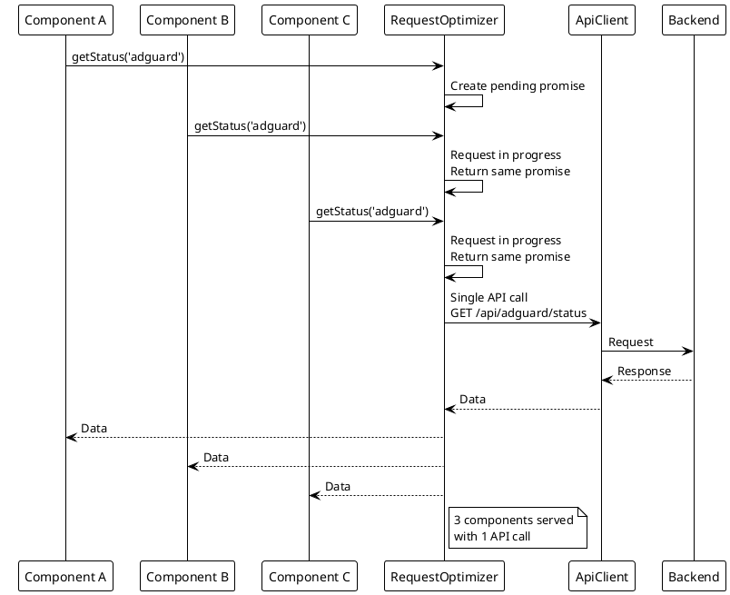
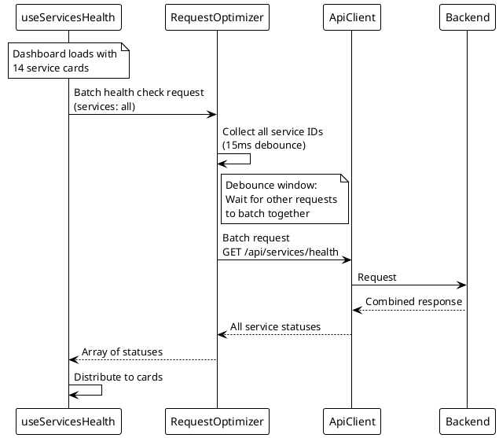

# Request Optimization

> [!abstract] Overview
> Watchman frontend uses request optimization to batch and deduplicate API calls, reducing network overhead.

## Implementation

Current implementation is centered on React Query caching/invalidation and API client request deduplication (`[[apps/frontend/src/services/ApiClient.ts]]`, `[[apps/frontend/src/hooks/useWebSocket.ts]]`, `[[apps/frontend/src/lib/queryKeys.ts]]`).

### Features

- **Request Deduplication**: Identical concurrent requests are merged into a single API call
- **Centralized query keys**: Consistent cache keying via `queryKeys`
- **Targeted invalidation with family dedup**: WebSocket updates trigger debounced invalidation using `queryKeys.servicePrefix(...)` plus specific keys (for example `adguardFull`, `torRelay`, and router ARP), with flush-time deduplication of query-key families before invalidation
- **Targeted invalidation dedup implementation**: flush-time query-family dedup now uses a keyed map before calling React Query invalidations, reducing duplicate invalidation calls during bursty update windows
- **Typed in-flight dedup map**: ApiClient in-flight request dedup uses `Map<string, Promise<unknown>>`
- **Request header hygiene**: `Content-Type: application/json` is auto-set only for non-`GET`/`HEAD` requests unless already provided
- **Update check query hygiene**: `UpdateBadge` update checks now run through React Query (`queryKeys.serviceUpdates(service)`) with a 6-hour stale/refetch window instead of local interval polling

## Architecture

```
Component A → React Query/API Client ─┐
                                      ├→ Single API call → Response → Shared cache
Component B → React Query/API Client ─┘
```

## Usage

Components/hooks use React Query with centralized keys (for example `queryKeys.serviceStatus(serviceId)`), and the WebSocket hook invalidates affected key families on updates.

## Integration with Hooks

- `useServiceHealth` / `useAllServicesHealth` - primary service health query hooks
- `useWebSocket` - debounced targeted key-based query invalidation for real-time updates
- `UpdateBadge` - update availability query via `useQuery` + `apiClient.getServiceUpdates(service)`

## Related Code

- `[[apps/frontend/src/components/UpdateBadge.tsx]]`
- `[[apps/frontend/src/services/ApiClient.ts]]` (`getServiceUpdates`)
- `[[apps/frontend/src/lib/queryKeys.ts]]` (`serviceUpdates`)

## WebSocket vs Polling

Watchman uses WebSocket for real-time updates to avoid polling:

- Frontend establishes WebSocket connection on load
- Backend broadcasts status changes automatically
- No periodic polling needed from frontend
- Reduces bandwidth and server load

## PlantUML Diagrams

### Request Deduplication



### Request Batching



### WebSocket vs Polling Comparison

```plantuml
@startuml
!theme plain

skinparam noteBackgroundColor #FFFACD

note top of Polling
  POLLING APPROACH
end note

participant "Frontend" as FE1
participant "Backend" as BE1

loop Every 15 seconds
    FE1 -> BE1 : GET /api/adguard/status
    BE1 --> FE1 : Response
end

note top of WebSocket
  WEBSOCKET APPROACH
end note

participant "Frontend" as FE2
participant "WebSocketManager" as WSM
participant "Backend" as BE2

FE2 -> WSM : Connect (once)
WSM --> FE2 : Connection established

note over BE2
  Service status changes
end note

BE2 -> WSM : Status change detected
WSM -> FE2 : Push update (immediate)

note right of WebSocket
  Benefits:
  - No periodic requests
  - Immediate updates
  - Lower bandwidth
  - Less server load
end note
@enduml
```

## Related

- [[docs/performance/index|Performance]]
- [[docs/performance/caching-strategies|Caching Strategies]]
- [[docs/features/real-time-updates|Real-Time Updates]]
