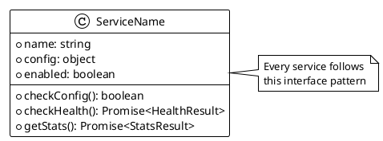
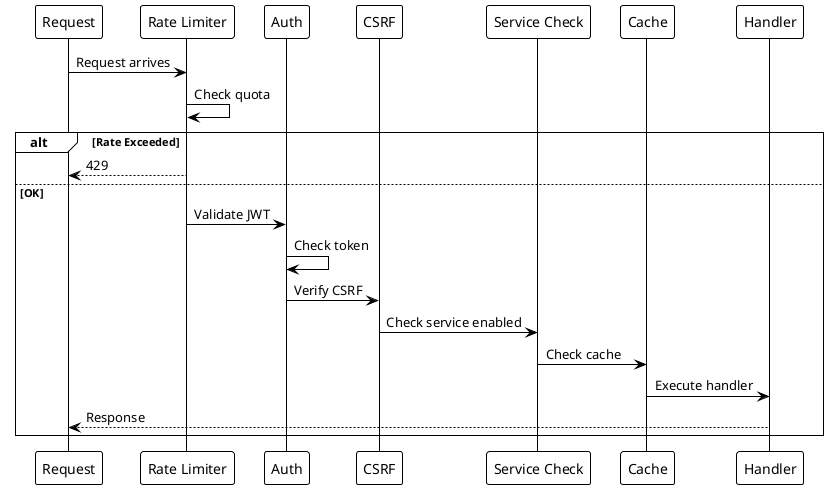

# Code Patterns

> [!abstract] Overview
> Standard patterns and conventions used throughout the Watchman codebase.

## Backend Patterns

### Service Class Pattern

Every service follows this structure:

```javascript
export default class ServiceName {
  constructor(config) {
    this.name = "service-name";
    this.config = config;
    this.enabled = this.checkConfig();
  }

  checkConfig() {
    // Return true if service is properly configured
  }

  async checkHealth() {
    // Lightweight ping - returns { status, timestamp, data? }
  }

  async getStats() {
    // Detailed metrics - returns { data, timestamp }
  }
}
```

### Factory Registration Pattern

Services are registered in `serviceFactoryConfig.js`:

```javascript
import ServiceName from "./ServiceName.js";

export const serviceFactoryConfigs = {
  servicename: {
    ServiceClass: ServiceName,
    getConfig: () => {
      if (!process.env.SERVICENAME_HOST) return null;
      return { host: process.env.SERVICENAME_HOST };
    },
  },
};
```

### Route Middleware Pattern

```javascript
app.get(
  "/api/service/endpoint",
  rateLimiter, // Rate limiting
  requireAuth, // Authentication (if needed)
  verifyCsrf, // CSRF protection (for mutations)
  requireServiceEnabled("service"), // Service availability
  cacheMiddleware, // Response caching (if needed)
  async (req, res) => {
    // Handler
  }
);
```

### Route Registration Pattern

Route handlers are registered through focused route modules and wired in `server.js`:

```javascript
import { registerAuthRoutes } from "./routes/authRoutes.js";
import { registerMetaRoutes } from "./routes/metaRoutes.js";

registerAuthRoutes(app, deps);
registerMetaRoutes(app, deps);
```

Standard per-service status/stats/update endpoints remain factory-generated via `createServiceRoutes()` and `createUpdatesRoute()`.

Shared route-level helpers are centralized in `[[apps/backend/routes/routeUtils.js]]` and consumed by route modules (including `[[apps/backend/routes/serviceFactory.js]]`, `[[apps/backend/routes/serviceAliasRoutes.js]]`, `[[apps/backend/routes/routerRoutes.js]]`, `[[apps/backend/routes/metaRoutes.js]]`, `[[apps/backend/routes/controlRoutes.js]]`, `[[apps/backend/routes/homebridgeRoutes.js]]`, `[[apps/backend/routes/instanceRoutes.js]]`, and `[[apps/backend/routes/authRoutes.js]]`) to reduce duplicated service-context and error-message logic without changing route contracts.

### Error Handling Pattern

```javascript
try {
  const result = await service.doSomething();
  res.json(result);
} catch (error) {
  logger.error("Operation failed", { error: error.message });
  res.status(500).json({
    error: "User-friendly error message",
    message: error.message,
  });
}
```

### Logging Pattern

```javascript
import logger from "../middleware/logger.js";

logger.info("General information");
logger.error("Error message", { error: error.message, context });
logger.service("service-name", "Service-specific message");
logger.startup("Startup message");
logger.progress("Progress message");
logger.warning("Warning message");
```

## Frontend Patterns

### Frontend Logging Pattern

Prefer the frontend logger utility for diagnostics in hooks/components instead of direct `console.*` calls:

```typescript
import { logger } from "@/lib/logger";

logger.warn("Recoverable frontend issue", { context: "useAuth" });
logger.error("Unhandled UI error", { error, componentStack });
```

Use `unknown` in catch blocks and narrow before logging details where needed.

Related files: `[[apps/frontend/src/lib/logger.ts]]`, `[[apps/frontend/src/hooks/useWebSocket.ts]]`, `[[apps/frontend/src/hooks/useAuth.tsx]]`, `[[apps/frontend/src/components/ErrorBoundary.tsx]]`, `[[apps/frontend/src/lib/csrf.ts]]`.

Redaction behavior note: in `[[apps/frontend/src/lib/logger.ts]]`, when a redaction regex matches without a capture group, the replacement falls back to `[REDACTED]`.

Coverage reference: `[[apps/frontend/src/lib/logger.test.ts]]` validates this fallback branch and standard redaction behavior.

### Service Card Pattern

```tsx
import { OptimizedServiceCard } from "./OptimizedServiceCard";

export function ServiceCard() {
  return (
    <OptimizedServiceCard
      serviceName="service-name"
      title="Service Display Name"
      icon={<Icon />}
      renderStats={(stats) => <div>{/* Render stats */}</div>}
    />
  );
}
```

### Custom Hook Pattern

```tsx
export function useServiceName() {
  const [data, setData] = useState(null);
  const [loading, setLoading] = useState(true);

  useEffect(() => {
    // Fetch data
    return () => {
      // Cleanup
    };
  }, []);

  return { data, loading };
}
```

### API Client Pattern

```typescript
const response = await apiClient.get("/api/service/status");
return response.data;
```

## Naming Conventions

| Element       | Convention                  | Example            |
| ------------- | --------------------------- | ------------------ |
| Service class | PascalCase + Service suffix | `AdGuardService`   |
| Service route | lowercase                   | `adguard`          |
| Env vars      | UPPER_SNAKE_CASE            | `ADGUARD_MAIN_URL` |
| Components    | PascalCase                  | `AdGuardCard`      |
| Hooks         | camelCase + use prefix      | `useAuth`          |
| Middleware    | camelCase                   | `requireAuth`      |

## Related

- [[docs/guides/contributing|Contributing Guide]]
- [[docs/guides/adding-services|Adding Services Guide]]

## PlantUML Diagrams

### Service Class Pattern



### Factory Registration Pattern

```plantuml
@startuml
!theme plain

package "serviceFactoryConfig.js" as Factory {
    object "serviceFactoryConfigs" as Config {
        servicename: {
            ServiceClass,
            getConfig(),
            required,
            postInit
        }
    }
}

package "ServiceManager" as SM {
    [services Map]
    [getService()]
}

Factory --> SM : Registers all services

note right of Factory
  Each entry maps:
  - Service class
  - Config getter function
  - Lifecycle hooks
end note
@enduml
```

### Middleware Chain Pattern


