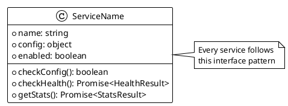
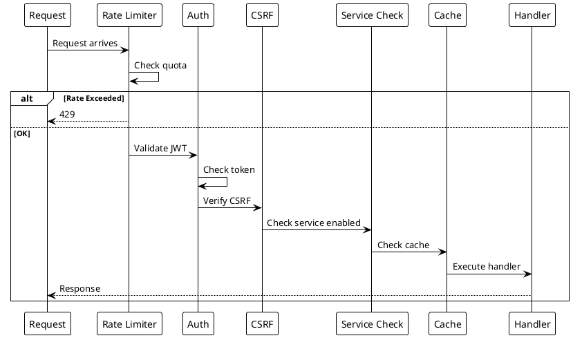

# Code Patterns

> [!abstract] Overview
> Standard patterns and conventions used throughout the Watchman codebase.

## Backend Patterns

### Service Class Pattern

Every service follows this structure:

```javascript
export default class ServiceName {
  constructor(config) {
    this.name = "service-name";
    this.config = config;
    this.enabled = this.checkConfig();
  }

  checkConfig() {
    // Return true if service is properly configured
  }

  async checkHealth() {
    // Lightweight ping - returns { status, timestamp, data? }
  }

  async getStats() {
    // Detailed metrics - returns { data, timestamp }
  }
}
```

### Service Registration Pattern

Services are registered in [[apps/backend/src/domain/ServiceRegistry.ts|ServiceRegistry]]:

```typescript
// apps/backend/src/domain/ServiceRegistry.ts
export class ServiceRegistry {
  static register(service: BaseService): void { ... }
  static get(id: string): BaseService | undefined { ... }
  static getAll(): BaseService[] { ... }
}
```

Services are instantiated by kind via `ServiceFactory` and wired into the `BackgroundPoller` at bootstrap.

### Route Plugin Pattern (Fastify v4)

Each transport concern is a Fastify plugin registered in `[[apps/backend/src/transport/http/server.ts]]`:

```typescript
import fp from "fastify-plugin";

const serviceRoutes = fp(async (fastify) => {
  fastify.get("/services/:id/health", async (req, reply) => {
    // Handler
  });
});
```

### Error Handling Pattern

```javascript
try {
  const result = await service.doSomething();
  res.json(result);
} catch (error) {
  logger.error("Operation failed", { error: error.message });
  res.status(500).json({
    error: "User-friendly error message",
    message: error.message,
  });
}
```

### Logging Pattern

```javascript
import logger from "../middleware/logger.js";

logger.info("General information");
logger.error("Error message", { error: error.message, context });
logger.service("service-name", "Service-specific message");
logger.startup("Startup message");
logger.progress("Progress message");
logger.warning("Warning message");
```

## Frontend Patterns

### Frontend Logging Pattern

Prefer the frontend logger utility for diagnostics in hooks/components instead of direct `console.*` calls:

```typescript
import { logger } from "@/lib/logger";

logger.warn("Recoverable frontend issue", { context: "useAuth" });
logger.error("Unhandled UI error", { error, componentStack });
```

Use `unknown` in catch blocks and narrow before logging details where needed.

Related files: `[[apps/frontend/src/lib/logger.ts]]`, `[[apps/frontend/src/hooks/useWebSocket.ts]]`, `[[apps/frontend/src/components/ErrorBoundary.tsx]]`.

Redaction behavior note: in `[[apps/frontend/src/lib/logger.ts]]`, when a redaction regex matches without a capture group, the replacement falls back to `[REDACTED]`.

Coverage reference: `[[apps/frontend/src/lib/logger.test.ts]]` validates this fallback branch and standard redaction behavior.

### ServiceRenderer Registry Pattern (Phase 3 — Bento Dashboard)

The bento dashboard uses a **service-renderer registry** to drive customization per service without duplicating the `<ServiceTile>` component. Each service has one file in `apps/frontend/src/services/renderers/` that exports a `ServiceRenderer` object:

```typescript
// apps/frontend/src/services/renderers/bitcoin.ts
import type { ServiceRenderer } from "./types";

export const bitcoinRenderer: ServiceRenderer<BitcoinStats> = {
  // Summary metrics displayed in the tile
  summaryMetrics: ["block_height", "peers", "mempool_size"],

  // Detailed view groups and charts
  detailGroups: [
    {
      title: "Blockchain",
      metrics: ["block_height", "difficulty"],
      charts: ["block_height"],
    },
    {
      title: "Network",
      metrics: ["peers", "version"],
    },
  ],

  // Tile styling
  tone: "luxury",
  size: "xl", // xl, l, m, s
  density: "compact",

  // Format specific metrics
  formatters: {
    block_height: (v) => `#${v.toLocaleString()}`,
    peers: (v) => `${v} peers`,
  },
};
```

The registry index (`apps/frontend/src/services/renderers/index.ts`) maps service kinds to renderers:

```typescript
import { bitcoinRenderer } from "./bitcoin";
import { synologyRenderer } from "./synology";
// ... 12 more services

export const RENDERERS: Record<string, ServiceRenderer> = {
  bitcoin: bitcoinRenderer,
  synology: synologyRenderer,
  // ...
};
```

**Why this pattern:**
- **No duplication**: One tile component reused for all services
- **Extensibility**: Add new service without touching tile code
- **Consistency**: All services share the same layout, behavior, and styling constraints
- **Rule of 3+**: Used across 14+ services (violated by 18 inline `*Card.tsx` files)

### Custom Hook Pattern

```tsx
export function useServiceName() {
  const [data, setData] = useState(null);
  const [loading, setLoading] = useState(true);

  useEffect(() => {
    // Fetch data
    return () => {
      // Cleanup
    };
  }, []);

  return { data, loading };
}
```

### API Client Pattern

```typescript
const response = await apiClient.get("/api/service/status");
return response.data;
```

### DuckDB Time Conversion Pattern

When passing JavaScript `Date` objects as bound parameters to DuckDB queries, use the `toTs()` helper to avoid int32 overflow on timestamp values:

```typescript
import { toTs } from "@/infra/timeseries/duckdbTime";

const fromTime = toTs(new Date("2026-04-18T12:00:00Z"));
const query = db.prepare(
  "SELECT * FROM metric_raw WHERE ts >= ? AND ts < ?"
);
const rows = await query.run(fromTime, toTs(new Date()));
```

This pattern is defined in [[apps/backend/src/infra/timeseries/duckdbTime.ts|duckdbTime.ts]] and ensures correct handling of `DuckDBTimestampValue` when working with time-series data.

### Per-Kind Zod Schema + UI Field Metadata Pattern

Service configurations are defined as Zod schemas with attached field metadata for dynamic UI form generation. One file per service kind under `apps/backend/src/config/schemas/`:

```typescript
// apps/backend/src/config/schemas/bitcoin.ts
import { z } from "zod";

export const BitcoinConfigSchema = z.object({
  onionUrl: z.string().url(),
  rpcUser: z.string(),
  rpcPassword: z.string(),
  rpcPort: z.number().int().default(8332),
});

export const BitcoinFieldMeta: FieldMeta[] = [
  {
    name: "onionUrl",
    label: "Onion Address",
    type: "text",
    required: true,
    help: "Tor hidden service URL",
  },
  {
    name: "rpcUser",
    label: "RPC User",
    type: "text",
    required: true,
  },
  {
    name: "rpcPassword",
    label: "RPC Password",
    type: "password",
    secret: true, // Encrypted at rest; masked in GET responses
    required: true,
  },
  {
    name: "rpcPort",
    label: "RPC Port",
    type: "number",
    required: false,
    placeholder: "8332",
  },
];

export type BitcoinConfig = z.infer<typeof BitcoinConfigSchema>;
```

**Why this pattern:**
- **Single source of truth**: Zod schema defines both validation and field metadata
- **Type safety**: `z.infer<>` generates TypeScript types automatically
- **Dynamic UI**: Frontend generates forms from field metadata without hardcoding
- **Server validation**: Same schema validates on both client (partial) and server (full)
- **Secret handling**: Metadata `secret: true` flag marks fields for encryption and redaction

Re-export all schemas from `[[apps/backend/src/config/schemas/index.ts]]` for API endpoint to serve to frontend.

### Mutex-Serialized Lifecycle Pattern

Hot-reload of service configurations requires serialized state transitions to avoid race conditions. Use `Async.Mutex` from the `async` package:

```typescript
// apps/backend/src/application/ServiceLifecycle.ts
import { Mutex } from "async";

export class ServiceLifecycle {
  private configMutex = new Mutex();

  constructor(private poller: BackgroundPoller, private eventBus: EventBus) {
    this.eventBus.on("config:service.created", (event) => this.onCreated(event));
    this.eventBus.on("config:service.updated", (event) => this.onUpdated(event));
    this.eventBus.on("config:service.deleted", (event) => this.onDeleted(event));
  }

  private async onUpdated(event: ConfigServiceUpdatedEvent) {
    // Lock prevents concurrent mutations
    await this.configMutex.runExclusive(async () => {
      const oldService = ServiceRegistry.get(event.id);
      if (!oldService) return;

      // Pause polling to allow in-flight requests to drain
      this.poller.pause();
      try {
        // Clean up old service
        await oldService.onStop?.();

        // Create and start new service
        const newService = ServiceFactory.createService(
          event.kind,
          event.config,
          this.infra
        );
        await newService.onStart?.();

        // Update registry
        ServiceRegistry.update(newService);

        // Retrack in poller
        this.poller.untrack(oldService.id);
        this.poller.retrack(newService);
      } finally {
        // Always resume even on error
        this.poller.resume();
      }

      // Emit applied event for WebSocket broadcast
      this.eventBus.emit("service.config.applied", {
        id: newService.id,
      });
    });
  }
}
```

**Why this pattern:**
- **Prevents race conditions**: Mutex ensures only one config change executes at a time
- **Graceful poller coordination**: Pause allows in-flight polls to finish before state change
- **Error safety**: `finally` block ensures poller resumes even if intermediate steps fail
- **WebSocket-friendly**: Emits reduced events for broadcast (no secrets)

## Naming Conventions

| Element       | Convention                  | Example            |
| ------------- | --------------------------- | ------------------ |
| Service class | PascalCase + Service suffix | `AdGuardService`   |
| Service route | lowercase                   | `adguard`          |
| Env vars      | UPPER_SNAKE_CASE            | `ADGUARD_MAIN_URL` |
| Components    | PascalCase                  | `AdGuardCard`      |
| Hooks         | camelCase + use prefix      | `useAuth`          |
| Middleware    | camelCase                   | `requireAuth`      |

## Related

- [[docs/guides/contributing|Contributing Guide]]
- [[docs/guides/adding-services|Adding Services Guide]]

## PlantUML Diagrams

### Service Class Pattern



### Factory Registration Pattern

```plantuml
@startuml
!theme plain

package "serviceFactoryConfig.js" as Factory {
    object "serviceFactoryConfigs" as Config {
        servicename: {
            ServiceClass,
            getConfig(),
            required,
            postInit
        }
    }
}

package "ServiceManager" as SM {
    [services Map]
    [getService()]
}

Factory --> SM : Registers all services

note right of Factory
  Each entry maps:
  - Service class
  - Config getter function
  - Lifecycle hooks
end note
@enduml
```

### Middleware Chain Pattern


