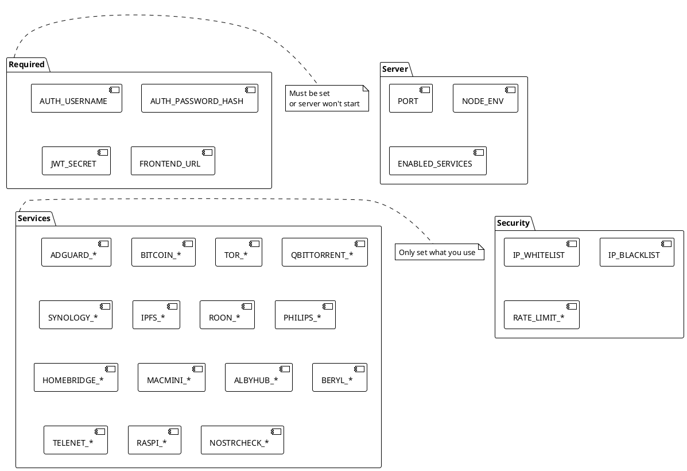
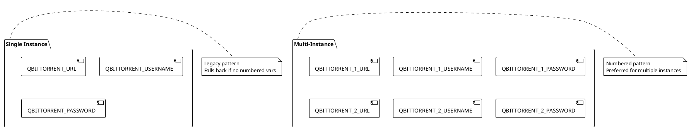

# Environment Variables

> [!abstract] Overview
> All environment variables for the Watchman project. Set these in `apps/backend/.env.local`.

## Required Variables

| Variable             | Description                               | Example                                              |
| -------------------- | ----------------------------------------- | ---------------------------------------------------- |
| `FRONTEND_URL`       | Frontend origin(s), comma/space-separated (for CORS) | `http://localhost:5173 https://watchman.example.com` |

> [!info] Authentication Removed
> As of v2.3, Watchman is a single-user home-lab application with **no authentication**. Previously required variables `AUTH_USERNAME`, `AUTH_PASSWORD_HASH`, and `JWT_SECRET` have been removed. See [[docs/adr/017-remove-authentication-frontend-v2-migration|ADR-017]] for context.
>
> **Network isolation** (firewall, VPN, or closed LAN) is the operator's responsibility.

## Master Key Configuration

| Variable             | Description                               | Default | Example                                              |
| -------------------- | ----------------------------------------- | ------- | ---------------------------------------------------- |
| `WATCHMAN_MASTER_KEY` | AES-256-GCM key for encrypting service secrets (base64, 32 bytes, optional) | Auto-provisioned at `{DATA_DIR}/master.key` if not set | `Z0VzN3AxMHBXZ3UyaDRxZ0I1Y...` (base64-decoded = 32 bytes) |

> [!warning] Master Key Loss
> If `WATCHMAN_MASTER_KEY` is lost or rotated, all encrypted service secrets become unrecoverable. Store the master key file securely (encrypted backup, secrets vault). Preserve `{DATA_DIR}/master.key` during backups. Losing it requires re-entering all service credentials.

## Server Configuration

| Variable            | Description                                                                                                                  | Default       | Example                            |
| ------------------- | ---------------------------------------------------------------------------------------------------------------------------- | ------------- | ---------------------------------- |
| `BACKEND_V2_PORT`   | Backend server port (changed from 3101 → 3001 in v2.3)                                                                      | `3001`        | `3001`, `8080`                     |
| `BACKEND_V2_HOST`   | Backend server bind address                                                                                                  | `0.0.0.0`     | `127.0.0.1`, `0.0.0.0`             |
| `NODE_ENV`          | Environment mode                                                                                                             | `development` | `production`                       |
| `TRUST_PROXY`       | Fastify `trust proxy` setting parsed from env (boolean, hop count, or trusted subnet/IP list) and applied in server startup. | `1`           | `false`, `1`, `loopback,127.0.0.1` |
| `LOG_LEVEL`         | Pino logging level                                                                                                           | `info`        | `debug`, `info`, `warn`, `error`   |

> [!info] Service Configuration
> As of v2.2, services are managed via the UI and stored in DuckDB. The `ENABLED_SERVICES` and per-service env vars are removed. On first boot, legacy service env vars are migrated to the database. See [[docs/features/ui-configuration|UI Configuration Feature]] for details.

## Persistent Data Storage

| Variable             | Description                                 | Default             | Example |
| -------------------- | ------------------------------------------- | ------------------- | ------- |
| `DATA_DIR`           | Directory for DuckDB ConfigStore and master key | `./data`        | `~/.watchman/data` |

> [!info] Data Directory
> The backend stores encrypted service configuration and the master key at `{DATA_DIR}/`. On desktop (Electron), this is typically `<userData>/data/`. If running standalone, ensure the directory is writable and backed up regularly.

## Desktop App Configuration (Electron)

| Variable                    | Description                                   | Default             | Notes |
| --------------------------- | --------------------------------------------- | ------------------- | ----- |
| `WATCHMAN_DEV_URL`          | Frontend URL override (dev mode only)         | `watchman://app/`   | For testing custom frontend server |

> [!info] Desktop Data Directory
> In Electron, `DATA_DIR` is automatically set to `<userData>/data/` where `<userData>` is the platform-specific app data directory (e.g., `~/Library/Application Support/Watchman` on macOS). See [[docs/guides/running-the-desktop-app|Desktop App Guide]] for platform-specific paths.

## Important Notes

- `TRUST_PROXY` affects client IP detection and protocol behavior when running behind reverse proxies.
- `FRONTEND_URL` supports multiple origins separated by commas and/or spaces; each origin is validated individually in code.
- Master key rotation: See [[docs/features/ui-configuration|UI Configuration Feature]] for implications.
- **No auth configuration needed**: Watchman is single-user. Use network isolation (firewall, VPN) for security.

## Service Configuration (Migrated to UI)

> [!warning] Legacy Environment Variables Deprecated
> As of v2.2, all per-service configuration (e.g., `ADGUARD_MAIN_URL`, `BITCOIN_RPC_USER`, `QBITTORRENT_URL`, etc.) is managed via the UI and stored in DuckDB.
>
> **On first boot with v2.2+**: The system automatically migrates existing service env vars to the database. Afterward, you can safely remove them from `.env`.
>
> **To configure services**: Use the Setup Wizard (`/setup`) or the Services UI (`/settings/services`). See [[docs/features/ui-configuration|UI Configuration Feature]] for complete guide.

### Legacy Pattern (for historical reference)

Services were previously configured via environment variables. This is no longer supported. Examples:

```bash
# Old pattern (no longer used):
ADGUARD_MAIN_URL=http://192.0.2.1
BITCOIN_RPC_USER=rpcuser
QBITTORRENT_1_URL=http://192.0.2.10:8080
```

All per-service config is now dynamic and encrypted in the database.

## Related

- [[docs/guides/setup|Setup Guide]]
- [[docs/features/multi-instance|Multi-Instance Support]]
- [[apps/backend/.env.example|Environment Example]]

## PlantUML Diagrams

### Environment Variable Categories



### Multi-Instance Configuration


