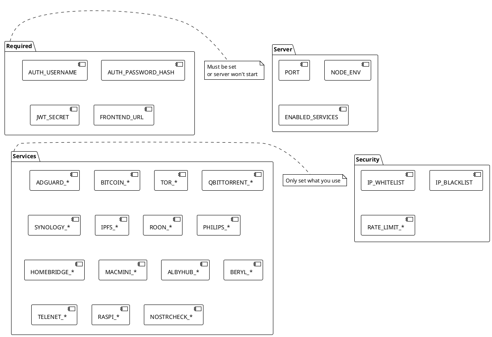
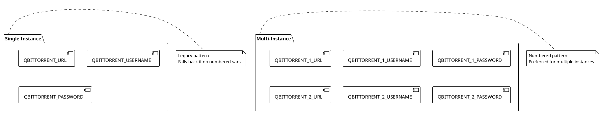

# Environment Variables

> [!abstract] Overview
> All environment variables for the Watchman project. Set these in `apps/backend/.env.local`.

## Required Variables

| Variable             | Description                               | Example                                              |
| -------------------- | ----------------------------------------- | ---------------------------------------------------- |
| `AUTH_USERNAME`      | Admin username                            | `admin`                                              |
| `AUTH_PASSWORD_HASH` | bcrypt password hash                      | `$2b$10$...`                                         |
| `JWT_SECRET`         | JWT signing secret (min 32 chars)         | `your-super-secret-jwt-key-min-32-characters`        |
| `FRONTEND_URL`       | Frontend origin(s), comma/space-separated | `http://localhost:5173 https://watchman.example.com` |

## Server Configuration

| Variable            | Description                                                                                                                  | Default       | Example                            |
| ------------------- | ---------------------------------------------------------------------------------------------------------------------------- | ------------- | ---------------------------------- |
| `PORT`              | Backend server port                                                                                                          | `3001`        | `3001`                             |
| `NODE_ENV`          | Environment mode                                                                                                             | `development` | `production`                       |
| `TRUST_PROXY`       | Express `trust proxy` setting parsed from env (boolean, hop count, or trusted subnet/IP list) and applied in server startup. | `1`           | `false`, `1`, `loopback,127.0.0.1` |
| `AUTH_RETURN_TOKEN` | Feature flag for legacy login response bodies: when `true`, includes deprecated `token` field in `/api/auth/login` JSON.     | `false`       | `true`                             |
| `ENABLED_SERVICES`  | Comma-separated service list                                                                                                 | All enabled   | `adguard,tor,bitcoin`              |

## Cookie Configuration

| Variable               | Description            | Default                        |
| ---------------------- | ---------------------- | ------------------------------ |
| `COOKIE_DOMAIN`        | Override cookie domain | Auto-derived from FRONTEND_URL |
| `COOKIE_STRICT_DOMAIN` | Force strict domain    | `false` for multiple origins   |
| `CSRF_COOKIE_NAME`     | CSRF cookie name       | `csrfToken`                    |

## Auth and Proxy Notes

- `AUTH_RETURN_TOKEN=false` is the default and recommended mode; authentication is cookie-first via HTTP-only `token` cookie.
- Use `AUTH_RETURN_TOKEN=true` only for temporary client compatibility while migrating away from reading `token` from login JSON.
- `TRUST_PROXY` affects client IP detection and secure cookie/protocol behavior when running behind reverse proxies.
- `FRONTEND_URL` supports multiple origins separated by commas and/or spaces; each origin is validated individually in [[apps/backend/config.js]].
- Production HTTPS warnings are evaluated per configured frontend origin (non-local public origins should be HTTPS) in [[apps/backend/config.js]].
- Related implementation files: [[apps/backend/server.js]], [[apps/backend/routes/authRoutes.js]], [[apps/backend/utils/env.js]], [[apps/backend/utils/origin.js]].

## Service Configurations

### AdGuard Home

| Variable            | Description          | Example            |
| ------------------- | -------------------- | ------------------ |
| `ADGUARD_MAIN_URL`  | AdGuard Home URL     | `http://192.0.2.1` |
| `ADGUARD_MAIN_AUTH` | Auth token           | `your-auth-token`  |
| `ADGUARD_TIMEOUT`   | Request timeout (ms) | `10000`            |

### Bitcoin

| Variable               | Description       | Default                    | Example            |
| ---------------------- | ----------------- | -------------------------- | ------------------ |
| `BITCOIN_ONION_URL`    | Tor onion address | -                          | `your-onion.onion` |
| `BITCOIN_RPC_USER`     | RPC username      | -                          | `rpcuser`          |
| `BITCOIN_RPC_PASSWORD` | RPC password      | -                          | `rpcpass`          |
| `BITCOIN_RPC_PORT`     | RPC port          | `8332`                     | `8332`             |
| `BITCOIN_TOR_PROXY`    | Tor proxy URL     | `socks5h://127.0.0.1:9050` | -                  |

### Tor

| Variable             | Description      | Example     |
| -------------------- | ---------------- | ----------- |
| `TOR_RELAY_NICKNAME` | Relay nickname   | `my-relay`  |
| `TOR_RELAY_IP`       | Relay IP address | `192.0.2.1` |

> [!info] Tor runtime data location
> TorManager runtime data defaults to `apps/backend/.tor-data` (module-relative), not a process working-directory-relative path.
> This path is an implementation default in [[apps/backend/services/TorManager.js|TorManager.js]] and does not currently have an environment variable override.

### qBittorrent

| Variable               | Description     | Example                 |
| ---------------------- | --------------- | ----------------------- |
| `QBITTORRENT_URL`      | qBittorrent URL | `http://127.0.0.1:8069` |
| `QBITTORRENT_USERNAME` | Username        | `admin`                 |
| `QBITTORRENT_PASSWORD` | Password        | `password`              |

### Multi-Instance Pattern

```bash
QBITTORRENT_1_URL=http://192.0.2.10:8080
QBITTORRENT_1_USERNAME=admin
QBITTORRENT_1_PASSWORD=password1
QBITTORRENT_2_URL=http://192.0.2.11:8080
QBITTORRENT_2_USERNAME=admin
QBITTORRENT_2_PASSWORD=password2
```

### Synology

| Variable            | Description  | Example       |
| ------------------- | ------------ | ------------- |
| `SYNOLOGY_HOST`     | NAS hostname | `192.0.2.100` |
| `SYNOLOGY_PORT`     | DSM port     | `5000`        |
| `SYNOLOGY_USERNAME` | Username     | `admin`       |
| `SYNOLOGY_PASSWORD` | Password     | `password`    |

### IPFS

| Variable       | Description  | Example                 |
| -------------- | ------------ | ----------------------- |
| `IPFS_API_URL` | IPFS API URL | `http://127.0.0.1:5001` |

### Roon

| Variable     | Description      | Example          |
| ------------ | ---------------- | ---------------- |
| `ROON_HOST`  | Roon server host | `192.0.2.150`    |
| `ROON_PORTS` | Ports to check   | `9003,9330,9100` |

### Philips Hue

| Variable              | Description | Example       |
| --------------------- | ----------- | ------------- |
| `PHILIPS_BRIDGE_HOST` | Bridge IP   | `192.0.2.200` |

### Homebridge

| Variable                | Description    | Example                   |
| ----------------------- | -------------- | ------------------------- |
| `HOMEBRIDGE_URL`        | Homebridge URL | `http://192.0.2.210:8581` |
| `HOMEBRIDGE_AUTH_TOKEN` | Auth token     | `your-token`              |

### Mac Mini

| Variable               | Description  | Example        |
| ---------------------- | ------------ | -------------- |
| `MACMINI_HOST`         | Mac hostname | `127.0.0.1`    |
| `MACMINI_SSH_USER`     | SSH username | `admin`        |
| `MACMINI_SSH_KEY_PATH` | SSH key path | `/path/to/key` |

### Alby Hub

| Variable        | Description  | Example                 |
| --------------- | ------------ | ----------------------- |
| `ALBYHUB_URL`   | Alby Hub URL | `http://127.0.0.1:8080` |
| `ALBYHUB_TOKEN` | Auth token   | `your-token`            |

### Router (Beryl)

| Variable      | Description    | Example     |
| ------------- | -------------- | ----------- |
| `BERYL_HOST`  | Router IP      | `192.0.2.1` |
| `BERYL_PORTS` | Ports to check | `80,443`    |

### Router (Telenet)

| Variable        | Description    | Example     |
| --------------- | -------------- | ----------- |
| `TELENET_HOST`  | Router IP      | `192.0.2.1` |
| `TELENET_PORTS` | Ports to check | `80`        |

### Raspberry Pi

| Variable     | Description | Default | Example       |
| ------------ | ----------- | ------- | ------------- |
| `RASPI_HOST` | Pi hostname | -       | `192.0.2.230` |
| `RASPI_PORT` | SSH port    | `22`    | `22`          |

### Nostrcheck

| Variable               | Description         | Default | Example                    |
| ---------------------- | ------------------- | ------- | -------------------------- |
| `NOSTRCHECK_RELAY_URL` | Relay WebSocket URL | -       | `wss://relay.domain.com`   |
| `NOSTRCHECK_WEB_URL`   | Relay web URL       | -       | `https://relay.domain.com` |
| `NOSTRCHECK_ENABLED`   | Enable service      | `false` | `true`                     |

## Related

- [[docs/guides/setup|Setup Guide]]
- [[docs/features/multi-instance|Multi-Instance Support]]
- [[apps/backend/.env.example|Environment Example]]

## PlantUML Diagrams

### Environment Variable Categories



### Multi-Instance Configuration


