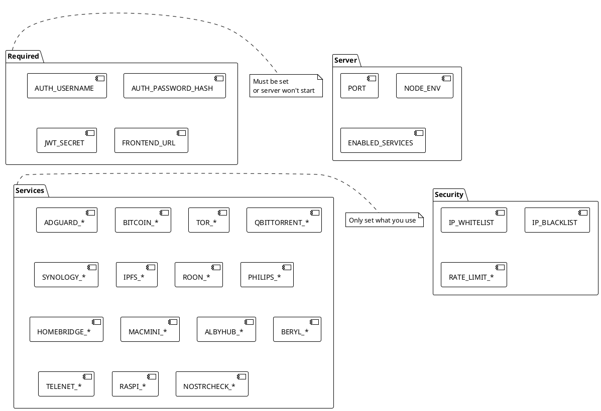
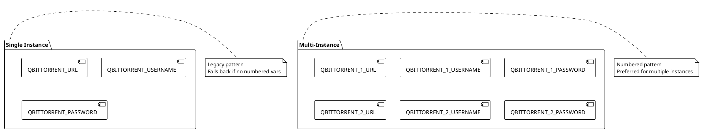

# Environment Variables

> [!abstract] Overview
> All environment variables for the Watchman project. Set these in `apps/backend/.env.local`.

## Required Variables

| Variable             | Description                               | Example                                              |
| -------------------- | ----------------------------------------- | ---------------------------------------------------- |
| `AUTH_USERNAME`      | Admin username                            | `admin`                                              |
| `AUTH_PASSWORD_HASH` | bcrypt password hash                      | `$2b$10$...`                                         |
| `JWT_SECRET`         | JWT signing secret (min 32 chars)         | `your-super-secret-jwt-key-min-32-characters`        |
| `FRONTEND_URL`       | Frontend origin(s), comma/space-separated | `http://localhost:5173 https://watchman.example.com` |
| `WATCHMAN_MASTER_KEY` | AES-256-GCM key for encrypting secrets (base64, 32 bytes) | `Z0VzN3AxMHBXZ3UyaDRxZ0I1Y...` (base64-decoded = 32 bytes) |

> [!warning] Master Key Loss
> If `WATCHMAN_MASTER_KEY` is lost or rotated, all encrypted service secrets become unrecoverable. Store it securely in your deployment (secrets vault, encrypted environment, encrypted `.env.local`, etc.). Losing it requires re-entering all service credentials.

## Server Configuration

| Variable            | Description                                                                                                                  | Default       | Example                            |
| ------------------- | ---------------------------------------------------------------------------------------------------------------------------- | ------------- | ---------------------------------- |
| `PORT`              | Backend server port                                                                                                          | `3001`        | `3001`                             |
| `NODE_ENV`          | Environment mode                                                                                                             | `development` | `production`                       |
| `TRUST_PROXY`       | Fastify `trust proxy` setting parsed from env (boolean, hop count, or trusted subnet/IP list) and applied in server startup. | `1`           | `false`, `1`, `loopback,127.0.0.1` |
| `AUTH_RETURN_TOKEN` | Feature flag for legacy login response bodies: when `true`, includes deprecated `token` field in `/api/auth/login` JSON.     | `false`       | `true`                             |

> [!info] Service Configuration
> As of v2.2, services are managed via the UI and stored in DuckDB. The `ENABLED_SERVICES` and per-service env vars are removed. On first boot, legacy service env vars are migrated to the database. See [[docs/features/ui-configuration|UI Configuration Feature]] for details.

## Time-Series Configuration

| Variable             | Description                                 | Default              | Example            |
| -------------------- | ------------------------------------------- | -------------------- | ------------------ |
| `TIMESERIES_ENABLED` | Enable/disable time-series metrics storage  | `true`               | `true`, `false`    |
| `DATA_DIR`           | Directory for DuckDB and other data files   | `./data`             | `/var/lib/watchman` |

> [!info] Time-Series Storage
> When `TIMESERIES_ENABLED=true`, Watchman stores metrics in a DuckDB database at `{DATA_DIR}/timeseries.duckdb`. The database contains 5 tables (metric_raw, metric_1m, metric_5m, metric_1h, rollup_state) with automatic background rollups and retention policies. See [[docs/features/time-series-history|Time-Series Feature Documentation]] for details.

## Cookie Configuration

| Variable               | Description            | Default                        |
| ---------------------- | ---------------------- | ------------------------------ |
| `COOKIE_DOMAIN`        | Override cookie domain | Auto-derived from FRONTEND_URL |
| `COOKIE_STRICT_DOMAIN` | Force strict domain    | `false` for multiple origins   |
| `CSRF_COOKIE_NAME`     | CSRF cookie name       | `csrfToken`                    |
| `CSRF_HEADER_NAME`     | CSRF header name       | `x-csrf-token`                 |

## Auth and Proxy Notes

- `AUTH_RETURN_TOKEN=false` is the default and recommended mode; authentication is cookie-first via HTTP-only `token` cookie.
- Use `AUTH_RETURN_TOKEN=true` only for temporary client compatibility while migrating away from reading `token` from login JSON.
- `TRUST_PROXY` affects client IP detection and secure cookie/protocol behavior when running behind reverse proxies.
- `FRONTEND_URL` supports multiple origins separated by commas and/or spaces; each origin is validated individually in code.
- Master key rotation: See [[docs/features/ui-configuration|UI Configuration Feature]] for implications.

## Service Configuration (Migrated to UI)

> [!warning] Legacy Environment Variables Deprecated
> As of v2.2, all per-service configuration (e.g., `ADGUARD_MAIN_URL`, `BITCOIN_RPC_USER`, `QBITTORRENT_URL`, etc.) is managed via the UI and stored in DuckDB.
>
> **On first boot with v2.2+**: The system automatically migrates existing service env vars to the database. Afterward, you can safely remove them from `.env`.
>
> **To configure services**: Use the Setup Wizard (`/setup`) or the Services UI (`/settings/services`). See [[docs/features/ui-configuration|UI Configuration Feature]] for complete guide.

### Legacy Pattern (for historical reference)

Services were previously configured via environment variables. This is no longer supported. Examples:

```bash
# Old pattern (no longer used):
ADGUARD_MAIN_URL=http://192.0.2.1
BITCOIN_RPC_USER=rpcuser
QBITTORRENT_1_URL=http://192.0.2.10:8080
```

All per-service config is now dynamic and encrypted in the database.

## Related

- [[docs/guides/setup|Setup Guide]]
- [[docs/features/multi-instance|Multi-Instance Support]]
- [[apps/backend/.env.example|Environment Example]]

## PlantUML Diagrams

### Environment Variable Categories



### Multi-Instance Configuration


