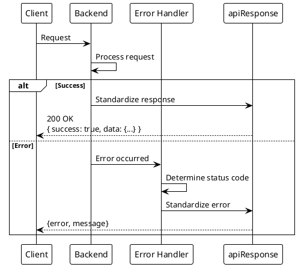
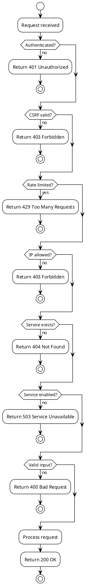

# Error Codes

> [!abstract] Overview
> Standard error responses and HTTP status codes used across the Watchman API.

## HTTP Status Codes

| Code  | Meaning               | When Used                              |
| ----- | --------------------- | -------------------------------------- |
| `200` | OK                    | Successful request                     |
| `400` | Bad Request           | Invalid input, missing required fields |
| `401` | Unauthorized          | Missing or invalid authentication      |
| `403` | Forbidden             | Authenticated but not authorized       |
| `404` | Not Found             | Service or endpoint not found          |
| `405` | Method Not Allowed    | Wrong HTTP method                      |
| `429` | Too Many Requests     | Rate limit exceeded                    |
| `500` | Internal Server Error | Unexpected server error                |
| `501` | Not Implemented       | Endpoint not implemented               |
| `503` | Service Unavailable   | Service not configured/enabled         |

## Error Response Format

Standardized via `apiResponse.js` middleware:

```json
{
  "error": "User-friendly error message",
  "message": "Technical details (development only)"
}
```

## Common Error Responses

### Authentication Errors

| Endpoint          | Status | Response                                 |
| ----------------- | ------ | ---------------------------------------- |
| `/api/auth/login` | 401    | `{ "message": "Invalid credentials" }`   |
| Protected route   | 401    | `{ "error": "Authentication required" }` |
| CSRF failure      | 403    | `{ "error": "Invalid CSRF token" }`      |

### Service Errors

| Condition              | Status | Response                                                    |
| ---------------------- | ------ | ----------------------------------------------------------- |
| Service not found      | 404    | `{ "error": "Service 'X' not found", "status": "offline" }` |
| Service not configured | 503    | `{ "error": "Service not configured" }`                     |
| Service not enabled    | 400    | `{ "error": "Service not enabled" }`                        |
| Health check failed    | 200    | `{ "status": "offline", "error": "Connection failed" }`     |

### Rate Limiting

| Condition           | Status | Response                           |
| ------------------- | ------ | ---------------------------------- |
| Rate limit exceeded | 429    | `{ "error": "Too many requests" }` |

### Validation Errors

| Condition              | Status | Response                                   |
| ---------------------- | ------ | ------------------------------------------ |
| Missing required field | 400    | `{ "error": "Missing required field: X" }` |
| Invalid service ID     | 400    | `{ "error": "Invalid service id: X" }`     |
| Invalid input type     | 400    | `{ "error": "X must be a Y" }`             |

### Security Errors

| Condition          | Status | Response                                         |
| ------------------ | ------ | ------------------------------------------------ |
| IP not whitelisted | 403    | `{ "error": "IP not allowed" }`                  |
| Account locked     | 429    | `{ "error": "Account locked, try again later" }` |
| CORS violation     | 403    | `{ "error": "Origin not allowed" }`              |

## Related

- [[docs/api/index|API Documentation]]
- [[docs/security/index|Security]]

## PlantUML Diagrams

### Error Response Flow



### Error Code Decision Tree


