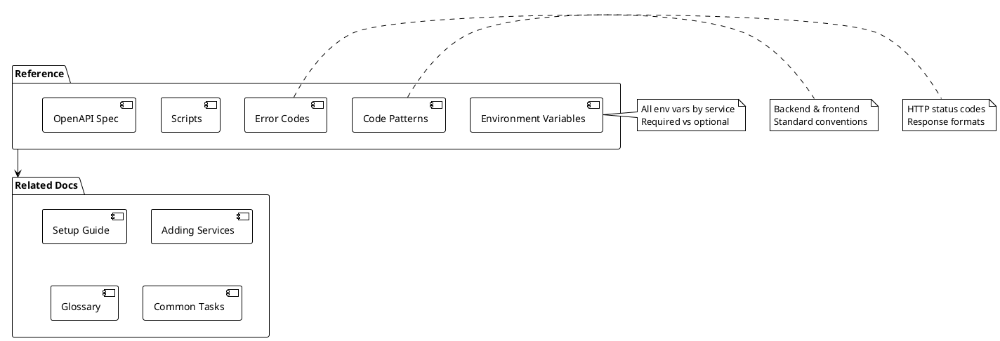

# Reference

> [!abstract] Overview
> Quick-reference documentation for developers working with the Watchman codebase. These docs provide at-a-glance information for configuration, commands, patterns, and error handling.

## Reference Index

```dataview
TABLE WITHOUT ID file.link AS "Reference", date AS "Updated", tags AS "Tags"
FROM "docs/reference"
WHERE type = "reference"
SORT file.name ASC
```

## Configuration

| Document                               | Description             |
| -------------------------------------- | ----------------------- | --------------------------------------------- |
| [[docs/reference/environment-variables | Environment Variables]] | Complete reference of all env vars by service |
| [[docs/reference/scripts               | Scripts Reference]]     | All npm scripts and commands                  |

## Development

| Document                           | Description         |
| ---------------------------------- | ------------------- | --------------------------------------------------- |
| [[docs/reference/code-patterns     | Code Patterns]]     | Standard patterns for backend and frontend          |
| [[docs/reference/error-codes       | Error Codes]]       | HTTP status codes and error response formats        |
| [[docs/reference/openapi-spec      | OpenAPI Spec]]      | How to read and extend the OpenAPI spec             |
| [[docs/reference/backend-utilities | Backend Utilities]] | Utility modules (circuit breaker, validation, etc.) |

## Quick Links

- **Backend Entry**: [[apps/backend/src/index.ts]]
- **HTTP Transport**: [[apps/backend/src/transport/http/server.ts]]
- **WebSocket Transport**: [[apps/backend/src/transport/ws/wsPlugin.ts]]
- **Service Registry**: [[apps/backend/src/domain/ServiceRegistry.ts]]
- **Base Service**: [[apps/backend/src/domain/BaseService.ts]]
- **Config Store**: [[apps/backend/src/config/store/ConfigStore.ts]]
- **Background Poller**: `apps/backend/src/infra/scheduler/BackgroundPoller.ts`
- **Frontend Entry**: [[apps/frontend/src/main.tsx]]
- **OpenAPI Spec**: [[apps/backend/openapi.yaml]]

## Related

- [[docs/guides/setup|Setup Guide]]
- [[docs/guides/adding-services|Adding Services Guide]]
- [[docs/glossary.md|Glossary]]
- [[docs/common-tasks.md|Common Tasks]]

## PlantUML Diagrams

### Reference Documentation Map


