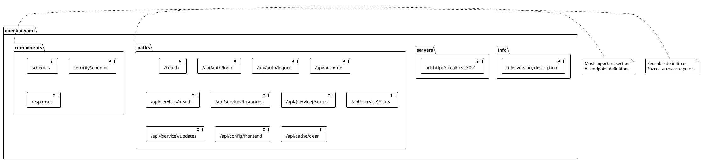
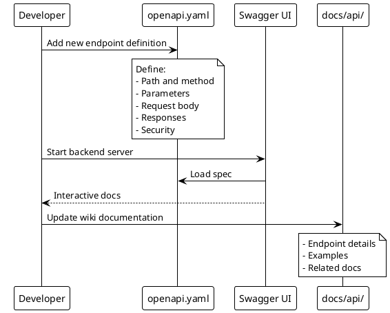

# OpenAPI Specification

> [!abstract] Overview
> Watchman uses **OpenAPI 3.0** (formerly known as Swagger) to document its REST API. This reference explains how to read the spec, use the interactive documentation, and extend it when adding new endpoints.

## Spec Location

| File          | Path                           | Description                        |
| ------------- | ------------------------------ | ---------------------------------- |
| **Main Spec** | [[apps/backend/openapi.yaml]]  | Complete OpenAPI 3.0 specification |
| **Symlink**   | [[apps/backend/api-docs.yaml]] | Symlink for easy access            |

## Interactive Documentation

When the backend is running, access the interactive Swagger UI:

```
http://localhost:3001/api/docs
```

This provides:

- Interactive API testing
- Request/response examples
- Schema documentation
- Authentication configuration

## Spec Structure

### OpenAPI Document Sections

```yaml
openapi: 3.0.3
info: # API metadata
  title: Watchman API
  version: 1.0.0
  description: ...

servers: # Server URLs
  - url: http://localhost:3001

paths: # API endpoints (THE MOST IMPORTANT SECTION)
  /health:
    get: ...
  /api/auth/login:
    post: ...

components: # Reusable schemas
  schemas: ...
  securitySchemes: ...

security: # Global security requirements
  - bearerAuth: []
```

## Reading the Spec

### Path Item Object

Each path in `paths` defines endpoints:

```yaml
paths:
  /health: # The URL path
    get: # HTTP method
      summary: ... # Short description
      operationId: ... # Unique identifier
      responses: ... # Response definitions
```

### Operation Object

```yaml
get:
  summary: Backend health check
  description: |
    Returns the health status of the backend server.
    Does not require authentication.
  tags: [Health]
  parameters: [] # Query/path parameters
  responses: # Possible responses
    "200":
      description: Server is healthy
      content:
        application/json:
          schema:
            $ref: "#/components/schemas/HealthResponse"
```

### Schema Object

Define request/response body structures:

```yaml
components:
  schemas:
    ServiceStatus:
      type: object
      properties:
        status:
          type: string
          enum: [online, offline, degraded]
        timestamp:
          type: string
          format: date-time
        service:
          type: string
```

## Adding New Endpoints

When adding a new API endpoint:

### 1. Define the Path

```yaml
paths:
  /api/new-service/status:
    get:
      summary: Get service status
      tags: [Services]
      responses:
        "200":
          description: Service status
          content:
            application/json:
              schema:
                $ref: "#/components/schemas/ServiceStatus"
```

### 2. Add Schema

```yaml
components:
  schemas:
    ServiceStatus:
      type: object
      required:
        - status
        - timestamp
      properties:
        status:
          type: string
          enum: [online, offline]
        timestamp:
          type: string
          format: date-time
```

### 3. Add Security (if needed)

```yaml
paths:
  /api/new-service/stats:
    get:
      # ... other fields
      security:
        - bearerAuth: []
```

### 4. Document in Wiki

Create or update API doc in `docs/api/`:

```markdown
### New Service

| Endpoint                  | Method | Description    | Auth |
| ------------------------- | ------ | -------------- | ---- |
| `/api/new-service/status` | GET    | Service status | No   |
| `/api/new-service/stats`  | GET    | Service stats  | Yes  |
```

## Common Patterns

### Authentication

JWT authentication is defined globally:

```yaml
components:
  securitySchemes:
    bearerAuth:
      type: http
      scheme: bearer
      bearerFormat: JWT
```

Endpoints requiring auth add:

```yaml
security:
  - bearerAuth: []
```

### Rate Limiting

Document in the endpoint description:

```yaml
get:
  summary: Get service health
  description: |
    Rate limit: 100 requests per 15 minutes per IP
  responses: ...
```

### Error Responses

Standard error schema:

```yaml
components:
  schemas:
    Error:
      type: object
      properties:
        success:
          type: boolean
          example: false
        error:
          type: object
          properties:
            code:
              type: string
            message:
              type: string
            statusCode:
              type: integer
```

### Multi-Instance Paths

Use path parameters for dynamic paths:

```yaml
paths:
  /api/{serviceId}/status:
    get:
      parameters:
        - name: serviceId
          in: path
          required: true
          schema:
            type: string
            pattern: '^\\w+_\\d+$' # e.g., qbittorrent_1
          example: qbittorrent_1
```

## Tools

### Validation

```bash
# Validate spec (requires OpenAPI CLI)
npx @redocly/cli lint openapi.yaml
```

### Code Generation

Generate client SDKs:

```bash
# Generate TypeScript client
npx openapi-generator generate -i openapi.yaml -g typescript-axios -o ./generated

# Generate Python client
npx openapi-generator generate -i openapi.yaml -g python -o ./generated
```

### Import to Postman

1. Open `http://localhost:3001/api/docs`
2. Click "Export" → "OpenAPI v3"
3. Import into Postman

## Related

- [[docs/api/index|API Documentation]]
- [[apps/backend/openapi.yaml|OpenAPI Spec (Code)]]
- [[docs/reference/error-codes|Error Codes]]
- [[docs/guides/adding-services|Adding Services Guide]]

## PlantUML Diagrams

### OpenAPI Spec Structure



### Spec to Documentation Flow


