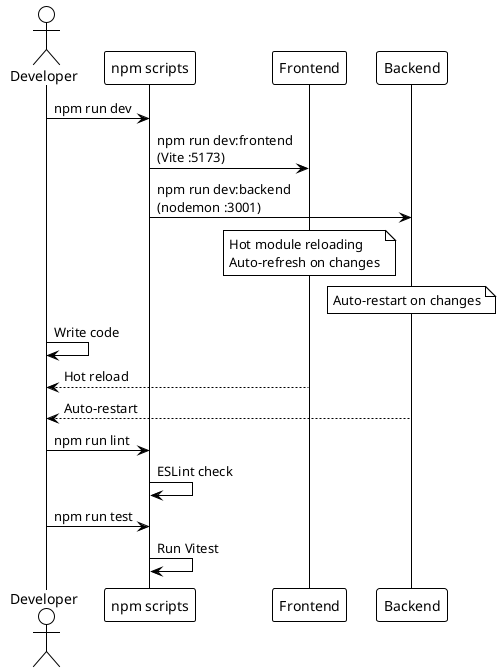
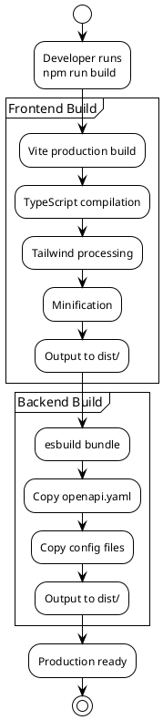

# Scripts Reference

> [!abstract] Overview
> All available npm scripts for the Watchman project.

## Root Scripts

### Development

| Command                  | Description                                 |
| ------------------------ | ------------------------------------------- |
| `npm run dev`            | Start frontend + backend concurrently       |
| `npm run dev:frontend`   | Start frontend only (Vite on 5173)          |
| `npm run dev:backend`    | Start backend only (Fastify on 3001)        |
| `npm run backend`        | Alias of `dev:backend`                      |

### Building

| Command                  | Description                                  |
| ------------------------ | -------------------------------------------- |
| `npm run build`          | Build frontend + backend                     |
| `npm run build:frontend` | Build frontend only                          |
| `npm run build:backend`  | Build backend only                           |
| `npm run build:dev`      | Dev-mode frontend build                      |
| `npm run preview`        | Preview production frontend build            |
| `npm run dist`           | Build + package Electron app for distribution |
| `npm run clean`          | Remove all `node_modules`, `dist`, `out`     |

### Production (self-host)

| Command                  | Description                              |
| ------------------------ | ---------------------------------------- |
| `npm run start`          | Start production backend + preview       |
| `npm run start:backend`  | Production backend only                  |
| `npm run start:frontend` | Frontend preview only                    |

### Linting & Formatting

| Command                  | Description                              |
| ------------------------ | ---------------------------------------- |
| `npm run lint`           | Frontend ESLint                          |
| `npm run lint:frontend`  | Frontend ESLint (explicit alias)         |
| `npm run lint:backend`   | Backend ESLint                           |
| `npm run lint:fix`       | Autofix across workspaces                |
| `npm run format`         | Prettier format across workspaces        |
| `npm run format:check`   | Prettier check across workspaces         |
| `npm run typecheck`      | tsc across backend + frontend            |

### Testing

| Command                  | Description                                  |
| ------------------------ | -------------------------------------------- |
| `npm run test`           | Backend Vitest suite                         |
| `npm run test:frontend`  | Frontend Vitest suite                        |
| `npm run test:all`       | Backend + frontend tests (concurrent)        |
| `npm run test:coverage`  | Frontend coverage report                     |
| `npm run test:watch`     | Backend Vitest in watch mode                 |
| `npm run test:e2e`       | Playwright e2e suite                         |
| `npm run test:e2e:visual` | Playwright with snapshot updates            |

### Electron (desktop app)

| Command                  | Description                                  |
| ------------------------ | -------------------------------------------- |
| `npm run electron:dev`   | Desktop dev mode (`NODE_ENV=development`)    |
| `npm run electron:prod`  | Desktop production mode (built artifacts)    |
| `npm run electron:clean` | Clean install, rebuild, launch               |

### Types

| Command                  | Description                                                 |
| ------------------------ | ----------------------------------------------------------- |
| `npm run generate:types` | Regenerate TypeScript types from `apps/backend/openapi.yaml` |

### Desktop (`apps/desktop`)

| Command                 | Description                    |
| ----------------------- | ------------------------------ |
| `npm run dev`           | Start Electron app (dev mode)  |
| `npm run start`         | Start packaged Electron app    |
| `npm run build`         | Build app for packaging        |
| `npm run package`       | Package for all platforms      |
| `npm run clean`         | Clean build artifacts          |

## Workspace Scripts

### Frontend (`apps/frontend`)

| Command                 | Description              |
| ----------------------- | ------------------------ |
| `npm run dev`           | Start Vite dev server    |
| `npm run build`         | Production build         |
| `npm run preview`       | Preview production build |
| `npm run lint`          | ESLint check             |
| `npm run lint:fix`      | Fix ESLint issues        |
| `npm run format`        | Prettier format          |
| `npm run format:check`  | Check formatting         |
| `npm run test`          | Run Vitest tests         |
| `npm run test:coverage` | Run Vitest with coverage |

### Backend (`apps/backend`)

| Command                | Description                    |
| ---------------------- | ------------------------------ |
| `npm run dev`          | Start with nodemon/auto-reload |
| `npm run start`        | Start production server        |
| `npm run build`        | Build for production           |
| `npm run lint`         | ESLint check                   |
| `npm run lint:fix`     | Fix ESLint issues              |
| `npm run format`       | Prettier format                |
| `npm run format:check` | Check formatting               |

## Related

- [[docs/guides/setup|Setup Guide]]
- [[docs/guides/deployment|Deployment Guide]]

## PlantUML Diagrams

### Development Lifecycle

### Build Pipeline

