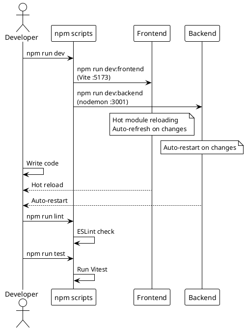
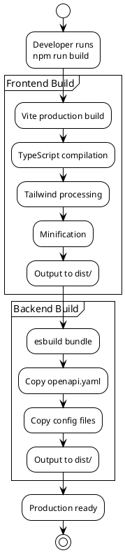

# Scripts Reference

> [!abstract] Overview
> All available npm scripts for the Watchman project.

## Root Scripts

| Command                  | Description                           |
| ------------------------ | ------------------------------------- |
| `npm run dev`            | Start frontend + backend concurrently |
| `npm run dev:frontend`   | Start frontend only (Vite on 5173)    |
| `npm run dev:backend`    | Start backend only (Express on 3001)  |
| `npm run start`          | Start both + open browser             |
| `npm run start:frontend` | Start frontend in production mode     |
| `npm run start:backend`  | Start backend in production mode      |
| `npm run build`          | Build frontend + backend              |
| `npm run build:frontend` | Build frontend only                   |
| `npm run build:backend`  | Build backend only                    |
| `npm run lint`           | Lint all workspaces                   |
| `npm run lint:fix`       | Fix lint issues in all workspaces     |
| `npm run format`         | Format code with Prettier             |
| `npm run format:check`   | Check formatting                      |
| `npm run test`           | Run tests in all workspaces           |
| `npm run clean`          | Remove all node_modules               |
| `npm run setup`          | Install dependencies                  |

## Workspace Scripts

### Frontend (`apps/frontend`)

| Command                 | Description              |
| ----------------------- | ------------------------ |
| `npm run dev`           | Start Vite dev server    |
| `npm run build`         | Production build         |
| `npm run preview`       | Preview production build |
| `npm run lint`          | ESLint check             |
| `npm run lint:fix`      | Fix ESLint issues        |
| `npm run format`        | Prettier format          |
| `npm run format:check`  | Check formatting         |
| `npm run test`          | Run Vitest tests         |
| `npm run test:coverage` | Run Vitest with coverage |

### Backend (`apps/backend`)

| Command                | Description                    |
| ---------------------- | ------------------------------ |
| `npm run dev`          | Start with nodemon/auto-reload |
| `npm run start`        | Start production server        |
| `npm run build`        | Build for production           |
| `npm run lint`         | ESLint check                   |
| `npm run lint:fix`     | Fix ESLint issues              |
| `npm run format`       | Prettier format                |
| `npm run format:check` | Check formatting               |

## Related

- [[docs/guides/setup|Setup Guide]]
- [[docs/guides/deployment|Deployment Guide]]

## PlantUML Diagrams

### Development Lifecycle

### Build Pipeline

