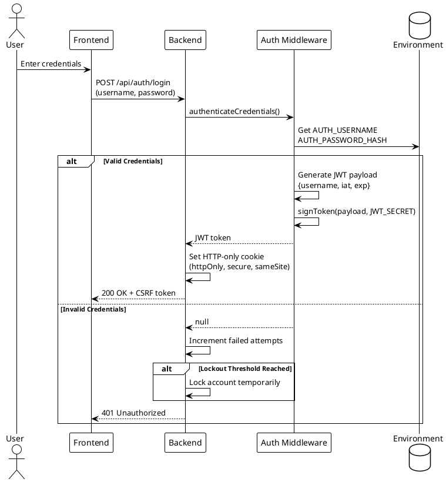
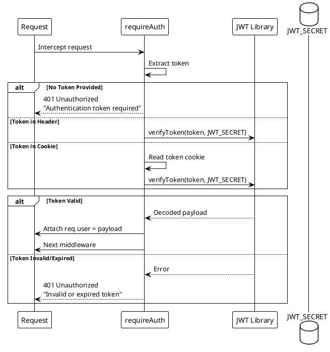
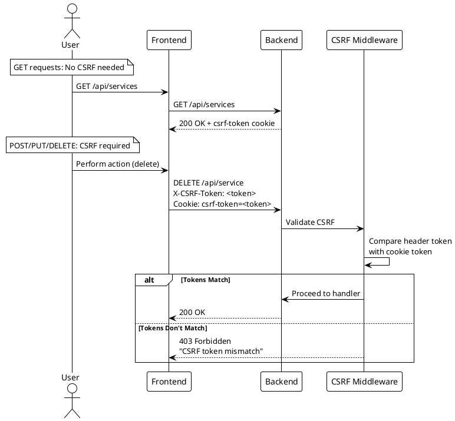

# Auth Middleware (Superseded)

> [!danger] Superseded — No Longer Implemented
> This document describes the **historical** `auth.js` middleware that handled JWT generation, verification, and credential checks. As of v2.3, the entire auth layer has been removed. See [[docs/adr/017-remove-authentication-frontend-v2-migration|ADR-017]]. The files, environment variables (`JWT_SECRET`, `AUTH_USERNAME`, `AUTH_PASSWORD_HASH`), and middleware described below no longer exist. Content retained for archival reference only.

> [!abstract] Historical Overview
> The auth middleware previously handled JWT token generation, verification, and credential authentication. It provided the core authentication layer for the Watchman API.

## Files

- `apps/backend/middleware/auth.js` - Main authentication middleware

## Core Functions

### Token Management

| Function                   | Description                                        |
| -------------------------- | -------------------------------------------------- |
| `signToken(payload, opts)` | Generate a signed JWT with configurable expiration |
| `verifyToken(token)`       | Verify and decode a JWT, returns null on failure   |

### Credential Authentication

| Function                                      | Description                                           |
| --------------------------------------------- | ----------------------------------------------------- |
| `authenticateCredentials(username, password)` | Validate username/password against environment config |

## Token Configuration

```javascript
// Token signing options
jwt.sign(payload, JWT_SECRET, {
  expiresIn: "15m", // 15 minute expiration
  algorithm: "HS256", // Explicit algorithm
});
```

| Setting    | Value                     |
| ---------- | ------------------------- |
| Algorithm  | HS256                     |
| Expiration | 15 minutes                |
| Secret     | `JWT_SECRET` env variable |

## Middleware: requireAuth

The `requireAuth` middleware protects API endpoints:

```javascript
import { requireAuth } from "./middleware/auth.js";

app.get("/api/protected", requireAuth, (req, res) => {
  // req.user contains decoded token payload
  res.json({ user: req.user });
});
```

### Flow

```
Request → requireAuth middleware
  ↓
Extract token from:
  1. Authorization: Bearer <token>
  2. Cookie: token=<token>
  ↓
Verify token with JWT_SECRET
  ↓
Attach user to req.user
  ↓
Next middleware
```

### Response on Failure

```json
// Missing token
{
  "error": "Unauthorized",
  "message": "Authentication token required"
}

// Invalid/expired token
{
  "error": "Unauthorized",
  "message": "Invalid or expired token"
}
```

## Credential Authentication

```javascript
const user = await authenticateCredentials(username, password);
if (user) {
  // Valid credentials
}
```

### Security Features

- **Timing attack prevention**: Always performs bcrypt compare (even on invalid username)
- **Input validation**: Rejects non-string input, limits length (128/256 chars)
- **Single user**: Uses `AUTH_USERNAME` and `AUTH_PASSWORD_HASH` from environment

## Environment Variables

| Variable             | Description                                            |
| -------------------- | ------------------------------------------------------ |
| `JWT_SECRET`         | Secret key for signing JWTs (min 32 chars recommended) |
| `AUTH_USERNAME`      | Admin username                                         |
| `AUTH_PASSWORD_HASH` | bcrypt hash of admin password                          |

## Coverage Notes

- `requireAuth` and credential error-path behavior are covered in `apps/backend/tests/authMiddleware.test.js`, including the bcrypt failure branch.
- `requireAuth` decoded-token handling now explicitly covers payloads without `iat` in `apps/backend/tests/authMiddleware.test.js` (`req.user.tokenIssuedAt` stays `undefined`).
- Token extraction/verification edge cases are covered in `apps/backend/tests/authToken.test.js`, including non-object request handling and empty-key cookie parsing behavior.
- CSRF validation edge cases for state-changing requests are covered in `apps/backend/tests/csrf.test.js`, including mismatched-length token rejection and production cookie options (`secure=true`, `sameSite='strict'`).

## PlantUML Diagrams

### JWT Token Flow



### requireAuth Middleware Flow



### CSRF Protection Flow



## Related

- [[docs/security/authentication|Authentication Overview]]
- CSRF Middleware
- `apps/backend/server.js`
