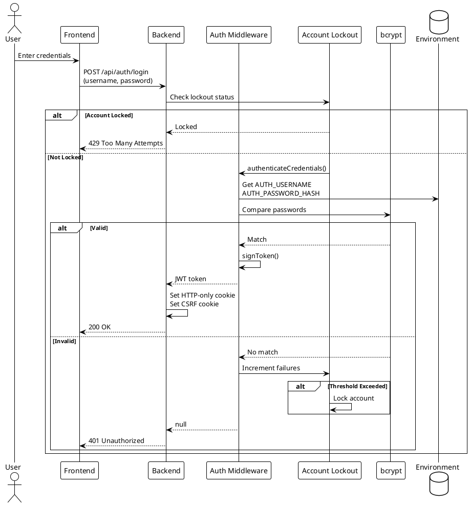
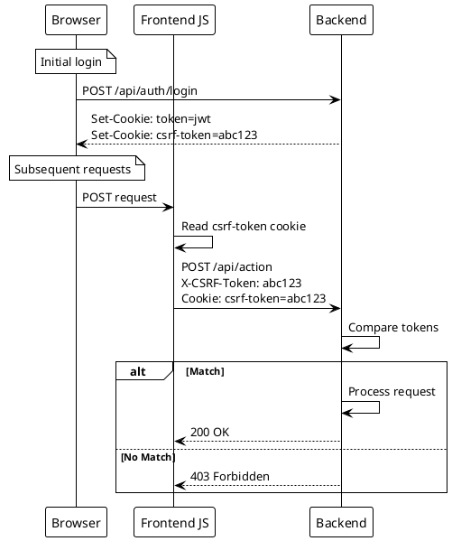
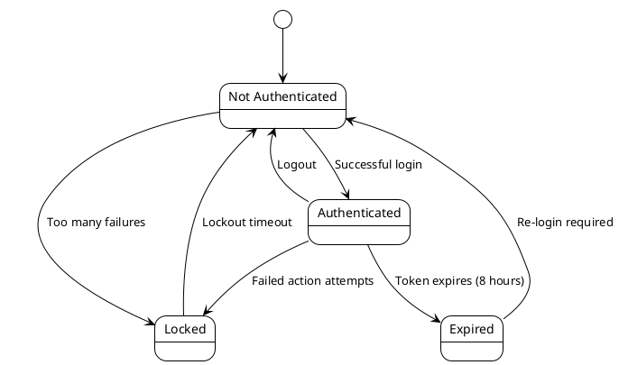

# Authentication

> [!abstract] Overview
> Watchman uses JWT-based authentication with HTTP-only cookies and CSRF protection via the double-submit cookie pattern.

## Authentication Flow

### Login

```
POST /api/auth/login
Body: { username, password }
→ Check account lockout
→ Validate credentials (bcrypt)
→ Generate JWT access token
→ Set HTTP-only cookie
→ Issue CSRF token cookie
→ Return user info
```

### Session Check

```
GET /api/auth/me
→ Check Authorization header or cookie
→ Verify JWT token
→ Return authenticated status
→ Refresh CSRF token
```

### Logout

```
POST /api/auth/logout
→ Clear JWT cookie
→ Clear CSRF cookie
```

## JWT Configuration

| Setting     | Value                                      |
| ----------- | ------------------------------------------ |
| Token type  | Access token                               |
| Cookie name | `token`                                    |
| HttpOnly    | `true`                                     |
| Secure      | `true` (production)                        |
| SameSite    | `strict` (production), `lax` (development) |
| Max Age     | 8 hours                                    |
| Domain      | Derived from FRONTEND_URL                  |

## CSRF Protection

Uses double-submit cookie pattern:

1. Server issues CSRF token as accessible cookie
2. Client reads token and sends in request header
3. Server verifies cookie value matches header value

### Middleware

[[apps/backend/middleware/csrf.js|csrf.js]]:

- `issueCsrfToken(res)` - Generate and set CSRF cookie
- `verifyCsrf` - Middleware to verify CSRF token

## Account Lockout

[[apps/backend/middleware/accountLockout.js|accountLockout.js]]:

- Tracks failed login attempts per username/IP
- Locks account after threshold exceeded
- Prevents brute force attacks

## Password Storage

- bcrypt hashing with configurable cost factor
- Hash comparison on login
- Passwords never stored in plaintext

## Protected Routes

Most API endpoints require authentication via `requireAuth` middleware:

- Stats endpoints
- Control/action endpoints
- Cache management
- Security administration

## Related

- [[docs/security/rate-limiting|Rate Limiting]]
- [[docs/security/ip-control|IP Control]]
- [[docs/architecture/data-flow|Data Flow]]

## PlantUML Diagrams

### Complete Authentication Flow



### CSRF Double-Submit Pattern



### Session Lifecycle


