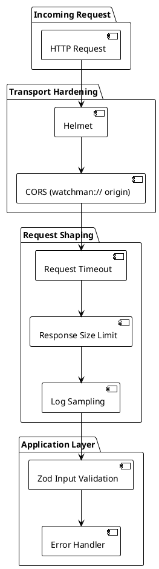

# Security

> [!abstract] Overview
> Watchman is a single-user home-lab application. Built-in authentication has been removed (see [[docs/adr/017-remove-authentication-frontend-v2-migration|ADR-017]]). Security relies on network isolation: firewall rules, VPN, or deployment on a closed local network. In split-deploy mode (Pi backend + Mac client), the backend and client communicate over LAN without TLS; firewall rules and DHCP isolation are critical (see [[docs/adr/018-split-deploy-pi-backend|ADR-018]]).
>
> The security documentation below is **for reference only** and documents the network isolation responsibility, not built-in auth mechanisms.

## Security Index

```dataview
TABLE WITHOUT ID file.link AS "Document", date AS "Date", status AS "Status"
FROM "docs/security"
WHERE type = "security"
SORT file.name ASC
```

## Security Approach (Single-User, No Built-In Auth)

| Responsibility   | Mechanism                      | Notes |
| --- | --- | --- |
| **Network Isolation** | Firewall / VPN / Closed LAN | Operator's responsibility; no port forwarding to internet |
| Input Validation | Parameter sanitization and Zod validation | All user inputs validated before processing |
| Headers          | Helmet, CSP, HSTS (via Fastify) | Standard security headers applied |
| Logging          | Structured Pino logging with sensitive field redaction | Audit trail for configuration changes |

> [!warning] No Built-In Authentication
> Watchman **does not** have authentication, CSRF protection, rate-limiting middleware, or account lockout. Ensure network isolation before running Watchman. See [[docs/adr/017-remove-authentication-frontend-v2-migration|ADR-017]] for design rationale.

## Security Features

- **Input Validation** - Zod schema validation and type checking on all endpoints
- **Security Headers** - Helmet, CSP, HSTS, Permissions-Policy (via Fastify)
- **CORS Restrictions** - Origin-validated CORS configured via `FRONTEND_URL`
- **Request Timeout** - Global timeout prevents hanging requests
- **Response Size Limit** - Prevents large response DoS
- **Command Injection Prevention** - Strict validation for SSH/SNMP/ARP commands
- **Structured Logging** - PII redaction in Pino logs, configuration audit trail
- **Master Key Protection** - AES-256-GCM encryption of service secrets at rest
- **No Network Exposure** - Intended for trusted networks only (operator's responsibility)

## Production Hardening

See [[docs/guides/deployment|Deployment Guide]] for production security checklist.

## Authentication (Removed as of v2.3)

As of v2.3, all built-in authentication has been removed:
- Deleted `useAuth` hook, AuthGuard component, and Login page
- Removed JWT token generation, CSRF validation, and rate-limiting middleware
- Removed `AUTH_USERNAME` and `AUTH_PASSWORD_HASH` environment variables

See [[docs/adr/017-remove-authentication-frontend-v2-migration|ADR-017]] for design rationale.

**Security is now the operator's responsibility:** Use firewall rules, VPN, or deployment on a closed local network to prevent unauthorized access.

## LAN-Only Communication (Split Deploy)

When running in split-deploy mode (Electron client paired with Raspberry Pi backend):

- All API calls from Mac to Pi travel over LAN HTTP without TLS
- Configuration secrets are encrypted at rest on the Pi with AES-256-GCM
- Network isolation (VPN, firewall, closed Wi-Fi) prevents unauthorized access
- No support for internet-facing deployments; this is a strict LAN-only mode
- Operator must reserve a DHCP lease or use static IP for the Pi to keep the URL stable

See [[docs/adr/018-split-deploy-pi-backend|ADR-018]] and [[docs/guides/deploying-to-raspberry-pi|Pi Deploy Guide]] for setup guidance.

## Related

- [[docs/adr/017-remove-authentication-frontend-v2-migration|ADR-017]] — Single-user, no authentication
- [[docs/adr/018-split-deploy-pi-backend|ADR-018]] — Split deploy LAN architecture
- [[docs/architecture/index|Architecture]]
- [[docs/guides/deployment|Deployment Guide]]
- [[docs/guides/deploying-to-raspberry-pi|Pi Deploy Guide]]

## PlantUML Diagrams

### Request Pipeline (Single-User, No Auth)



> Historical multi-layer JWT/CSRF/rate-limit/IP-control diagrams were removed in v2.3 per [[docs/adr/017-remove-authentication-frontend-v2-migration|ADR-017]]. See [[docs/security/authentication|Authentication (Superseded)]] for archived flow diagrams.
