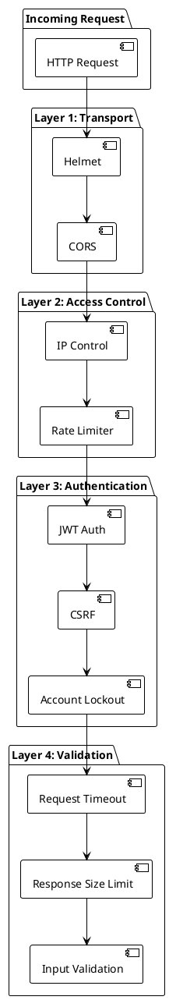
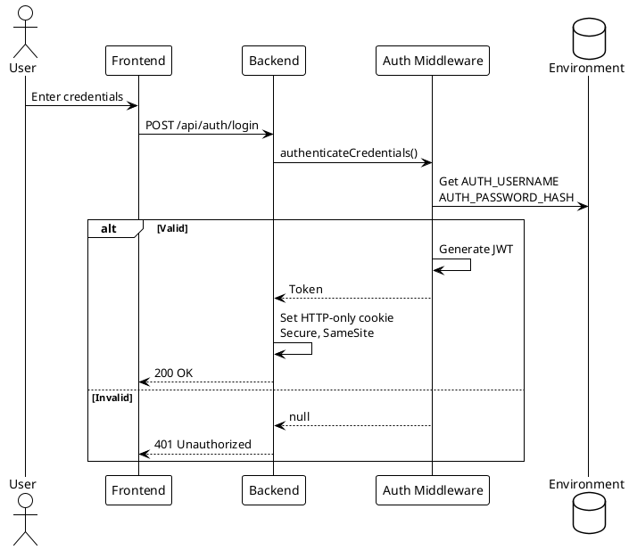
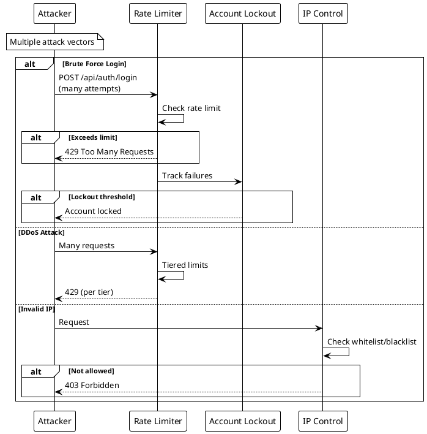

# Security

> [!abstract] Overview
> Watchman implements defense-in-depth security with multiple layers of protection.

## Security Index

```dataview
TABLE WITHOUT ID file.link AS "Document", date AS "Date", status AS "Status"
FROM "docs/security"
WHERE type = "security"
SORT file.name ASC
```

## Security Layers

| Layer            | Documentation                   | Description       |
| ---------------- | ------------------------------- | ----------------- | --------------------------------------- |
| Authentication   | [[docs/security/authentication  | Authentication]]  | JWT, cookies, CSRF protection           |
| Auth Middleware  | [[docs/security/auth-middleware | Auth Middleware]] | Token management, credential validation |
| Rate Limiting    | [[docs/security/rate-limiting   | Rate Limiting]]   | Tiered request throttling               |
| IP Control       | [[docs/security/ip-control      | IP Control]]      | Whitelist/blacklist enforcement         |
| Headers          | [[docs/architecture/index       | Architecture]]    | Helmet, CSP, HSTS                       |
| Input Validation | [[docs/reference/code-patterns  | Code Patterns]]   | Sanitization and validation             |
| Logging          | [[docs/LOGGING                  | Logging]]         | Structured audit logging                |

## Security Features

- **JWT Authentication** - HTTP-only cookies with secure flags
- **CSRF Protection** - Double-submit cookie pattern
- **Rate Limiting** - Per-IP, per-endpoint tiered limits
- **IP Control** - Whitelist/blacklist for sensitive endpoints
- **Account Lockout** - Failed login tracking and lockout
- **Input Validation** - Parameter sanitization and type checking
- **Security Headers** - Helmet, CSP, HSTS, Permissions-Policy
- **CORS Restrictions** - Origin-validated CORS in production
- **Request Timeout** - Global timeout prevents hanging requests
- **Response Size Limit** - Prevents large response DoS
- **Command Injection Prevention** - Strict validation for SSH/ARP commands
- **Structured Logging** - PII redaction, audit trails

## Production Hardening

See [[docs/guides/deployment|Deployment Guide]] for production security checklist.

## Recent Auth/CSRF Test Coverage

- Frontend auth and route-protection tests: [[apps/frontend/src/hooks/useAuth.test.tsx]] (+11), [[apps/frontend/src/components/AuthGuard.test.tsx]] (+3), [[apps/frontend/src/pages/Login.test.tsx]] (+7)
  - includes auth bootstrap fallback username, bootstrap payload-error handling, login/logout success paths, logout/login failure paths, outside-provider throw behavior, and non-`Error` network fallback assertions
  - includes login page redirect, missing-credentials validation, remember-me success, failed login rendering, default fallback message, auth-context error rendering, and loading/disabled submit coverage
- Frontend CSRF utility coverage: [[apps/frontend/src/lib/csrf.test.ts]] (+6)
  - includes token header injection, cookie-read exception logging, `hasToken()` absent-token false-path, missing-token no-header behavior, empty config fallback, and custom cookie/header config token injection
- Frontend API auth-adjacent endpoint coverage: [[apps/frontend/src/services/apiClient/endpoints.test.ts]] (expanded 3 → 8 tests)
  - includes login fallback token handling and endpoint composition edge cases
- Backend auth/csrf edge-branch coverage: [[apps/backend/tests/authMiddleware.test.js]], [[apps/backend/tests/authToken.test.js]], [[apps/backend/tests/csrf.test.js]]
  - auth and csrf middleware now report **100% line coverage**
  - backend suite status: **81/81 tests passing**

## Related

- [[docs/architecture/index|Architecture]]
- [[docs/guides/deployment|Deployment Guide]]

## PlantUML Diagrams

### Security Layers Overview



### Authentication Flow



### Attack Prevention


