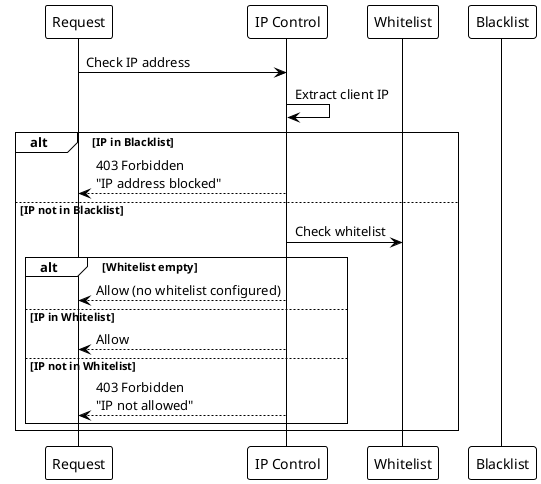
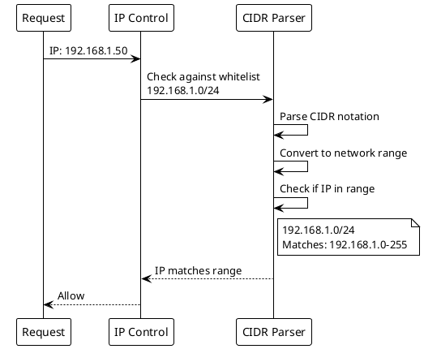

# IP Control

> [!abstract] Overview
> Watchman supports IP-based access control through whitelists and blacklists for sensitive endpoints.

## Implementation

[[apps/backend/middleware/ipControl.js|ipControl.js]]
[[apps/backend/utils/ip.js|ip.js]]

### Middleware Functions

| Function               | Purpose                                    |
| ---------------------- | ------------------------------------------ |
| `requireWhitelistedIP` | Blocks requests from non-whitelisted IPs   |
| `enforceIPControl`     | Applies both whitelist and blacklist rules |

### IP Normalization

- Request IP extraction now uses `getRequestIp(req)` from [[apps/backend/utils/ip.js]]
- Stored and compared whitelist/blacklist/temp-block entries are normalized through `normalizeIp(...)`
- Localhost detection for startup-safe behavior uses `isLocalhostIp(...)`
- Equivalent representations (for example `::ffff:127.0.0.1` and `127.0.0.1`) are treated as the same IP

## Configuration

IP control is configured via environment variables:

```bash
# Comma-separated list of allowed IPs
IP_WHITELIST=192.168.1.0/24,10.0.0.1

# Comma-separated list of blocked IPs
IP_BLACKLIST=192.168.1.100
```

## Usage

### Security Administration

Endpoints requiring IP whitelist:

- `GET /api/security/alerts`
- `GET /api/security/stats`

### General Enforcement

`enforceIPControl` middleware is applied early in the stack for all requests.

Middleware registration source: [[apps/backend/bootstrap/configureMiddleware.js]], invoked from [[apps/backend/server.js]].

## Related

- [[docs/security/index|Security]]
- [[docs/security/rate-limiting|Rate Limiting]]

## PlantUML Diagrams

### IP Control Flow



### CIDR Range Matching


