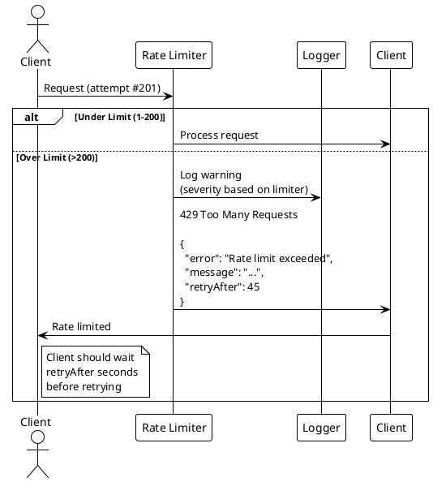

# Rate Limiting

> [!abstract] Overview
> Watchman implements tiered rate limiting to protect against abuse, brute force attacks, and DoS. Different endpoint categories have different limits based on their sensitivity and expected usage patterns.

## Implementation

[[apps/backend/middleware/rateLimiting.js|rateLimiting.js]] uses `express-rate-limit` with per-tier configurations:

| Limiter          | Window | Max Requests | Use For         | Bypass                        |
| ---------------- | ------ | ------------ | --------------- | ----------------------------- |
| `healthLimiter`  | 1 min  | 200          | Health checks   | localhost                     |
| `generalLimiter` | 1 min  | 100          | General API     | localhost + health User-Agent |
| `controlLimiter` | 5 min  | 10           | Service control | none                          |
| `authLimiter`    | 15 min | 10           | Auth endpoints  | none                          |

## Middleware Chain

Rate limiting is applied early in the middleware stack:

```
Request → healthLimiter / generalLimiter → Route-specific limiter → Auth → Other middleware
```

### Applied To

| Limiter          | Endpoints                                                        |
| ---------------- | ---------------------------------------------------------------- |
| `healthLimiter`  | `/health`                                                        |
| `generalLimiter` | `/api/services/*`, `/api/{service}/status`                       |
| `controlLimiter` | `/api/adguard/protection`, `/api/cache/clear`, `/api/router/arp` |
| `authLimiter`    | `/api/auth/login`                                                |

## Environment Variables

| Variable                 | Default | Description                          |
| ------------------------ | ------- | ------------------------------------ |
| `RATE_LIMIT_HEALTH_MAX`  | 200     | Max health check requests per window |
| `RATE_LIMIT_GENERAL_MAX` | 100     | Max general API requests per window  |
| `RATE_LIMIT_CONTROL_MAX` | 10      | Max control requests per window      |
| `RATE_LIMIT_AUTH_MAX`    | 10      | Max auth requests per window         |

## Response Format

When rate limit is exceeded:

```json
{
  "error": "Rate limit exceeded for {type} requests",
  "message": "Too many requests from this IP address. Please try again later.",
  "retryAfter": "{duration}",
  "timestamp": "2026-04-02T12:00:00.000Z",
  "type": "RATE_LIMIT_EXCEEDED"
}
```

## Security Features

### IP Detection

- Uses `req.ip` with fallback to `req.connection.remoteAddress`
- Works correctly behind proxies (with trusted proxy config)

### Bypass Logic

- **Health**: Localhost bypass for monitoring systems
- **General**: Localhost + valid User-Agent bypass for health checks
- **Control**: No bypass (always applied)
- **Auth**: No bypass (security critical)

### Logging

Each limiter logs when limits are reached:

- **General**: Warning log
- **Control**: Warning log with "potential abuse" flag
- **Auth**: Warning log with HIGH severity and "possible brute force" flag

## Related

- [[docs/security/index|Security Overview]]
- [[docs/security/authentication|Authentication]]
- [[docs/security/ip-control|IP Control]]

## PlantUML Diagrams

### Rate Limiter Architecture

```plantuml
@startuml
!theme plain

package "Request" as Req {
    [HTTP Request] as HTTP
    [Client IP] as IP
}

package "Rate Limiters" as Limiters {
    [healthLimiter] as HL
    [generalLimiter] as GL
    [controlLimiter] as CL
    [authLimiter] as AL
}

package "Configuration" as Config {
    [Config Store] as CFG
}

HTTP -> IP : Extract client IP

alt Health Check Request
    IP -> HL : Check rate limit
    HL -> CFG : Get health limit (200/min)
else General API Request
    IP -> GL : Check rate limit
    GL -> CFG : Get general limit (100/min)
else Control Request
    IP -> CL : Check rate limit
    CL -> CFG : Get control limit (10/5min)
else Auth Request
    IP -> AL : Check rate limit
    AL -> CFG : Get auth limit (10/15min)
end

alt Under Limit
    Limiters -> HTTP : Allow request
else Over Limit
    Limiters -> HTTP : 429 Too Many Requests\n(retryAfter header)
end
@enduml
```

### Rate Limit Window

```plantuml
@startuml
!theme plain

state "Time Window (sliding)" as Window {
    [*] --> T0 : Request

    state "0-60 seconds" as W1 {
        [*] --> R1 : Request 1
        R1 --> R2 : Request 2
        R2 --> R3 : Request 3
        R3 --> Rn : ...Request N
    }

    note right of W1
      Sliding window:
      Each request resets
      the full window timer
    end note

    T0 --> W1 : t=0
    W1 --> [*] : t>60s (window clears)
}

note over Window
  Example: healthLimiter
  Max 200 requests per 60s window
end note
@enduml
```

### Rate Limit Response Flow


