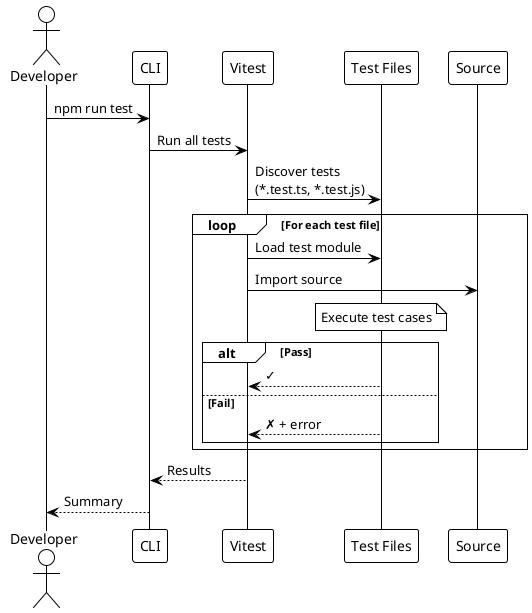

# Testing

> [!abstract] Overview
> Watchman uses **Vitest** as the unified test runner across the monorepo, with **@testing-library/react** for frontend component testing and jsdom for DOM simulation.

## Test Documentation

```dataview
TABLE WITHOUT ID file.link AS "Document", date AS "Date", status AS "Status"
FROM "docs/testing"
WHERE type != "index"
SORT file.name ASC
```

## Test Framework Stack

| Layer           | Tool                             | Purpose                                      |
| --------------- | -------------------------------- | -------------------------------------------- |
| Test Runner     | **Vitest** 3.2+                  | Unified test runner for frontend and backend |
| DOM Environment | **jsdom** 25+                    | Browser-like environment for frontend tests  |
| React Testing   | **@testing-library/react** 16+   | Component rendering and user interaction     |
| Assertions      | **Vitest expect**                | Jest-compatible assertions                   |
| Matchers        | **@testing-library/jest-dom** 6+ | DOM-specific assertions                      |

## Running Tests

```bash
# Run all tests in the monorepo
npm run test

# Frontend tests
npm run test --workspace=apps/frontend
npx vitest run                          # Run once (CI mode)
npx vitest                              # Watch mode

# Run specific test file
npx vitest run src/lib/utils.test.ts

# Run tests matching a pattern
npx vitest run --testNamePattern="testName"
```

## Testing Strategy

### Frontend

- **Component rendering** - Verify components render correctly with various props
- **Hook behavior** - Test custom hooks in isolation
- **User interaction flows** - Test clicks, form submissions, navigation
- **Error boundaries** - Verify error handling in component trees

### Backend

- **API endpoint testing** - Verify route behavior and response shapes
- **Service integration testing** - Test service class behavior with mocked HTTP
- **Middleware testing** - Verify auth, CSRF, rate limiting behavior
- **Authentication flow** - Test login, token validation, session management

## Test Structure

```
apps/frontend/
├── src/
│   ├── lib/
│   │   └── utils.test.ts              # Utility function tests
│   ├── components/
│   │   └── *.test.tsx                 # Component tests (to be added)
│   └── hooks/
│       └── *.test.ts                  # Hook tests (to be added)
apps/backend/
├── services/
│   └── *.test.js                      # Service tests (to be added)
├── middleware/
│   └── *.test.js                      # Middleware tests (to be added)
└── routes/
    └── *.test.js                      # Route tests (to be added)
```

## Coverage Status

| Area               | Status         | Notes                           |
| ------------------ | -------------- | ------------------------------- |
| Utility functions  | ✅ Covered     | `cn()` function tested          |
| React components   | ⚠️ Partial     | Service cards need tests        |
| Custom hooks       | ❌ Not covered | `useAuth`, `useWebSocket`, etc. |
| API client         | ❌ Not covered | `ApiClient.ts` needs tests      |
| Backend services   | ❌ Not covered | All service classes need tests  |
| Backend middleware | ❌ Not covered | Auth, CSRF, rate limiting       |
| Backend routes     | ❌ Not covered | API endpoints need tests        |

## Related

- [[docs/testing/testing-strategy|Testing Strategy and Patterns]]
- [[docs/guides/contributing|Contributing Guide]]
- [[docs/reference/scripts|Scripts Reference]]
- [[docs/reference/code-patterns|Code Patterns]]

## PlantUML Diagrams

### Test Pyramid

```plantuml
@startuml
!theme plain

skinparam rectangleBackgroundColor #FFFACD

rectangle "End-to-End Tests" as E2E {
    note right: Few, slow, comprehensive
}

rectangle "Integration Tests" as Int {
    note right: Medium count
}

rectangle "Unit Tests" as Unit {
    note right: Many, fast, focused
}

Unit --> Int : Integration
Int --> E2E : E2E

note right of Unit
  Vitest + jsdom
end note

note right of Int
  @testing-library/react
end note
@enduml
```

### Test Execution Flow


