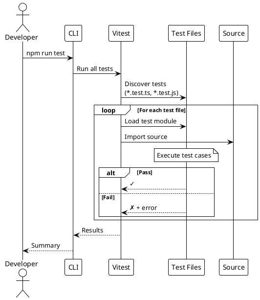

# Testing

> [!abstract] Overview
> Watchman uses **Vitest** as the unified test runner across the monorepo, with **@testing-library/react** for frontend component testing and jsdom for DOM simulation.

## Test Documentation

```dataview
TABLE WITHOUT ID file.link AS "Document", date AS "Date", status AS "Status"
FROM "docs/testing"
WHERE type != "index"
SORT file.name ASC
```

## Test Framework Stack

| Layer           | Tool                             | Purpose                                      |
| --------------- | -------------------------------- | -------------------------------------------- |
| Test Runner     | **Vitest** 3.2+                  | Unified test runner for frontend and backend |
| DOM Environment | **jsdom** 25+                    | Browser-like environment for frontend tests  |
| React Testing   | **@testing-library/react** 16+   | Component rendering and user interaction     |
| Assertions      | **Vitest expect**                | Jest-compatible assertions                   |
| Matchers        | **@testing-library/jest-dom** 6+ | DOM-specific assertions                      |

## Running Tests

```bash
# Run all tests in the monorepo
npm run test

# Frontend tests
npm run test --workspace=apps/frontend
npm run test:coverage --workspace=apps/frontend
npx vitest run                          # Run once (CI mode)
npx vitest                              # Watch mode

# Run specific test file
npx vitest run src/lib/utils.test.ts

# Run tests matching a pattern
npx vitest run --testNamePattern="testName"
```

## Testing Strategy

### Frontend

- **Component rendering** - Verify components render correctly with various props
- **Hook behavior** - Test custom hooks in isolation
- **User interaction flows** - Test clicks, form submissions, navigation
- **Error boundaries** - Verify error handling in component trees

### Backend

- **API endpoint testing** - Verify route behavior and response shapes
- **Service integration testing** - Test service class behavior with mocked HTTP
- **Middleware testing** - Verify auth, CSRF, rate limiting behavior
- **Authentication flow** - Test login, token validation, session management
- **Core utility testing** - Validate backend helpers used by routes and middleware
- **Infrastructure testing** - Cover request validation, logging, and IP parsing helpers

### Recent frontend coverage additions

- [[apps/frontend/src/components/ServiceLink.test.tsx]] (new)
  - validates `hostOnly` rendering behavior in [[apps/frontend/src/components/ServiceLink.tsx]]
  - validates click behavior uses computed href via `openHref`
- [[apps/frontend/src/App.test.tsx]] (new)
  - validates router-level rendering for top-level route composition in [[apps/frontend/src/App.tsx]]
  - covers `/login` route rendering and unknown-route NotFound fallback behavior
  - verifies app shell wiring with mocked providers/components using `@` alias imports
  - validates React Query retry policy behavior for `shouldRetryQuery` in [[apps/frontend/src/App.tsx]] (no retries for 4xx, retries up to 3 attempts for non-4xx)
- [[apps/frontend/src/hooks/use-mobile.test.tsx]] (new)
  - validates mobile breakpoint behavior in [[apps/frontend/src/hooks/use-mobile.tsx]] for below/above-768px viewport transitions
  - validates effect cleanup by asserting media-query `change` listener removal on unmount
- [[apps/frontend/src/pages/NotFound.test.tsx]] (new)
  - validates NotFound page content in [[apps/frontend/src/pages/NotFound.tsx]]
  - covers `404` heading, "Page not found" message, and dashboard back-link to `/`
- [[apps/frontend/src/lib/env.test.ts]] (new)
  - validates `VITE_BACKEND_URL` required/optional handling in [[apps/frontend/src/lib/env.ts]]
  - covers invalid URL validation failure path
  - confirms optional frontend port reads
- [[apps/frontend/src/lib/queryKeys.test.ts]] (new)
  - validates stable query key tuples for config, health, instances, and metrics in [[apps/frontend/src/lib/queryKeys.ts]]
  - covers default and explicit instance-id composition for service keys
  - covers Homebridge-specific key builders and router ARP keys
- [[apps/frontend/src/lib/url.test.ts]] (new)
  - covers URL display normalization and missing-value fallback in [[apps/frontend/src/lib/url.ts]]
  - validates href generation with scheme inference and secure preference
  - covers ping-display states and safe `window.open` behavior/error swallowing
- [[apps/frontend/src/lib/utils.test.ts]] (expanded coverage)
  - `formatNumber` suffix + localized formatting branches (`M`, `K`, and sub-thousand values)
  - `formatBytes` nullish/non-finite handling and unit formatting
  - `formatUptime` day/hour/minute formatting paths
  - `formatSpeed` byte-rate formatting and nullish passthrough
  - `instanceDisplayName` instance-suffix vs base-name behavior
- [[apps/frontend/src/lib/apiResponse.test.ts]] (new)
  - `isApiResponseEnvelope` valid-shape and invalid-shape detection
  - `unwrapApiResponse` `_payload` precedence, `data` fallback, and pass-through behavior
  - `extractApiError` precedence rules (`error` → `message` → fallback) for envelope and non-envelope payloads
- [[apps/frontend/src/lib/logger.test.ts]] (expanded)
  - verifies frontend logger redaction behavior in [[apps/frontend/src/lib/logger.ts]]
  - covers regex redaction fallback branch when no capture group exists (now returns `[REDACTED]`)
  - adds structured payload behavior checks (Error serialization and object metadata merge)
  - covers helper-prefix logging (`serviceCreated`, `websocket`, `serviceWorker`) and debug gating outside development mode
- [[apps/frontend/src/hooks/useWebSocket.test.tsx]] (new)
  - validates batched/deduped `service_update` invalidation behavior (including aggregate `servicesHealth` invalidation)
  - validates `alert` level routing to toasts and unknown-message warning behavior
  - validates send-error handling path when socket `.send()` throws
  - validates unmount-time flush of queued invalidations
  - validates tor/router invalidation families (`torRelay`, `routerArp`) and `metrics` invalidation behavior
  - validates `connection` message toast path
  - validates max reconnect attempts error path and singleton cleanup stability between tests
- [[apps/frontend/src/components/dashboard/dashboardData.test.ts]] (new)
  - validates dashboard data helper behavior in [[apps/frontend/src/components/dashboard/dashboardData.ts]]
  - covers AdGuard/Tor stats normalization defaults, Tor connection info selection, tile chunking, and instance-tile append behavior
- [[apps/frontend/src/components/dashboard/dashboardStatus.test.ts]] (new)
  - validates dashboard status helper behavior in [[apps/frontend/src/components/dashboard/dashboardStatus.ts]]
  - covers status mapping (`online`/`warning`/fallback `offline`) and aggregate count derivation for services health + enabled-service states
- [[apps/frontend/src/lib/backendUrl.test.ts]] (expanded)
  - expands `getWebSocketUrl()` and backend URL branch coverage in [[apps/frontend/src/lib/backendUrl.ts]]
  - covers `ws://` vs `wss://` protocol selection and path normalization
  - covers fallback behavior for empty env URL and invalid env URL (runtime window host fallback)
  - covers production fallback backend URL construction when env URL is unset

### Recent frontend Vitest setup adjustments

- [[apps/frontend/vitest.config.ts]] now includes Vite React plugin and `@` path alias resolution at both root and `test` levels
- Vitest project entries (`node` and `jsdom`) now each declare alias mapping for `@ -> ./src`
- This keeps `@/...` imports and mocks stable across utility tests and jsdom route/component tests (including [[apps/frontend/src/App.test.tsx]])

## Test Structure

```
apps/frontend/
├── src/
│   ├── lib/
│   │   ├── utils.test.ts              # Utility function tests
│   │   ├── apiResponse.test.ts        # API response envelope/error helper tests
│   │   ├── env.test.ts                # Environment variable validation and required lookups
│   │   ├── queryKeys.test.ts          # React Query key construction and instance-aware key helpers
│   │   ├── backendUrl.test.ts         # Backend/base URL and WebSocket URL derivation behavior
│   │   ├── logger.test.ts             # Frontend logger redaction + metadata behavior
│   │   └── url.test.ts                # URL display/href/ping helpers and safe external open behavior
│   ├── components/
│   │   ├── ErrorBoundary.test.tsx     # Error boundary rendering/recovery behavior
│   │   ├── ServiceLink.test.tsx       # hostOnly rendering + click-through behavior
│   │   └── dashboard/
│   │       ├── dashboardData.test.ts       # Dashboard data helper normalization/chunking/instance tile behavior
│   │       └── dashboardStatus.test.ts     # Dashboard status mapping and aggregate counter derivation behavior
│   ├── hooks/
│   │   ├── useWebSocket.test.tsx      # WebSocket message handling, batched invalidation dedup, alert/unknown-message behavior
│   │   ├── use-mobile.test.tsx        # Mobile breakpoint updates and media-query listener cleanup behavior
│   │   ├── useEnabledServices.test.ts # Enabled service list derivation
│   │   ├── usePingServiceCard.test.ts # Service ping card behavior
│   │   └── useServiceInstances.test.ts # Service instance resolution behavior
│   ├── App.test.tsx                   # Top-level app route rendering behavior
│   └── pages/
│       └── NotFound.test.tsx          # 404 page content and dashboard-link behavior
apps/backend/src/                      # TypeScript tests colocated with source
├── domain/
│   ├── BaseService.test.ts            # BaseService contract and lifecycle
│   ├── ServiceRegistry.test.ts        # Registry CRUD operations
│   └── services/                      # Per-service unit tests (14 services)
├── infra/
│   ├── cache/swr.test.ts              # SWR cache TTL and invalidation
│   ├── circuitBreaker/breaker.test.ts # Circuit breaker state machine
│   ├── scheduler/poller.test.ts       # BackgroundPoller orchestration
│   └── timeseries/timeseries.test.ts  # DuckDB time-series query behavior
└── transport/
    ├── http/http.test.ts              # Fastify HTTP route behavior
    └── ws/ws.test.ts                  # WebSocket plugin behavior
```

## Phase 3–4 Frontend Test Suite Completion (2026-05-13)

### Phase 3: Component & Hook Coverage

**New test files (9 files, 150+ new tests):**

| File                                                     | Coverage                                                                                   |
| -------------------------------------------------------- | ------------------------------------------------------------------------------------------ |
| `src/services/renderers/renderers.test.ts`              | All 11 renderers (adguard, albyhub, bitcoin, homebridge, ipfs, macmini, philips, etc.)   |
| `src/pages/setup/kindCategories.test.ts`                | `KIND_CATEGORIES`, `CATEGORY_ORDER`, `getKindMeta()` pure unit tests                     |
| `src/pages/setup/steps/steps.smoke.test.tsx`            | All 5 setup steps + `SetupWizard` integration (jsdom)                                    |
| `src/components/dashboard/BentoDashboard.smoke.test.tsx` | Empty state, heading, labels, interactive buttons (jsdom)                                |
| `src/components/detail/detail.smoke.test.tsx`           | ChartsPanel, ConfigPanel (boolean/object configs, test-conn click), RawStatsPanel (jsdom) |
| `src/providers/WebSocketProvider.test.tsx`              | `WebSocketProvider` and `useWebSocketContext` hook (with/without provider jsdom)         |
| `src/lib/metricHistory.hook.test.tsx`                   | `useMetricSeries` hook (empty, pre-recorded, re-renders) (jsdom)                         |
| `src/components/smoke.test.tsx` (expanded)              | Toggle, ToggleGroup, Popover, Sheet (all variants) (jsdom)                               |
| `src/lib/apiResponse.test.ts` (expanded)                | Nested error objects, v2 envelope cases (node)                                           |

**Frontend coverage targets (vitest.config.ts):**
```typescript
thresholds: {
  lines: 80,
  statements: 80,
  functions: 65,
  branches: 75,
}
```

**Frontend coverage results:**
- **Lines:** 80.07% (threshold: 80%) ✅
- **Statements:** ~80% (threshold: 80%) ✅
- **Functions:** 68.12% (threshold: 65%) ✅
- **Branches:** 79.08% (threshold: 75%) ✅
- **Test count:** 450 tests across 45 test files (all passing) ✅

### Phase 4: CI/E2E Enforcement

**CI workflow additions (.github/workflows/ci.yml):**

New `test-e2e` job:
- Install Playwright Chromium + dependencies
- Run `npm run test:e2e` (Playwright smoke tests)
- Upload `playwright-report` artifact (14-day retention)
- Gated on `build` job (production bundle dependency)
- Required by `ci-complete` aggregate check for branch protection

**Branch protection impact:**
The `ci-complete` job now includes `test-e2e` in its `needs` array. E2E tests are now **required for all PRs and pushes to main** — ensuring no smoke test regressions merge.

## Service Testing Pattern (Phase 0b)

**Test Setup** (2026-05-07):

All service unit tests follow a consistent pattern with mocked HTTP server and `fakePing()` helper:

```typescript
import type { PingProber } from '../../../infra/net/pingProbe.js';

function fakePing(): PingProber {
  return { probe: async () => ({ success: true, avgMs: 5 }) };
}

describe('AdGuardService', () => {
  it('checkHealth reports reachable when running', async () => {
    const svc = new AdGuardService({ 
      http: createHttpClient(), 
      ping: fakePing(),  // Always required
      config: makeConfig(), 
      now: () => 1 
    });
    const res = await svc.checkHealth(new AbortController().signal);
    expect(res.ok).toBe(true);  // Always ok(), never err()
    if (res.ok) {
      expect(res.value.reachable).toBe(true);
      expect(res.value.host?.reachable).toBe(true);
      expect(res.value.service?.ok).toBe(true);
    }
  });

  it('connection failure yields unreachable snapshot', async () => {
    const svc = new AdGuardService({
      http: createHttpClient(),
      ping: fakePing(),
      config: makeConfig({ baseUrl: 'http://127.0.0.1:1' }),
      now: () => 0,
    });
    const res = await svc.checkHealth(new AbortController().signal);
    expect(res.ok).toBe(true);  // Still ok()
    if (res.ok) expect(res.value.reachable).toBe(false);  // But snapshot shows unreachable
  });
});
```

**Key patterns:**

- **`ping: fakePing()` is required** in all service constructors during tests
- **`checkHealth` always returns `ok(HealthSnapshot)`** — errors become `reachable: false` snapshots
- **No `err()` assertions** on health checks; errors are captured in snapshot fields
- **Two-tier snapshot** — `host` (ICMP) and `service` (protocol probe) tiers both populated
- **Unreachable tests** verify `res.value.reachable === false` rather than checking for error states

**Protocol-Level Testing: Fake TCP Server Pattern** (Phase 0b+):

Services using protocol clients (Tor ControlPort, Roon WebSocket, etc.) use a shared fake TCP server for isolation instead of mocking. See [[docs/testing/testing-strategy.md|Testing Strategy § Protocol-Level Testing: Fake TCP Server Pattern]] for full pattern and example with Tor ControlClient.

Test files updated in Phase 0b (28 files, 226 tests passing):
- `AdGuardService.test.ts`, `AlbyHubService.test.ts`, `BitcoinService.test.ts`, `HomebridgeService.test.ts`, `IpfsService.test.ts`, `QBittorrentService.test.ts`, `SynologyService.test.ts` — added `ping: fakePing()` to constructors and updated health assertions
- `TorService.test.ts` — added ControlPort path tests using `fakePing()` and `fakeTorControl()` helpers
- Also fixed reachability logic in `RaspberryPiService.ts`: `host.reachable || service.reachable` (was `host.reachable` only)

## Backend Coverage Configuration

**Phase 8 Coverage Push** (2026-04-18):

Test configuration in [[apps/backend/vitest.config.ts]]:

| Metric      | Threshold | Coverage     | Status |
| ----------- | --------- | ------------ | ------ |
| Lines       | 80%       | 96.88%       | ✅ Pass |
| Branches    | 75%       | 76.23%       | ✅ Pass |
| Functions   | 80%       | 96.2%        | ✅ Pass |
| Statements  | 80%       | 96.88%       | ✅ Pass |

**Excluded from Coverage:**
The following adapters are intentionally excluded as they are untestable I/O layers:
- `src/infra/gpio/pigpioClientImpl.ts` - GPIO hardware interface (Raspberry Pi)
- `src/infra/snmp/snmpGetterImpl.ts` - SNMP network protocol client
- `src/infra/ssh/sshExecutorImpl.ts` - SSH remote command execution
- `src/infra/net/pingProbe.ts` - ICMP ping network probe
- `src/core/logger.ts` - Logging utility
- `src/core/container.ts` - Dependency injection container

**Branch Threshold Rationale:**
The branch threshold is set to 75% (not 80%) pragmatically. Remaining untestable branches are `??` (nullish coalescing) and `?.` (optional chaining) fallbacks in service response parsers. These are difficult to test without mocking external API variations that are best validated through integration testing.

## Coverage Status

| Area               | Status         | Notes                                                                                                                                                                                                                                                                                                                                                              |
| ------------------ | -------------- | ------------------------------------------------------------------------------------------------------------------------------------------------------------------------------------------------------------------------------------------------------------------------------------------------------------------------------------------------------------------ |
| Utility functions  | ✅ Improved    | Frontend lib aggregate improved materially with expanded `logger.test.ts` and `backendUrl.test.ts`; dashboard helpers now have targeted coverage; extended renderers coverage for all 11 service types                                                                                                                                                            |
| React components   | ✅ Phase 3     | **Phase 3 complete:** BentoDashboard, detail panels (ChartsPanel, ConfigPanel, RawStatsPanel), setup wizard (WelcomeStep, KindPickerStep, ReviewStep, ConfigureStep), UI components (Toggle, ToggleGroup, Popover, Sheet)                                                                                                                                         |
| Custom hooks       | ✅ Phase 3     | [[apps/frontend/src/hooks/useWebSocket.test.tsx]] full coverage; [[apps/frontend/src/lib/metricHistory.hook.test.tsx]] new; [[apps/frontend/src/providers/WebSocketProvider.test.tsx]] new; comprehensive invalidation, alert routing, message handling                                                                                                            |
| API response utils | ✅ Covered     | New [[apps/frontend/src/lib/apiResponse.test.ts]] covers envelope detection, unwrapping, error extraction, nested errors, v2 envelope cases                                                                                                                                                                                                                       |
| API client         | ⚠️ Partial     | `ApiClient.test.ts` covers wrapper surface/singleton; `endpoints.test.ts` expanded to 11 tests; `endpoints.ts` at 86.58% lines, 96.66% branches, 71.79% functions                                                                                                                                                                                                 |
| Renderers          | ✅ Phase 3     | [[apps/frontend/src/services/renderers/renderers.test.ts]] covers ALL 11 renderers (adguard, albyhub, bitcoin, homebridge, ipfs, macmini, philips, qbittorrent, raspi, roon, synology) + factory and metrics helper                                                                                                                                             |
| Setup pages        | ✅ Phase 3     | [[apps/frontend/src/pages/setup/kindCategories.test.ts]] kind constants; [[apps/frontend/src/pages/setup/steps/steps.smoke.test.tsx]] all setup steps integration                                                                                                                                                                                                |
| Backend services   | ✅ Covered     | All 14 service classes have colocated `.test.ts` files under `apps/backend/src/domain/services/`                                                                                                                                                                                                                                                                  |
| Backend core/infra | ✅ Passing     | Phase 8: 96.88% lines, 76.23% branches, 96.2% functions, 96.88% statements. All thresholds passing. I/O adapters intentionally excluded.                                                                                                                                                                                                                        |
| E2E / Playwright   | ✅ Phase 4     | **Phase 4 complete:** CI `test-e2e` job runs Playwright smoke tests, gated on `build`, required by `ci-complete` for branch protection                                                                                                                                                                                                                            |

## Related

- [[docs/testing/testing-strategy|Testing Strategy and Patterns]]
- [[docs/guides/contributing|Contributing Guide]]
- [[docs/reference/scripts|Scripts Reference]]
- [[docs/reference/code-patterns|Code Patterns]]

## PlantUML Diagrams

### Test Pyramid

```plantuml
@startuml
!theme plain

skinparam rectangleBackgroundColor #FFFACD

rectangle "End-to-End Tests" as E2E {
    note right: Few, slow, comprehensive
}

rectangle "Integration Tests" as Int {
    note right: Medium count
}

rectangle "Unit Tests" as Unit {
    note right: Many, fast, focused
}

Unit --> Int : Integration
Int --> E2E : E2E

note right of Unit
  Vitest + jsdom
end note

note right of Int
  @testing-library/react
end note
@enduml
```

### Test Execution Flow


