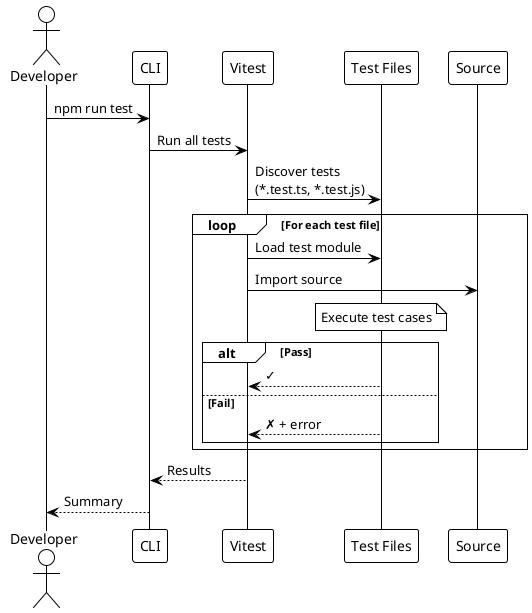

# Testing

> [!abstract] Overview
> Watchman uses **Vitest** as the unified test runner across the monorepo, with **@testing-library/react** for frontend component testing and jsdom for DOM simulation.

## Test Documentation

```dataview
TABLE WITHOUT ID file.link AS "Document", date AS "Date", status AS "Status"
FROM "docs/testing"
WHERE type != "index"
SORT file.name ASC
```

## Test Framework Stack

| Layer           | Tool                             | Purpose                                      |
| --------------- | -------------------------------- | -------------------------------------------- |
| Test Runner     | **Vitest** 3.2+                  | Unified test runner for frontend and backend |
| DOM Environment | **jsdom** 25+                    | Browser-like environment for frontend tests  |
| React Testing   | **@testing-library/react** 16+   | Component rendering and user interaction     |
| Assertions      | **Vitest expect**                | Jest-compatible assertions                   |
| Matchers        | **@testing-library/jest-dom** 6+ | DOM-specific assertions                      |

## Running Tests

```bash
# Run all tests in the monorepo
npm run test

# Frontend tests
npm run test --workspace=apps/frontend
npm run test:coverage --workspace=apps/frontend
npx vitest run                          # Run once (CI mode)
npx vitest                              # Watch mode

# Run specific test file
npx vitest run src/lib/utils.test.ts

# Run tests matching a pattern
npx vitest run --testNamePattern="testName"
```

## Testing Strategy

### Frontend

- **Component rendering** - Verify components render correctly with various props
- **Hook behavior** - Test custom hooks in isolation
- **User interaction flows** - Test clicks, form submissions, navigation
- **Error boundaries** - Verify error handling in component trees

### Backend

- **API endpoint testing** - Verify route behavior and response shapes
- **Service integration testing** - Test service class behavior with mocked HTTP
- **Middleware testing** - Verify auth, CSRF, rate limiting behavior
- **Authentication flow** - Test login, token validation, session management
- **Core utility testing** - Validate backend helpers used by routes and middleware
- **Infrastructure testing** - Cover request validation, logging, and IP parsing helpers

### Recent backend coverage additions

- Expanded auth middleware coverage in [[apps/backend/tests/authMiddleware.test.js]] (including bcrypt failure branch handling)
- Expanded auth token helper coverage in [[apps/backend/tests/authToken.test.js]] (including non-object request handling and empty-key cookie parsing)
- Expanded CSRF middleware coverage in [[apps/backend/tests/csrf.test.js]] (including mismatched-length token rejection)
- Expanded response-size middleware coverage in [[apps/backend/tests/responseSizeLimit.test.js]] (object-chunk size coercion and repeated-write behavior after limit exceed)
- Expanded `requireAuth` coverage in [[apps/backend/tests/authMiddleware.test.js]] for decoded JWT payloads without `iat` (`tokenIssuedAt` remains `undefined`)
- Expanded CSRF cookie-option coverage in [[apps/backend/tests/csrf.test.js]] for production-mode `secure=true` and `sameSite='strict'`
- Expanded auth route integration coverage in [[apps/backend/tests/authRoutes.integration.test.js]] for `/api/auth/me` non-object decoded-token fallback behavior
- Added request timeout middleware tests in [[apps/backend/tests/requestTimeout.test.js]]
- Expanded Tor manager coverage in [[apps/backend/tests/TorManager.test.js]]
  - validates `isInstalled()` fallback path from `which tor` to Homebrew detection
  - validates `installTor()` success and failure paths
  - validates `startTor()` stdout/stderr bootstrap log parsing and process `error` path handling
  - validates `cleanup()` warning path when success logger invocation throws
  - current TorManager coverage from backend node test coverage run: **~95.90% lines / ~90.91% branches / ~90.63% functions**
- Expanded logger coverage in [[apps/backend/tests/logger.test.js]]

### Recent frontend coverage additions

- [[apps/frontend/src/hooks/use-toast.test.tsx]] (new)
  - validates reducer behavior in [[apps/frontend/src/hooks/use-toast.ts]] for toast-limit enforcement (`ADD_TOAST` keeps newest toast)
  - validates dismiss-all reducer path when `DISMISS_TOAST` is dispatched without a `toastId`
  - validates hook lifecycle (`toast` add/update/dismiss + timer-based removal)
- [[apps/frontend/src/components/UpdateBadge.test.tsx]] (new)
  - validates 503 path returns hidden output for [[apps/frontend/src/components/UpdateBadge.tsx]] (service-not-configured behavior)
  - validates warning-log path when update query errors
  - validates update-available click behavior opens release URL in a new tab
- [[apps/frontend/src/components/ServiceLink.test.tsx]] (new)
  - validates `hostOnly` rendering behavior in [[apps/frontend/src/components/ServiceLink.tsx]]
  - validates click behavior uses computed href via `openHref`
- [[apps/frontend/src/components/ServerStatusBadge.test.tsx]] (new)
  - validates status variant rendering for `loading`, `online`, `warning`, `error`, `maintenance`, and `offline` in [[apps/frontend/src/components/ServerStatusBadge.tsx]]
- [[apps/frontend/src/App.test.tsx]] (new)
  - validates router-level rendering for top-level route composition in [[apps/frontend/src/App.tsx]]
  - covers `/login` route rendering and unknown-route NotFound fallback behavior
  - verifies app shell wiring with mocked providers/components using `@` alias imports
  - validates React Query retry policy behavior for `shouldRetryQuery` in [[apps/frontend/src/App.tsx]] (no retries for 4xx, retries up to 3 attempts for non-4xx)
- [[apps/frontend/src/hooks/use-mobile.test.tsx]] (new)
  - validates mobile breakpoint behavior in [[apps/frontend/src/hooks/use-mobile.tsx]] for below/above-768px viewport transitions
  - validates effect cleanup by asserting media-query `change` listener removal on unmount
- [[apps/frontend/src/pages/NotFound.test.tsx]] (new)
  - validates NotFound page content in [[apps/frontend/src/pages/NotFound.tsx]]
  - covers `404` heading, "Page not found" message, and dashboard back-link to `/`
- [[apps/frontend/src/services/ApiClient.test.ts]] (new)
  - validates public API client surface in [[apps/frontend/src/services/ApiClient.ts]]
  - covers singleton export availability, constructor safety, and inherited endpoint method exposure
- [[apps/frontend/src/hooks/useAuth.test.tsx]] (+11 tests)
  - login failure paths (missing user payload + network error fallback)
  - logout error path (including non-`Error` rejection fallback)
  - outside-provider `useAuth` throw behavior
  - bootstrap fallback username from stringified `id`
  - bootstrap payload error path handling
  - explicit login/logout success assertions
- [[apps/frontend/src/lib/csrf.test.ts]] (+6 tests)
  - token header injection behavior
  - cookie-read exception logging path
  - `hasToken()` false-path when token is absent
  - no-token header omission behavior
  - empty config fallback behavior
  - custom cookie/header configuration behavior
- [[apps/frontend/src/components/AuthGuard.test.tsx]] (+3 tests)
  - loading state rendering
  - unauthenticated redirect to `/login`
  - authenticated child rendering
- [[apps/frontend/src/pages/Login.test.tsx]] (+7 tests)
  - already-authenticated redirect behavior
  - validation message for missing credentials
  - successful login with remember-me
  - failed login error rendering
  - default fallback login message
  - auth-context error rendering
  - loading state submit UX
- [[apps/frontend/src/services/apiClient/endpoints.test.ts]] (expanded 3 → 11 tests)
  - endpoint URL mapping coverage
  - Bitcoin timeout behavior
  - deprecated Homebridge alias coverage
  - login fallback token behavior
  - write-operation payload behavior
  - service-key endpoint composition
- [[apps/frontend/src/lib/env.test.ts]] (new)
  - validates `VITE_BACKEND_URL` required/optional handling in [[apps/frontend/src/lib/env.ts]]
  - covers invalid URL validation failure path
  - confirms optional frontend port reads
- [[apps/frontend/src/lib/queryKeys.test.ts]] (new)
  - validates stable query key tuples for config, health, instances, and metrics in [[apps/frontend/src/lib/queryKeys.ts]]
  - covers default and explicit instance-id composition for service keys
  - covers Homebridge-specific key builders and router ARP keys
- [[apps/frontend/src/lib/url.test.ts]] (new)
  - covers URL display normalization and missing-value fallback in [[apps/frontend/src/lib/url.ts]]
  - validates href generation with scheme inference and secure preference
  - covers ping-display states and safe `window.open` behavior/error swallowing
- [[apps/frontend/src/lib/utils.test.ts]] (expanded coverage)
  - `formatNumber` suffix + localized formatting branches (`M`, `K`, and sub-thousand values)
  - `formatBytes` nullish/non-finite handling and unit formatting
  - `formatUptime` day/hour/minute formatting paths
  - `formatSpeed` byte-rate formatting and nullish passthrough
  - `instanceDisplayName` instance-suffix vs base-name behavior
- [[apps/frontend/src/lib/apiResponse.test.ts]] (new)
  - `isApiResponseEnvelope` valid-shape and invalid-shape detection
  - `unwrapApiResponse` `_payload` precedence, `data` fallback, and pass-through behavior
  - `extractApiError` precedence rules (`error` → `message` → fallback) for envelope and non-envelope payloads
- [[apps/frontend/src/lib/logger.test.ts]] (expanded)
  - verifies frontend logger redaction behavior in [[apps/frontend/src/lib/logger.ts]]
  - covers regex redaction fallback branch when no capture group exists (now returns `[REDACTED]`)
  - adds structured payload behavior checks (Error serialization and object metadata merge)
  - covers helper-prefix logging (`serviceCreated`, `websocket`, `serviceWorker`) and debug gating outside development mode
- [[apps/frontend/src/pages/Index.test.tsx]] (new)
  - adds dashboard page rendering/error-state coverage for [[apps/frontend/src/pages/Index.tsx]]
  - improves dashboard page line coverage to ~88%
- [[apps/frontend/src/hooks/useWebSocket.test.tsx]] (new)
  - validates batched/deduped `service_update` invalidation behavior (including aggregate `servicesHealth` invalidation)
  - validates `alert` level routing to toasts and unknown-message warning behavior
  - validates send-error handling path when socket `.send()` throws
  - validates unmount-time flush of queued invalidations
  - validates tor/router invalidation families (`torRelay`, `routerArp`) and `metrics` invalidation behavior
  - validates `connection` message toast path
  - validates max reconnect attempts error path and singleton cleanup stability between tests
- [[apps/frontend/src/components/LiveServerDashboard.test.tsx]] (new)
  - validates loading-state rendering paths in [[apps/frontend/src/components/LiveServerDashboard.tsx]]
  - validates dashboard count-derivation behavior for mixed status payloads
  - validates refresh pending-state behavior during refresh cycles
  - validates stacked IPFS/Homebridge rendering path and system health label matrix behavior
- [[apps/frontend/src/components/dashboard/dashboardData.test.ts]] (new)
  - validates dashboard data helper behavior in [[apps/frontend/src/components/dashboard/dashboardData.ts]]
  - covers AdGuard/Tor stats normalization defaults, Tor connection info selection, tile chunking, and instance-tile append behavior
- [[apps/frontend/src/components/dashboard/dashboardStatus.test.ts]] (new)
  - validates dashboard status helper behavior in [[apps/frontend/src/components/dashboard/dashboardStatus.ts]]
  - covers status mapping (`online`/`warning`/fallback `offline`) and aggregate count derivation for services health + enabled-service states
- [[apps/frontend/src/components/dashboard/useDashboardQueries.test.ts]] (new)
  - validates `refreshEnabledQueries()` refetch scope: only enabled service queries plus `servicesHealth`
  - expanded to also cover enabled `frontendConfig` + `qbittorrent` refetch behavior when flags/service enablement permit
- [[apps/frontend/src/lib/backendUrl.test.ts]] (expanded)
  - expands `getWebSocketUrl()` and backend URL branch coverage in [[apps/frontend/src/lib/backendUrl.ts]]
  - covers `ws://` vs `wss://` protocol selection and path normalization
  - covers fallback behavior for empty env URL and invalid env URL (runtime window host fallback)
  - covers production fallback backend URL construction when env URL is unset

### Recent frontend Vitest setup adjustments

- [[apps/frontend/vitest.config.ts]] now includes Vite React plugin and `@` path alias resolution at both root and `test` levels
- Vitest project entries (`node` and `jsdom`) now each declare alias mapping for `@ -> ./src`
- This keeps `@/...` imports and mocks stable across utility tests and jsdom route/component tests (including [[apps/frontend/src/App.test.tsx]])

## Test Structure

```
apps/frontend/
├── src/
│   ├── lib/
│   │   ├── utils.test.ts              # Utility function tests
│   │   ├── apiResponse.test.ts        # API response envelope/error helper tests
│   │   ├── csrf.test.ts               # CSRF token read/header behavior + config edge cases
│   │   ├── env.test.ts                # Environment variable validation and required lookups
│   │   ├── queryKeys.test.ts          # React Query key construction and instance-aware key helpers
│   │   ├── backendUrl.test.ts         # Backend/base URL and WebSocket URL derivation behavior
│   │   ├── logger.test.ts             # Frontend logger redaction + metadata behavior
│   │   └── url.test.ts                # URL display/href/ping helpers and safe external open behavior
│   ├── components/
│   │   └── AuthGuard.test.tsx         # Route guard rendering/redirect behavior
│   │   └── LiveServerDashboard.test.tsx # Dashboard loading-state and count-derivation behavior
│   │   └── UpdateBadge.test.tsx        # Update badge 503/error/update-click behavior
│   │   └── ServiceLink.test.tsx        # hostOnly rendering + click-through behavior
│   │   └── ServerStatusBadge.test.tsx  # Status variant label rendering
│   │   └── dashboard/
│   │       ├── useDashboardQueries.test.ts # Dashboard refresh scope (enabled services + servicesHealth)
│   │       ├── dashboardData.test.ts       # Dashboard data helper normalization/chunking/instance tile behavior
│   │       └── dashboardStatus.test.ts     # Dashboard status mapping and aggregate counter derivation behavior
│   ├── hooks/
│   │   └── useAuth.test.tsx           # Auth bootstrap, fallback identity, login/logout success + failure paths
│   │   └── use-toast.test.tsx          # Toast reducer + hook lifecycle behavior
│   │   └── useWebSocket.test.tsx      # WebSocket message handling, batched invalidation dedup, alert/unknown-message behavior
│   │   └── use-mobile.test.tsx         # Mobile breakpoint updates and media-query listener cleanup behavior
│   ├── App.test.tsx                   # Top-level app route rendering behavior
│   ├── pages/
│       ├── Index.test.tsx             # Dashboard page rendering and error-state coverage
│       ├── Login.test.tsx             # Login submit flow, auth-context errors, and loading-state UX
│       └── NotFound.test.tsx          # 404 page content and dashboard-link behavior
│   └── services/
│       ├── ApiClient.test.ts          # Public ApiClient wrapper and singleton export behavior
│       └── apiClient/
│           └── endpoints.test.ts      # Endpoint wrappers, payload composition, aliases, and compatibility behavior
apps/backend/
└── tests/
    ├── authMiddleware.test.js         # JWT auth middleware behavior
    ├── authToken.test.js              # Auth token helper behavior
    ├── authRoutes.integration.test.js # Auth route integration behavior (`/login`, `/logout`, `/me`)
    ├── csrf.test.js                   # CSRF middleware behavior
    ├── responseSizeLimit.test.js      # Response-size middleware enforcement/edge behavior
    ├── requestTimeout.test.js         # Request timeout + abort behavior
    ├── TorManager.test.js             # Tor manager install/start/cleanup behavior and error-path handling
    └── logger.test.js                 # Structured logger behavior
```

## Coverage Status

| Area               | Status         | Notes                                                                                                                                                                                                                                                                                                                                                              |
| ------------------ | -------------- | ------------------------------------------------------------------------------------------------------------------------------------------------------------------------------------------------------------------------------------------------------------------------------------------------------------------------------------------------------------------ |
| Utility functions  | ✅ Improved    | Frontend lib aggregate improved materially with expanded `logger.test.ts` and `backendUrl.test.ts`; dashboard helpers now have targeted coverage via [[apps/frontend/src/components/dashboard/dashboardData.test.ts]] and [[apps/frontend/src/components/dashboard/dashboardStatus.test.ts]]; `backendUrl.ts` and `logger.ts` still remain below target thresholds |
| React components   | ⚠️ Partial     | Route/page coverage expanded with new `App.test.tsx` and `NotFound.test.tsx`; `AuthGuard` and `Login` remain at 100%, `Index.tsx` stays ~88%; service cards still need tests                                                                                                                                                                                       |
| Custom hooks       | ⚠️ Partial     | `useAuth.tsx` now at 100% lines/functions and 86.66% branches; [[apps/frontend/src/hooks/useWebSocket.test.tsx]] now covers invalidation, alert routing, malformed-message handling, disconnected-send/send-error paths, unmount flush behavior, and reconnect scheduling; additional hooks still need coverage                                                    |
| API response utils | ✅ Covered     | New [[apps/frontend/src/lib/apiResponse.test.ts]] covers envelope detection, unwrapping, and error extraction helpers in [[apps/frontend/src/lib/apiResponse.ts]]                                                                                                                                                                                                  |
| API client         | ⚠️ Partial     | New `ApiClient.test.ts` covers wrapper surface/singleton behavior; `endpoints.test.ts` remains expanded to 11 tests; `endpoints.ts` remains at 86.58% lines, 96.66% branches, 71.79% functions                                                                                                                                                                     |
| Backend services   | ❌ Not covered | All service classes need tests                                                                                                                                                                                                                                                                                                                                     |
| Backend middleware | ✅ Improved    | Auth/CSRF middleware now at 100% line coverage; backend suite passing 81/81 tests                                                                                                                                                                                                                                                                                  |
| Backend routes     | ⚠️ Partial     | Auth route integration coverage expanded                                                                                                                                                                                                                                                                                                                           |

## Related

- [[docs/testing/testing-strategy|Testing Strategy and Patterns]]
- [[docs/guides/contributing|Contributing Guide]]
- [[docs/reference/scripts|Scripts Reference]]
- [[docs/reference/code-patterns|Code Patterns]]

## PlantUML Diagrams

### Test Pyramid

```plantuml
@startuml
!theme plain

skinparam rectangleBackgroundColor #FFFACD

rectangle "End-to-End Tests" as E2E {
    note right: Few, slow, comprehensive
}

rectangle "Integration Tests" as Int {
    note right: Medium count
}

rectangle "Unit Tests" as Unit {
    note right: Many, fast, focused
}

Unit --> Int : Integration
Int --> E2E : E2E

note right of Unit
  Vitest + jsdom
end note

note right of Int
  @testing-library/react
end note
@enduml
```

### Test Execution Flow


