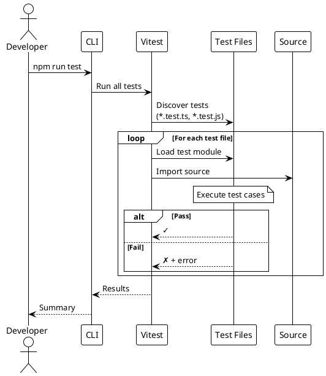

# Testing

> [!abstract] Overview
> Watchman uses **Vitest** as the unified test runner across the monorepo, with **@testing-library/react** for frontend component testing and jsdom for DOM simulation.

## Test Documentation

```dataview
TABLE WITHOUT ID file.link AS "Document", date AS "Date", status AS "Status"
FROM "docs/testing"
WHERE type != "index"
SORT file.name ASC
```

## Test Framework Stack

| Layer           | Tool                             | Purpose                                      |
| --------------- | -------------------------------- | -------------------------------------------- |
| Test Runner     | **Vitest** 3.2+                  | Unified test runner for frontend and backend |
| DOM Environment | **jsdom** 25+                    | Browser-like environment for frontend tests  |
| React Testing   | **@testing-library/react** 16+   | Component rendering and user interaction     |
| Assertions      | **Vitest expect**                | Jest-compatible assertions                   |
| Matchers        | **@testing-library/jest-dom** 6+ | DOM-specific assertions                      |

## Running Tests

```bash
# Run all tests in the monorepo
npm run test

# Frontend tests
npm run test --workspace=apps/frontend
npm run test:coverage --workspace=apps/frontend
npx vitest run                          # Run once (CI mode)
npx vitest                              # Watch mode

# Run specific test file
npx vitest run src/lib/utils.test.ts

# Run tests matching a pattern
npx vitest run --testNamePattern="testName"
```

## Testing Strategy

### Frontend

- **Component rendering** - Verify components render correctly with various props
- **Hook behavior** - Test custom hooks in isolation
- **User interaction flows** - Test clicks, form submissions, navigation
- **Error boundaries** - Verify error handling in component trees

### Backend

- **API endpoint testing** - Verify route behavior and response shapes
- **Service integration testing** - Test service class behavior with mocked HTTP
- **Middleware testing** - Verify auth, CSRF, rate limiting behavior
- **Authentication flow** - Test login, token validation, session management
- **Core utility testing** - Validate backend helpers used by routes and middleware
- **Infrastructure testing** - Cover request validation, logging, and IP parsing helpers

### Recent backend coverage additions

- Expanded auth middleware coverage in [[apps/backend/tests/authMiddleware.test.js]] (including bcrypt failure branch handling)
- Expanded auth token helper coverage in [[apps/backend/tests/authToken.test.js]] (including non-object request handling and empty-key cookie parsing)
- Expanded CSRF middleware coverage in [[apps/backend/tests/csrf.test.js]] (including mismatched-length token rejection)
- Added request timeout middleware tests in [[apps/backend/tests/requestTimeout.test.js]]
- Expanded Tor manager coverage in [[apps/backend/tests/TorManager.test.js]]
- Expanded logger coverage in [[apps/backend/tests/logger.test.js]]

### Recent frontend coverage additions

- [[apps/frontend/src/hooks/useAuth.test.tsx]] (+11 tests)
  - login failure paths (missing user payload + network error fallback)
  - logout error path (including non-`Error` rejection fallback)
  - outside-provider `useAuth` throw behavior
  - bootstrap fallback username from stringified `id`
  - bootstrap payload error path handling
  - explicit login/logout success assertions
- [[apps/frontend/src/lib/csrf.test.ts]] (+6 tests)
  - token header injection behavior
  - cookie-read exception logging path
  - `hasToken()` false-path when token is absent
  - no-token header omission behavior
  - empty config fallback behavior
  - custom cookie/header configuration behavior
- [[apps/frontend/src/components/AuthGuard.test.tsx]] (+3 tests)
  - loading state rendering
  - unauthenticated redirect to `/login`
  - authenticated child rendering
- [[apps/frontend/src/pages/Login.test.tsx]] (+7 tests)
  - already-authenticated redirect behavior
  - validation message for missing credentials
  - successful login with remember-me
  - failed login error rendering
  - default fallback login message
  - auth-context error rendering
  - loading state submit UX
- [[apps/frontend/src/services/apiClient/endpoints.test.ts]] (expanded 3 → 8 tests)
  - endpoint URL mapping coverage
  - Bitcoin timeout behavior
  - deprecated Homebridge alias coverage
  - login fallback token behavior
  - write-operation payload behavior
  - service-key endpoint composition

## Test Structure

```
apps/frontend/
├── src/
│   ├── lib/
│   │   ├── utils.test.ts              # Utility function tests
│   │   └── csrf.test.ts               # CSRF token read/header behavior + config edge cases
│   ├── components/
│   │   └── AuthGuard.test.tsx         # Route guard rendering/redirect behavior
│   ├── hooks/
│   │   └── useAuth.test.tsx           # Auth bootstrap, fallback identity, login/logout success + failure paths
│   └── pages/
│       └── Login.test.tsx             # Login submit flow, auth-context errors, and loading-state UX
apps/backend/
└── tests/
    ├── authMiddleware.test.js         # JWT auth middleware behavior
    ├── authToken.test.js              # Auth token helper behavior
    ├── csrf.test.js                   # CSRF middleware behavior
    ├── requestTimeout.test.js         # Request timeout + abort behavior
    ├── TorManager.test.js             # Tor manager behavior
    └── logger.test.js                 # Structured logger behavior
```

## Coverage Status

| Area               | Status         | Notes                                                                                               |
| ------------------ | -------------- | --------------------------------------------------------------------------------------------------- |
| Utility functions  | ✅ Covered     | `cn()` function tested                                                                              |
| React components   | ⚠️ Partial     | `AuthGuard` and `Login` now at 100% line/branch/function coverage; service cards still need tests   |
| Custom hooks       | ⚠️ Partial     | `useAuth.tsx` now at 100% lines/functions and 86.66% branches; additional hooks still need coverage |
| API client         | ⚠️ Partial     | `endpoints.ts` now at 86.58% lines, 96.66% branches, 71.79% functions                               |
| Backend services   | ❌ Not covered | All service classes need tests                                                                      |
| Backend middleware | ✅ Improved    | Auth/CSRF middleware now at 100% line coverage; backend suite passing 81/81 tests                   |
| Backend routes     | ⚠️ Partial     | Auth route integration coverage expanded                                                            |

## Related

- [[docs/testing/testing-strategy|Testing Strategy and Patterns]]
- [[docs/guides/contributing|Contributing Guide]]
- [[docs/reference/scripts|Scripts Reference]]
- [[docs/reference/code-patterns|Code Patterns]]

## PlantUML Diagrams

### Test Pyramid

```plantuml
@startuml
!theme plain

skinparam rectangleBackgroundColor #FFFACD

rectangle "End-to-End Tests" as E2E {
    note right: Few, slow, comprehensive
}

rectangle "Integration Tests" as Int {
    note right: Medium count
}

rectangle "Unit Tests" as Unit {
    note right: Many, fast, focused
}

Unit --> Int : Integration
Int --> E2E : E2E

note right of Unit
  Vitest + jsdom
end note

note right of Int
  @testing-library/react
end note
@enduml
```

### Test Execution Flow


