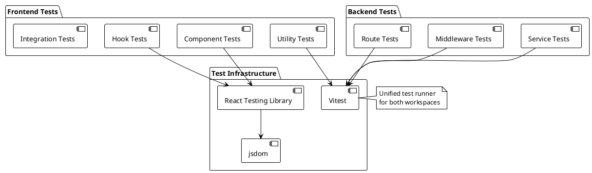
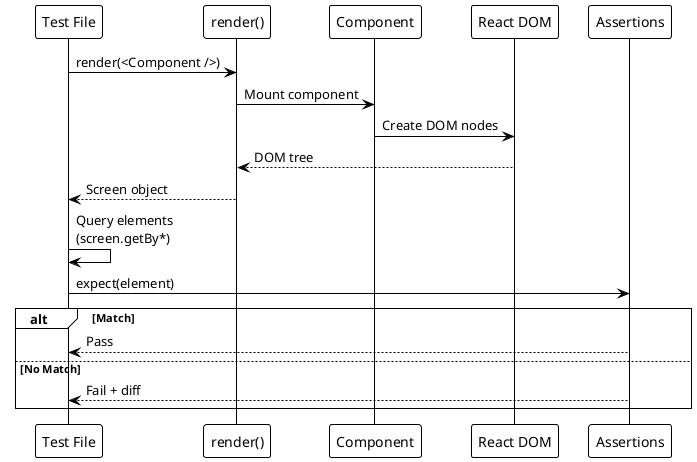
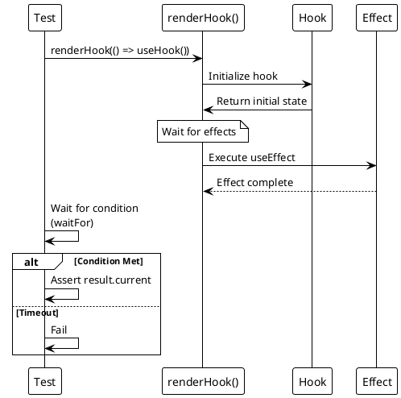

# Testing Strategy and Patterns

> [!abstract] Overview
> Watchman uses **Vitest** as the unified test runner across the monorepo. Frontend tests run in a jsdom environment with React Testing Library. Backend testing focuses on unit tests for service classes and middleware.

## Testing Philosophy

- **Test behavior, not implementation** -- Tests should verify what the code does, not how it does it
- **Write tests for all new features and bug fixes** -- This is mandatory per [[AGENTS|AGENTS.md]]
- **Cover edge cases and error handling** -- Happy path is not enough
- **Never modify original code to make testing easier** -- Tests adapt to code, not vice versa
- **Keep tests fast and deterministic** -- No flaky tests

## Test Framework Stack

| Layer           | Tool                             | Purpose                                          |
| --------------- | -------------------------------- | ------------------------------------------------ |
| Test Runner     | **Vitest** 3.2+                  | Unified test runner for frontend and backend     |
| DOM Environment | **jsdom** 25+                    | Browser-like environment for frontend tests      |
| React Testing   | **@testing-library/react** 16+   | Component rendering and user interaction testing |
| Assertions      | **Vitest expect**                | Jest-compatible assertions                       |
| Matchers        | **@testing-library/jest-dom** 6+ | DOM-specific assertions                          |

## Test Structure

```
apps/frontend/
├── src/
│   ├── lib/
│   │   ├── utils.ts
│   │   └── utils.test.ts          # Utility function tests
│   ├── components/
│   │   └── ComponentName.test.tsx  # Component tests (to be added)
│   └── hooks/
│       └── useHookName.test.ts     # Hook tests (to be added)
apps/backend/
├── services/
│   └── ServiceName.test.js         # Service unit tests (to be added)
├── middleware/
│   └── middlewareName.test.js      # Middleware tests (to be added)
└── routes/
    └── routeName.test.js           # Route tests (to be added)
```

## Running Tests

```bash
# Run all tests in the monorepo
npm run test

# Frontend tests
npm run test --workspace=apps/frontend
npx vitest run                          # Run once (CI mode)
npx vitest                              # Watch mode
npx vitest --watch                      # Explicit watch mode
npx vitest --ui                         # Watch mode with UI

# Run specific test file
npx vitest run src/lib/utils.test.ts

# Run tests matching a pattern
npx vitest run --testNamePattern="cn utility"

# Run tests with coverage (when configured)
npx vitest run --coverage

# Backend tests (when added)
npm run test --workspace=apps/backend
```

## Frontend Testing

### Component Testing

Use `@testing-library/react` for component tests:

```typescript
import { render, screen } from "@testing-library/react";
import { describe, it, expect } from "vitest";
import { ComponentName } from "./ComponentName";

describe("ComponentName", () => {
  it("renders correctly with default props", () => {
    render(<ComponentName />);
    expect(screen.getByRole("heading")).toBeInTheDocument();
  });

  it("handles user interaction", async () => {
    const { user } = renderWithUser(<ComponentName />);
    await user.click(screen.getByRole("button"));
    expect(screen.getByText("Clicked")).toBeInTheDocument();
  });
});
```

### Hook Testing

Use `@testing-library/react`'s `renderHook` for custom hook tests:

```typescript
import { renderHook, waitFor } from "@testing-library/react";
import { describe, it, expect } from "vitest";
import { useCustomHook } from "./useCustomHook";

describe("useCustomHook", () => {
  it("returns initial state", () => {
    const { result } = renderHook(() => useCustomHook());
    expect(result.current.value).toBe("initial");
  });
});
```

### Utility Function Testing

Pure functions are the easiest to test:

```typescript
import { describe, it, expect } from "vitest";
import { cn } from "./utils";

describe("cn utility", () => {
  it("joins class names and merges Tailwind classes", () => {
    const result = cn("p-2", "p-4", "text-center");
    expect(result).toContain("p-4"); // tailwind-merge prefers last
    expect(result).toContain("text-center");
  });
});
```

## Backend Testing

Current middleware coverage includes `responseSizeLimit` behavior in [[apps/backend/tests/responseSizeLimit.test.js]] for [[apps/backend/middleware/responseSizeLimit.js]]:

- health endpoint bypasses response-size enforcement
- under-limit responses pass through normally
- over-limit before headers sends non-recursive `413` JSON response
- over-limit after headers destroys the socket for active streams

Implementation detail: byte counting now tracks both `res.write` and `res.end` in [[apps/backend/middleware/responseSizeLimit.js]], and fixes the `originalEnd` handling bug.

Authentication route integration coverage now includes login response compatibility in [[apps/backend/tests/authRoutes.integration.test.js]] for [[apps/backend/routes/authRoutes.js]]:

- `AUTH_RETURN_TOKEN=false` omits `token` from response body while still setting the auth cookie
- `AUTH_RETURN_TOKEN=true` includes `token` in response body and still sets the auth cookie
- Login token signing asserts payload `{ sub, username }` with options `{ expiresIn: "8h" }`

Frontend auth/bootstrap coverage includes [[apps/frontend/src/hooks/useAuth.test.tsx]] for [[apps/frontend/src/hooks/useAuth.tsx]]:

- Auth state bootstrap (`getAuthMe`) is shared through `AuthProvider` and called once across multiple `useAuth` consumers
- Login flow uses a silent post-login `fetchMe` refresh to avoid loading-state flicker; this is behavior in [[apps/frontend/src/hooks/useAuth.tsx]] and should remain covered as auth tests expand

Frontend API client architecture now uses a stable public client wrapper `[[apps/frontend/src/services/ApiClient.ts]]` backed by `[[apps/frontend/src/services/apiClient/core.ts]]`, `[[apps/frontend/src/services/apiClient/endpoints.ts]]`, and `[[apps/frontend/src/services/apiClient/types.ts]]`.

Backend timeout/abort behavior now includes request-level abort propagation from [[apps/backend/middleware/requestTimeout.js]] into route/service health calls (`[[apps/backend/routes/metaRoutes.js]]`, `[[apps/backend/services/ServiceManager.js]]`). Add targeted tests for timeout and client-disconnect abort paths when extending backend middleware coverage.

Frontend backend URL coverage includes [[apps/frontend/src/lib/backendUrl.test.ts]] for [[apps/frontend/src/lib/backendUrl.ts]]:

- `getWebSocketUrl()` uses secure `wss://` when backend URL is HTTPS

### Service Class Testing

```javascript
import { describe, it, expect, vi } from "vitest";
import { AdGuardService } from "./AdGuardService.js";

describe("AdGuardService", () => {
  it("returns enabled when config is valid", () => {
    const service = new AdGuardService({
      host: "localhost",
      port: 3000,
    });
    expect(service.enabled).toBe(true);
  });

  it("returns disabled when config is missing", () => {
    const service = new AdGuardService({});
    expect(service.enabled).toBe(false);
  });
});
```

### Middleware Testing

```javascript
import { describe, it, expect, vi } from "vitest";
import { authMiddleware } from "./auth.js";

describe("auth middleware", () => {
  it("rejects requests without valid JWT", async () => {
    const req = { cookies: {} };
    const res = { status: vi.fn().mockReturnThis(), json: vi.fn() };
    const next = vi.fn();

    await authMiddleware(req, res, next);

    expect(res.status).toHaveBeenCalledWith(401);
    expect(next).not.toHaveBeenCalled();
  });
});
```

### API Route Testing

```javascript
import { describe, it, expect, vi, beforeEach } from "vitest";
import express from "express";

describe("GET /api/services/health", () => {
  let app;

  beforeEach(() => {
    app = express();
    // Setup routes
  });

  it("returns health status for all services", async () => {
    const res = await request(app)
      .get("/api/services/health")
      .set("Cookie", `token=${validToken}`);

    expect(res.status).toBe(200);
    expect(res.body.data).toHaveProperty("services");
  });
});
```

## Testing Conventions

### File Naming

- Test files: `*.test.ts` or `*.test.tsx` (frontend), `*.test.js` (backend)
- Co-locate tests with source files when possible
- Use `.spec.` suffix only for integration/E2E tests

### Test Organization

```typescript
describe("UnitName", () => {
  describe("methodName", () => {
    it("does X when Y", () => {});
    it("throws when Z", () => {});
  });
});
```

### Mocking

- Use `vi.fn()` for spy functions
- Use `vi.mock()` for module mocking
- Prefer dependency injection over module mocking when possible
- Mock external services (HTTP calls, WebSocket connections)

### Async Testing

```typescript
it("fetches data asynchronously", async () => {
  const result = await asyncFunction();
  expect(result).toBeDefined();
});

it("handles rejected promises", async () => {
  await expect(failingFunction()).rejects.toThrow("Expected error");
});
```

## Current Test Coverage

| Area               | Status               | Notes                                                                      |
| ------------------ | -------------------- | -------------------------------------------------------------------------- |
| Utility functions  | ✅ Covered           | `utils.test.ts` tests `cn()` function                                      |
| React components   | ❌ Not covered       | All 14+ service cards need tests                                           |
| Custom hooks       | ⚠️ Partially covered | `useAuth` provider bootstrap covered; `useWebSocket` and others need tests |
| API client         | ❌ Not covered       | `ApiClient.ts` needs tests                                                 |
| Backend services   | ❌ Not covered       | All service classes need tests                                             |
| Backend middleware | ⚠️ Partially covered | `responseSizeLimit` covered; auth/CSRF/rate limiting still need tests      |
| Backend routes     | ⚠️ Partially covered | Auth login compatibility covered in `authRoutes.integration.test.js`       |
| WebSocket manager  | ❌ Not covered       | Real-time communication needs tests                                        |

## Testing Priorities

1. **Critical path** -- Authentication flow, service health checks
2. **Error handling** -- Circuit breaker behavior, retry logic
3. **Edge cases** -- Missing config, network failures, invalid input
4. **User interactions** -- Login, monitoring workflows, navigation
5. **Real-time updates** -- WebSocket connection, reconnection, message handling

## PlantUML Diagrams

### Test Structure Overview



### Test Execution Flow

```plantuml
@startuml
!theme plain

actor "Developer" as Dev
participant "CLI" as CLI
participant "Vitest" as Vitest
participant "Test Files" as Tests
participant "Source Files" as Source

Dev -> CLI : npm run test
CLI -> Vitest : Run all tests

Vitest -> Tests : Discover tests\n(*.test.ts, *.test.js)

loop For each test file
    Vitest -> Vitest : Load test module
    Vitest -> Source : Import source code

    alt Setup Phase
        Vitest -> Tests : Run beforeEach/beforeAll
    end

    note over Tests
      Execute test cases
    end

    alt Test Passes
        Tests --> Vitest : Pass
    else Test Fails
        Tests --> Vitest : Fail
        Vitest --> Vitest : Capture error
    end

    alt Teardown Phase
        Vitest -> Tests : Run afterEach/afterAll
    end
end

Vitest --> CLI : Test results
CLI --> Dev : Summary (passed/failed)

alt Any Failures
    Dev -> Dev : Fix code or tests
    Dev -> CLI : Re-run
end
@enduml
```

### CI/CD Testing Pipeline

```plantuml
@startuml
!theme plain

skinparam backgroundColor #F0F0F0

partition "CI Pipeline" {
    start

    :Install Dependencies\n(npm install)

    :Lint Code\n(ESLint)

    :Format Check\n(Prettier)

    :Run Frontend Tests

    :Run Backend Tests

    :Build Frontend\n(Vite)

    :Build Backend\n(esbuild)

    :Security Audit\n(npm audit)

    stop
}

note right of "Install Dependencies"
  ci=true in npm to
  ensure clean install
end note

note right of "Lint Code"
  Exit on lint errors
  to prevent bad code
end note
@enduml
```

### Component Testing Pattern



### Hook Testing Pattern



## Related

- [[docs/guides/contributing|Contributing Guide]]
- [[docs/reference/scripts|Scripts Reference]]
- [[docs/reference/code-patterns|Code Patterns]]
- [[AGENTS|AGENTS.md]] - Agent testing guidelines
