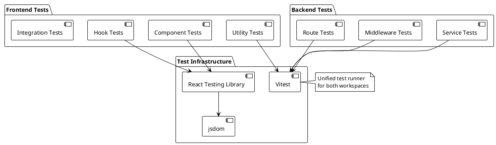
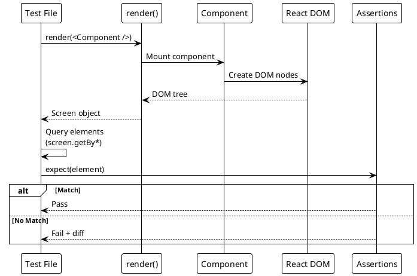
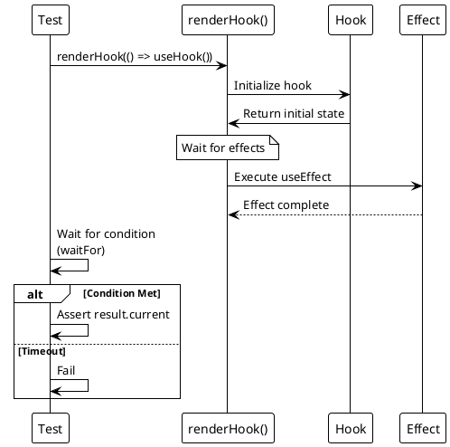

# Testing Strategy and Patterns

> [!danger] Superseded — v1 Test File Listings
> This document's **Test Structure** and **Backend Testing** sections describe **v1 backend tests** (`apps/backend/tests/*.test.js`, Express.js auth middleware) and auth-related frontend tests (`useAuth`, `AuthGuard`, `Login`, `csrf`) removed in v2.3. Current backend tests live under `apps/backend/src/**/*.test.ts`. See [[docs/testing/index|Testing Index]] for current state. Content retained for archival reference only.

> [!abstract] Overview
> Watchman uses **Vitest** as the unified test runner across the monorepo. Frontend tests run in a jsdom environment with React Testing Library. Backend testing focuses on route integration, middleware/validation behavior, and utility-level correctness.

## Testing Philosophy

- **Test behavior, not implementation** -- Tests should verify what the code does, not how it does it
- **Write tests for all new features and bug fixes** -- This is mandatory per [[AGENTS|AGENTS.md]]
- **Cover edge cases and error handling** -- Happy path is not enough
- **Never modify original code to make testing easier** -- Tests adapt to code, not vice versa
- **Keep tests fast and deterministic** -- No flaky tests

## Test Framework Stack

| Layer           | Tool                             | Purpose                                          |
| --------------- | -------------------------------- | ------------------------------------------------ |
| Test Runner     | **Vitest** 3.2+                  | Unified test runner for frontend and backend     |
| DOM Environment | **jsdom** 25+                    | Browser-like environment for frontend tests      |
| React Testing   | **@testing-library/react** 16+   | Component rendering and user interaction testing |
| Assertions      | **Vitest expect**                | Jest-compatible assertions                       |
| Matchers        | **@testing-library/jest-dom** 6+ | DOM-specific assertions                          |

## Test Structure

```
apps/frontend/
├── src/
│   ├── lib/
│   │   ├── utils.ts
│   │   ├── utils.test.ts           # Utility formatter + display helper tests
│   │   ├── apiResponse.test.ts     # API envelope unwrap/error helper tests
│   │   ├── csrf.test.ts            # CSRF utility tests
│   │   ├── env.test.ts             # Environment variable validation and required lookup behavior
│   │   ├── queryKeys.test.ts       # Query key construction and instance-aware key helpers
│   │   ├── backendUrl.test.ts      # Backend URL + WebSocket URL derivation behavior
│   │   ├── logger.test.ts          # Frontend logger redaction and metadata formatting behavior
│   │   └── url.test.ts             # URL display/build helpers and safe external open behavior
│   ├── components/
│   │   ├── AuthGuard.test.tsx      # Route guard behavior coverage
│   │   ├── UpdateBadge.test.tsx    # Update badge 503/error/click behavior
│   │   ├── ServiceLink.test.tsx    # hostOnly rendering + click-through behavior
│   │   ├── ServerStatusBadge.test.tsx # Status variant label coverage
│   │   └── dashboard/
│   │       ├── useDashboardQueries.test.ts # Dashboard query refresh scope coverage
│   │       ├── dashboardData.test.ts       # Dashboard data helper normalization/chunking/instance tile coverage
│   │       └── dashboardStatus.test.ts     # Dashboard status mapping and aggregate-counter derivation coverage
│   ├── hooks/
│   │   ├── useAuth.test.tsx        # Auth hook/provider coverage
│   │   ├── use-toast.test.tsx      # Toast reducer + hook lifecycle coverage
│   │   ├── useWebSocket.test.tsx   # WebSocket message handling and invalidation behavior
│   │   └── use-mobile.test.tsx     # Mobile breakpoint updates and listener cleanup behavior
│   ├── App.test.tsx                # App router-level route rendering coverage
│   └── pages/
│       ├── Index.test.tsx          # Dashboard page rendering/error-path coverage
│       ├── Login.test.tsx          # Login page auth flow coverage
│       └── NotFound.test.tsx       # NotFound page content/link behavior coverage
│   └── services/
│       ├── ApiClient.test.ts       # Public ApiClient wrapper/singleton behavior
│       └── apiClient/
│           ├── core.test.ts        # Core request/retry/error handling
│           └── endpoints.test.ts   # Endpoint mapping/payload behavior
apps/backend/
└── tests/
    ├── authMiddleware.test.js         # JWT auth middleware coverage
    ├── authToken.test.js              # Auth token helper coverage
    ├── authRoutes.integration.test.js # Auth route integration coverage
    ├── csrf.test.js                   # CSRF middleware coverage
    ├── responseSizeLimit.test.js      # Response-size middleware coverage
    ├── requestTimeout.test.js         # Timeout/abort middleware coverage
    ├── TorManager.test.js             # Tor manager coverage
    └── logger.test.js                 # Structured logger coverage
```

## Running Tests

```bash
# Run all tests in the monorepo
npm run test

# Frontend tests
npm run test --workspace=apps/frontend
npm run test:coverage --workspace=apps/frontend
npx vitest run                          # Run once (CI mode)
npx vitest                              # Watch mode
npx vitest --watch                      # Explicit watch mode
npx vitest --ui                         # Watch mode with UI

# Run specific test file
npx vitest run src/lib/utils.test.ts

# Run tests matching a pattern
npx vitest run --testNamePattern="cn utility"

# Run tests with coverage (when configured)
npx vitest run --coverage

# Backend tests
npm run test --workspace=apps/backend
```

## Frontend Testing

### Component Testing

Use `@testing-library/react` for component tests:

```typescript
import { render, screen } from "@testing-library/react";
import { describe, it, expect } from "vitest";
import { ComponentName } from "./ComponentName";

describe("ComponentName", () => {
  it("renders correctly with default props", () => {
    render(<ComponentName />);
    expect(screen.getByRole("heading")).toBeInTheDocument();
  });

  it("handles user interaction", async () => {
    const { user } = renderWithUser(<ComponentName />);
    await user.click(screen.getByRole("button"));
    expect(screen.getByText("Clicked")).toBeInTheDocument();
  });
});
```

### Hook Testing

Use `@testing-library/react`'s `renderHook` for custom hook tests:

```typescript
import { renderHook, waitFor } from "@testing-library/react";
import { describe, it, expect } from "vitest";
import { useCustomHook } from "./useCustomHook";

describe("useCustomHook", () => {
  it("returns initial state", () => {
    const { result } = renderHook(() => useCustomHook());
    expect(result.current.value).toBe("initial");
  });
});
```

### Utility Function Testing

Pure functions are the easiest to test:

```typescript
import { describe, it, expect } from "vitest";
import { cn } from "./utils";

describe("cn utility", () => {
  it("joins class names and merges Tailwind classes", () => {
    const result = cn("p-2", "p-4", "text-center");
    expect(result).toContain("p-4"); // tailwind-merge prefers last
    expect(result).toContain("text-center");
  });
});
```

## Backend Testing

Current middleware coverage includes `responseSizeLimit` behavior in `apps/backend/tests/responseSizeLimit.test.js` for `apps/backend/middleware/responseSizeLimit.js`:

- health endpoint bypasses response-size enforcement
- under-limit responses pass through normally
- over-limit before headers sends non-recursive `413` JSON response
- over-limit after headers destroys the socket for active streams
- object-like write chunks are coerced via `toString()` for byte-size accounting
- repeated `res.write(...)` calls after limit exceed consistently return `false`

Implementation detail: byte counting now tracks both `res.write` and `res.end` in `apps/backend/middleware/responseSizeLimit.js`, and fixes the `originalEnd` handling bug.

Authentication route integration coverage now includes login response compatibility in `apps/backend/tests/authRoutes.integration.test.js` for `apps/backend/routes/authRoutes.js`:

- `AUTH_RETURN_TOKEN=false` omits `token` from response body while still setting the auth cookie
- `AUTH_RETURN_TOKEN=true` includes `token` in response body and still sets the auth cookie
- Login token signing asserts payload `{ sub, username }` with options `{ expiresIn: "8h" }`
- `/api/auth/me` non-object decoded-token fallback behavior is covered (safe object fallback for user payload)

Backend coverage now includes focused tests for middleware, auth helpers, and infrastructure utilities:

- `apps/backend/tests/authMiddleware.test.js` - JWT auth middleware request handling, including bcrypt failure branch handling
- `apps/backend/tests/authMiddleware.test.js` - includes `requireAuth` behavior when decoded token has no `iat` (`tokenIssuedAt` remains `undefined`)
- `apps/backend/tests/authToken.test.js` - auth token parsing/signing helper behavior, including non-object request handling and empty-key cookie parsing
- `apps/backend/tests/csrf.test.js` - CSRF middleware validation and failure paths, including mismatched-length token rejection
- `apps/backend/tests/csrf.test.js` - includes production cookie option behavior (`secure=true`, `sameSite='strict'`)
- `apps/backend/tests/requestTimeout.test.js` - timeout + abort propagation behavior
- `apps/backend/tests/TorManager.test.js` - expanded Tor manager lifecycle and error handling
  - covers `isInstalled()` fallback to Homebrew when `which tor` fails
  - covers `installTor()` success and failure paths
  - covers `startTor()` bootstrap log handling from stdout/stderr and child-process `error` path
  - covers `cleanup()` warning-path behavior when success logger throws
  - measured coverage for `apps/backend/services/TorManager.js` from Node test coverage run: **~95.90% lines / ~90.91% branches / ~90.63% functions**
- `apps/backend/tests/logger.test.js` - expanded structured logger behavior and formatting

Additional focused utility coverage includes:

- `apps/backend/tests/validation.test.js` - request validation behavior and edge handling
- `apps/backend/tests/logger.test.js` - structured logging utility behavior
- `apps/backend/tests/routeUtils.test.js` - route helper utility correctness
- `apps/backend/tests/ip.test.js` - IP parsing/normalization helpers

Frontend auth/bootstrap coverage includes `apps/frontend/src/hooks/useAuth.test.tsx` for `apps/frontend/src/hooks/useAuth.tsx` (both removed in v2.3):

- Auth state bootstrap (`getAuthMe`) is shared through `AuthProvider` and called once across multiple `useAuth` consumers
- Bootstrap identity fallback is covered when backend user payload omits `username` (hook falls back to stringified `id`)
- Auth bootstrap payload access errors are covered (warning path + unauthenticated fallback)
- Login flow uses a silent post-login `fetchMe` refresh to avoid loading-state flicker; this is behavior in `apps/frontend/src/hooks/useAuth.tsx` and should remain covered as auth tests expand
- Login and logout success paths are explicitly covered
- Login failure paths now include both missing-user and network-error scenarios
- Logout failure path is covered
- Non-`Error` login/logout thrown values are covered with generic `Network error` fallback assertions
- Outside-provider `useAuth` usage is covered and expected to throw
- Current measured coverage for `apps/frontend/src/hooks/useAuth.tsx`: **100% lines**, **100% functions**, **86.66% branches**

Frontend auth surface coverage now also includes:

- `apps/frontend/src/lib/csrf.test.ts` - CSRF cookie/header helper behavior and config edge cases (token header injection, cookie-read exception logging, `hasToken()` absent-token false-path, missing-token no-header behavior, empty-config fallback, custom cookie/header names)
- `apps/frontend/src/components/AuthGuard.test.tsx` - loading, redirect, and authenticated render behavior for route protection (**100% lines/branches/functions** for `apps/frontend/src/components/AuthGuard.tsx`)
- `apps/frontend/src/pages/Login.test.tsx` - login page interaction and error-path handling (already-authenticated redirect, missing-credentials validation, remember-me success flow, failed login error rendering, default error fallback, auth-context error rendering, loading-state disabled submit UX) (**100% lines/branches/functions** for `apps/frontend/src/pages/Login.tsx`)
- Current measured coverage for `apps/frontend/src/lib/csrf.ts`: **96.77% lines**, **84.21% branches**, **100% functions**

Frontend utility + response-shape coverage now also includes:

- [[apps/frontend/src/lib/utils.test.ts]] - expanded formatter/display utility coverage for [[apps/frontend/src/lib/utils.ts]]:
  - `formatNumber` million/thousand suffix formatting and sub-thousand localization path
  - `formatBytes` nullish handling, non-finite/zero handling, and unit scaling behavior
  - `formatUptime` day/hour/minute rendering paths
  - `formatSpeed` `/s` formatting and nullish passthrough behavior
  - `instanceDisplayName` instance-number suffix handling
- [[apps/frontend/src/lib/apiResponse.test.ts]] - new response envelope utility coverage for [[apps/frontend/src/lib/apiResponse.ts]]:
  - `isApiResponseEnvelope` type/shape validation
  - `unwrapApiResponse` `_payload` precedence, `data` fallback, and non-envelope passthrough
  - `extractApiError` precedence chain (`error` → `message` → fallback) for envelope and plain-object payloads
- [[apps/frontend/src/lib/env.test.ts]] - environment helper coverage for [[apps/frontend/src/lib/env.ts]]:
  - empty `VITE_BACKEND_URL` handling with `get()` vs `getRequired()` behavior
  - valid backend URL and optional `VITE_FRONTEND_PORT` reads
  - invalid `VITE_BACKEND_URL` module validation rejection path
- [[apps/frontend/src/lib/queryKeys.test.ts]] - query key helper coverage for [[apps/frontend/src/lib/queryKeys.ts]]:
  - stable base keys (`frontendConfig`, `servicesHealth`, `servicesInstances`, `metrics`)
  - service key builders with default and explicit instance IDs
  - Homebridge key helpers and router ARP key composition
- [[apps/frontend/src/lib/url.test.ts]] - URL utility coverage for [[apps/frontend/src/lib/url.ts]]:
  - display URL normalization and missing-value fallback (`N/A`)
  - href generation with scheme preservation/inference and HTTPS preference
  - ping state labels and safe `openHref` no-op/error-swallowing behavior

Frontend API client architecture now uses a stable public client wrapper `[[apps/frontend/src/services/ApiClient.ts]]` backed by `[[apps/frontend/src/services/apiClient/core.ts]]`, `[[apps/frontend/src/services/apiClient/endpoints.ts]]`, and `[[apps/frontend/src/services/apiClient/types.ts]]`.

Frontend API client tests now include:

- `apps/frontend/src/services/apiClient/core.test.ts` - core request/retry/error handling behavior
- `apps/frontend/src/services/apiClient/endpoints.test.ts` - endpoint mapping and API contract helpers (expanded from 3 to 11 tests, including broad endpoint wrapper mapping, Bitcoin timeout, deprecated Homebridge alias, login fallback token, write payload helpers, tor relay nickname/no-nickname paths, and service-key endpoint composition)
- [[apps/frontend/vitest.config.ts]] - Vitest projects + coverage configuration
- [[apps/frontend/package.json]] - `test:coverage` script and `@vitest/coverage-v8` dependency

Current measured coverage for [[apps/frontend/src/services/apiClient/endpoints.ts]]: **86.58% lines**, **96.66% branches**, **71.79% functions**.

Backend timeout/abort behavior now includes request-level abort propagation from `apps/backend/middleware/requestTimeout.js` into route/service health calls (`apps/backend/routes/metaRoutes.js`, `apps/backend/services/ServiceManager.js`). Add targeted tests for timeout and client-disconnect abort paths when extending backend middleware coverage.

Frontend backend URL coverage includes [[apps/frontend/src/lib/backendUrl.test.ts]] for [[apps/frontend/src/lib/backendUrl.ts]]:

- `getWebSocketUrl()` uses secure `wss://` when backend URL is HTTPS

Frontend logger and dashboard-page coverage now also includes:

- [[apps/frontend/src/lib/logger.test.ts]] - coverage for frontend logging helper behavior in [[apps/frontend/src/lib/logger.ts]]
  - validates sensitive-value redaction behavior
  - validates regex fallback behavior where no capture group exists (returns `[REDACTED]`)
- `apps/frontend/src/pages/Index.test.tsx` - coverage for dashboard page behavior in `apps/frontend/src/pages/Index.tsx`
  - improves `Index.tsx` to ~88% line coverage
- [[apps/frontend/src/lib/backendUrl.test.ts]] - expanded coverage breadth for URL-derivation branches in [[apps/frontend/src/lib/backendUrl.ts]]

Frontend route shell and API client wrapper coverage now also includes:

- [[apps/frontend/src/App.test.tsx]] - route composition coverage for [[apps/frontend/src/App.tsx]]
  - `/login` route render behavior
  - unknown-route NotFound fallback behavior
  - top-level provider/component composition with alias-based mocks (`@/...`)
  - React Query retry-policy assertions for `shouldRetryQuery` (`4xx` no-retry, non-`4xx` retry up to 3 attempts)
- [[apps/frontend/src/pages/NotFound.test.tsx]] - NotFound page behavior for [[apps/frontend/src/pages/NotFound.tsx]]
  - `404` heading render
  - page-not-found message render
  - dashboard-link href/text assertions
- `apps/frontend/src/services/ApiClient.test.ts` - public wrapper behavior for [[apps/frontend/src/services/ApiClient.ts]]
  - singleton export shape (`apiClient`)
  - constructor behavior (`new ApiClient()`)
  - inherited endpoint method exposure from `ApiClientEndpoints`

Frontend real-time and dashboard-query coverage now also includes:

- [[apps/frontend/src/hooks/useWebSocket.test.tsx]] - WebSocket hook behavior for [[apps/frontend/src/hooks/useWebSocket.ts]]
  - batched/deduplicated `service_update` invalidation behavior
  - aggregate `servicesHealth` invalidation after service updates
  - `alert` level routing (`error`/`warning`/`info`) to toast handlers
  - unknown message type warning-path logging
- `apps/frontend/src/components/dashboard/useDashboardQueries.test.ts` - dashboard query orchestrator behavior for `apps/frontend/src/components/dashboard/useDashboardQueries.ts`
  - `refreshEnabledQueries()` refetches only enabled service queries
  - `refreshEnabledQueries()` always refetches `servicesHealth`
  - expanded enablement coverage for `frontendConfig` and `qbittorrent` query refetch branches

Frontend shared component and toast-hook coverage now also includes:

- `apps/frontend/src/hooks/use-toast.test.tsx` - reducer + hook lifecycle coverage for `apps/frontend/src/hooks/use-toast.ts`
  - `ADD_TOAST` limit behavior (latest toast retained)
  - `DISMISS_TOAST` without ID dismisses all active toasts
  - hook add/update/dismiss/remove flow with fake-timer removal validation
- `apps/frontend/src/components/UpdateBadge.test.tsx` - update-indicator behavior for `apps/frontend/src/components/UpdateBadge.tsx`
  - 503 service-not-configured path hides output (`null`) and logs debug
  - query-error path logs warning
  - update-available badge click opens release URL in new tab
- [[apps/frontend/src/components/ServiceLink.test.tsx]] - URL display/click behavior for [[apps/frontend/src/components/ServiceLink.tsx]]
  - missing `raw` value fallback (`N/A`)
  - `hostOnly` rendering branch
  - click-through via computed href (`openHref`)
- `apps/frontend/src/components/ServerStatusBadge.test.tsx` - status-label rendering for `apps/frontend/src/components/ServerStatusBadge.tsx`
  - `loading`, `online`, `warning`, `error`, `maintenance`, and `offline` label variants

Frontend mobile hook coverage now also includes [[apps/frontend/src/hooks/use-mobile.test.tsx]] for [[apps/frontend/src/hooks/use-mobile.tsx]]:

- breakpoint-state behavior across viewport transitions (`<768px` true, `>=768px` false)
- cleanup behavior for `matchMedia(...).removeEventListener("change", ...)` on unmount

Frontend dashboard helper coverage now also includes:

- [[apps/frontend/src/components/dashboard/dashboardData.test.ts]] - dashboard data helper behavior for [[apps/frontend/src/components/dashboard/dashboardData.ts]]
  - AdGuard stats default-field normalization and undefined-source handling
  - Tor stats mapping (including legacy snake_case fallback fields)
  - Tor connection info selection preference (frontend config port over stats)
  - tile chunking and instance-number parsing helpers
  - instance-tile append behavior for multi-instance and single-instance branches
- [[apps/frontend/src/components/dashboard/dashboardStatus.test.ts]] - dashboard status helper behavior for [[apps/frontend/src/components/dashboard/dashboardStatus.ts]]
  - status normalization (`online`/`warning`/fallback `offline`)
  - aggregate status bucket counting
  - count derivation from aggregate services-health payloads
  - count derivation from enabled-services state including loading placeholders

Frontend WebSocket hook coverage in [[apps/frontend/src/hooks/useWebSocket.test.tsx]] now also includes:

- disconnected-send warning behavior (`sendMessage` while socket is not open)
- send-error handling path when `WebSocket.send()` throws at runtime
- unmount-time invalidation flush behavior for queued service updates
- malformed payload parse-error logging path
- reconnect scheduling/throttling behavior after abnormal close events
- Tor invalidation family coverage (`queryKeys.torRelay()`) on relevant service updates
- router invalidation family coverage (`queryKeys.routerArp(...)`) for `router` instances
- metrics invalidation and connection toast handling paths
- max reconnect attempts error path (terminal retry failure behavior)
- singleton/global test cleanup stability between test cases

Frontend dashboard orchestrator coverage now also includes `apps/frontend/src/components/LiveServerDashboard.test.tsx` for `apps/frontend/src/components/LiveServerDashboard.tsx` (both removed in Phase 3):

- loading-state rendering behavior when dashboard queries are still resolving
- overview count-derivation branches for mixed service-status payloads
- refresh pending-state behavior during manual refresh operations
- stacked IPFS/Homebridge rendering path coverage
- system health label matrix coverage across status combinations

Backend Tor manager coverage in `apps/backend/tests/TorManager.test.js` now also includes:

- `isInstalled()` fallback behavior from `which tor` to Homebrew detection
- `installTor()` success and failure behavior
- `startTor()` bootstrap log handling from stdout/stderr and process-`error` path behavior
- `cleanup()` warning behavior when success logger throws during cleanup flow
- TorManager coverage metrics from backend Node coverage run: **~95.90% lines / ~90.91% branches / ~90.63% functions**

Frontend Vitest setup now also includes alias/plugin configuration in [[apps/frontend/vitest.config.ts]]:

- Added Vite React plugin and root-level `resolve.alias` for `@ -> ./src`
- Added Vitest `test.alias` mapping and per-project alias mapping for both `node` and `jsdom` projects
- This supports alias-based imports/mocks consistently in utility tests and DOM-based route/component tests

### Service Class Testing (Phase 0b+)

All service classes require a `ping: PingProber` dependency mock and follow the two-tier health model:

```typescript
import type { PingProber } from "../../../infra/net/pingProbe.js";
import { AdGuardService } from "./AdGuardService.js";

function fakePing(): PingProber {
  return { probe: async () => ({ success: true, avgMs: 5 }) };
}

describe("AdGuardService", () => {
  it("checkHealth always returns ok() with reachable snapshot", async () => {
    const svc = new AdGuardService({
      http: createHttpClient(),
      ping: fakePing(), // REQUIRED — two-tier health needs ICMP probe mock
      config: makeConfig(),
      now: () => 1,
    });
    const res = await svc.checkHealth(new AbortController().signal);
    expect(res.ok).toBe(true); // Always ok(), never err()
    if (res.ok) {
      expect(res.value).toHaveProperty("host"); // ICMP tier
      expect(res.value).toHaveProperty("service"); // Protocol tier
      expect(res.value).toHaveProperty("reachable"); // Composite
    }
  });

  it("connection failure yields unreachable snapshot, not error", async () => {
    const svc = new AdGuardService({
      http: createHttpClient(),
      ping: fakePing(),
      config: makeConfig({ baseUrl: "http://127.0.0.1:1" }),
      now: () => 0,
    });
    const res = await svc.checkHealth(new AbortController().signal);
    expect(res.ok).toBe(true); // Still ok()
    if (res.ok) {
      expect(res.value.reachable).toBe(false); // Failure as state, not error
    }
  });
});
```

**Key contract (Phase 0a+):**

- `checkHealth()` **always returns `ok(HealthSnapshot)`** — never throws or returns `err()`
- Errors (network, timeout, parse failure) are captured in the snapshot as `reachable: false` or `service.ok: false`
- Tests assert snapshot state, not error paths
- The snapshot includes both `host` (ICMP) and `service` (protocol) tiers for diagnostic clarity

### Protocol-Level Testing: Fake TCP Server Pattern (Phase 0b+)

Services that use protocol clients (e.g., Tor ControlPort, SNMP, Roon WebSocket) use a shared fake TCP server for isolation:

```typescript
import net from "node:net";
import { describe, it, expect, beforeEach, afterEach, vi } from "vitest";
import { createTorControlClient } from "./controlClient.js";

let server: net.Server | null = null;
let serverHandler: ((socket: net.Socket) => void) | null = null;

beforeEach(() => {
  server = net.createServer((socket) => {
    if (serverHandler) {
      serverHandler(socket);
    }
  });
  return new Promise<void>((resolve) => {
    server!.listen(0, "127.0.0.1", resolve);
  });
});

afterEach(() => {
  return new Promise<void>((resolve) => {
    if (server) {
      server.close(resolve);
    } else {
      resolve();
    }
  });
});

function torResponder(responseLines: string[]): (socket: net.Socket) => void {
  return (socket) => {
    const lines = [...responseLines];
    socket.on("data", () => {
      for (const line of lines) {
        socket.write(line + "\r\n");
      }
    });
  };
}

describe("TorControlClient", () => {
  it("connects with password and retrieves GETINFO", async () => {
    const addr = server!.address() as net.AddressInfo;
    serverHandler = torResponder(["250 OK", "250-key=value", "250 OK"]);

    const client = createTorControlClient();
    const handle = await client.connect(
      {
        host: "127.0.0.1",
        port: addr.port,
        password: "secret",
        timeoutMs: 1000,
      },
      new AbortController().signal
    );

    const info = await handle.getinfo(["key"], new AbortController().signal);
    expect(info.get("key")).toBe("value");
    await handle.close();
  });
});
```

**Key pattern:**

- Shared `net.Server` per test suite, re-bound for each test
- Mutable `serverHandler` callback allows per-test response logic
- Responder helper wraps response lines and auto-sends on data
- Tests isolate protocol behavior without mocking (true socket I/O)
- Used for: Tor ControlPort, Roon WebSocket, Synology, SNMP, etc.

**Task B5 Addition (Tor Event Subscription):**

- Tests for `TorEventSubscription` use the same fake TCP server pattern
- Subscription lifecycle tested: `authenticate()` → `setevents()` → `on(event, handler)` → `close()`
- Async `650` event routing and FIFO reply-waiter queue tested via fake server response sequencing
- TorService integration tests cover `onStart()` creating subscription, `BW` event handling updating `bwRead`/`bwWritten`, and `onStop()` closing subscription gracefully

**Task B6 Addition (Tor Traffic Deltas):**

- `TorService` unit tests verify delta computation: `trafficDeltaRead = currentRead - lastRead`, `trafficDeltaWritten = currentWritten - lastWritten`
- First poll returns deltas of 0 (sentinel -1 means no baseline)
- Subsequent polls compute correct deltas from cumulative byte counts
- State persistence across polls tested via sequential calls to `getStatsControlPort()`

**Task B7 Addition (Tor Onionoo Supplemental Enrichment):**

- `TorService.enrich()` tested via fake Onionoo HTTP server response injection
- Successful enrichment: verifies country, consensusWeight, asName, and consensusWeightFraction fields conditionally present in metrics
- Error handling: verifies Onionoo failures swallowed silently and ControlPort metrics complete without enrichment
- Integration: `getStatsControlPort()` tests confirm enrichment fields only spread into metrics when present
- Non-blocking: enrichment latency does not materially impact stats output time

### Middleware Testing

```javascript
import { describe, it, expect, vi } from "vitest";
import { authMiddleware } from "./auth.js";

describe("auth middleware", () => {
  it("rejects requests without valid JWT", async () => {
    const req = { cookies: {} };
    const res = { status: vi.fn().mockReturnThis(), json: vi.fn() };
    const next = vi.fn();

    await authMiddleware(req, res, next);

    expect(res.status).toHaveBeenCalledWith(401);
    expect(next).not.toHaveBeenCalled();
  });
});
```

### API Route Testing

```javascript
import { describe, it, expect, vi, beforeEach } from "vitest";
import express from "express";

describe("GET /api/services/health", () => {
  let app;

  beforeEach(() => {
    app = express();
    // Setup routes
  });

  it("returns health status for all services", async () => {
    const res = await request(app)
      .get("/api/services/health")
      .set("Cookie", `token=${validToken}`);

    expect(res.status).toBe(200);
    expect(res.body.data).toHaveProperty("services");
  });
});
```

## Testing Conventions

### File Naming

- Test files: `*.test.ts` or `*.test.tsx` (frontend), `*.test.js` (backend)
- Co-locate tests with source files when possible
- Use `.spec.` suffix only for integration/E2E tests

### Test Organization

```typescript
describe("UnitName", () => {
  describe("methodName", () => {
    it("does X when Y", () => {});
    it("throws when Z", () => {});
  });
});
```

### Mocking

- Use `vi.fn()` for spy functions
- Use `vi.mock()` for module mocking
- Prefer dependency injection over module mocking when possible
- Mock external services (HTTP calls, WebSocket connections)

### Async Testing

```typescript
it("fetches data asynchronously", async () => {
  const result = await asyncFunction();
  expect(result).toBeDefined();
});

it("handles rejected promises", async () => {
  await expect(failingFunction()).rejects.toThrow("Expected error");
});
```

## Current Test Coverage

| Area               | Status               | Notes                                                                                                                                                                                                                                                  |
| ------------------ | -------------------- | ------------------------------------------------------------------------------------------------------------------------------------------------------------------------------------------------------------------------------------------------------ |
| Utility functions  | ✅ Improved          | Frontend lib aggregate improved materially; dashboard helpers now have targeted coverage; expanded formatter and display utilities                                                                                                                     |
| API response utils | ✅ Covered           | New `apiResponse.test.ts` covers `isApiResponseEnvelope`, `unwrapApiResponse`, and `extractApiError` including nested error objects and v2 envelope cases                                                                                              |
| React components   | ✅ Phase 3 complete  | **Phase 3 added smoke tests** for `BentoDashboard`, `ChartsPanel`, `ConfigPanel`, `RawStatsPanel`, `WelcomeStep`, `KindPickerStep`, `ReviewStep`, `ConfigureStep`, `SetupWizard`, plus UI component coverage (Toggle, ToggleGroup, Popover, Sheet)     |
| Custom hooks       | ✅ Phase 3 complete  | `useMetricSeries` hook tests added; `useWebSocket` has comprehensive invalidation/message-handling coverage; `WebSocketProvider` and context consumption tests                                                                                         |
| Renderers          | ✅ Phase 3 complete  | Extended coverage for ALL renderers (adguard, albyhub, bitcoin, homebridge, ipfs, macmini, philips, qbittorrent, raspi, roon, synology) + `getRenderer()` and `rendererTrackedMetrics()` in [[apps/frontend/src/services/renderers/renderers.test.ts]] |
| Setup pages        | ✅ Phase 3 complete  | Pure tests for `KIND_CATEGORIES`, `CATEGORY_ORDER`, `getKindMeta()` in [[apps/frontend/src/pages/setup/kindCategories.test.ts]] + jsdom smoke tests for all setup steps in [[apps/frontend/src/pages/setup/steps/steps.smoke.test.tsx]]                |
| Detail views       | ✅ Phase 3 complete  | jsdom smoke tests for detail panels (`ChartsPanel`, `ConfigPanel`, `RawStatsPanel`) covering all config branches and user interactions in [[apps/frontend/src/components/detail/detail.smoke.test.tsx]]                                                |
| Backend services   | ✅ Covered           | All service classes have colocated `.test.ts` files under `apps/backend/src/domain/services/`                                                                                                                                                          |
| Backend middleware | ✅ Improved          | `auth` and `csrf` middleware are now at 100% line coverage; `requestTimeout` and `responseSizeLimit` are directly tested                                                                                                                               |
| Backend routes     | ⚠️ Partially covered | Auth route integration includes login compatibility and `/api/auth/me` decoded-token fallback coverage in `apps/backend/tests/authRoutes.integration.test.js`                                                                                          |
| E2E tests          | ✅ Phase 4 complete  | **Phase 4 added CI enforcement**: Playwright E2E smoke tests run in `test-e2e` job, gated on `build` job, required by `ci-complete` branch protection check                                                                                            |

Backend test suite status: expanded with additional middleware/auth route coverage in this update cycle.

### Phase 3 Frontend Test Suite Expansion (2026-05-13)

**Test file additions:**

- `apps/frontend/src/services/renderers/renderers.test.ts` — covers ALL 11 renderers (adguard, albyhub, bitcoin, homebridge, ipfs, macmini, philips, qbittorrent, raspi, roon, synology) + `getRenderer()` factory and `rendererTrackedMetrics()` helper
- `apps/frontend/src/pages/setup/kindCategories.test.ts` — pure unit tests for `KIND_CATEGORIES`, `CATEGORY_ORDER`, `getKindMeta()` helper
- `apps/frontend/src/pages/setup/steps/steps.smoke.test.tsx` — jsdom smoke tests for `WelcomeStep`, `KindPickerStep`, `ReviewStep`, `ConfigureStep`, and `SetupWizard` integration
- `apps/frontend/src/components/dashboard/BentoDashboard.smoke.test.tsx` — jsdom smoke tests for `BentoDashboard` (empty-observatory state, heading, labels, interactive buttons)
- `apps/frontend/src/components/detail/detail.smoke.test.tsx` — jsdom smoke tests for `ChartsPanel`, `ConfigPanel` (all branches including boolean/object config values, test-connection click), `RawStatsPanel`
- `apps/frontend/src/providers/WebSocketProvider.test.tsx` — jsdom tests for `WebSocketProvider` and `useWebSocketContext` hook (with/without provider)
- `apps/frontend/src/lib/metricHistory.hook.test.tsx` — jsdom tests for `useMetricSeries` hook (empty, pre-recorded, re-renders on update)
- `apps/frontend/src/components/smoke.test.tsx` — expanded with new UI component tests (Toggle/ToggleGroup, Popover, Sheet/SheetHeader/SheetBody/SheetFooter)
- `apps/frontend/src/lib/apiResponse.test.ts` — added nested error object and v2 envelope cases

**Vitest configuration (`apps/frontend/vitest.config.ts`):**

```typescript
coverage: {
  thresholds: {
    lines: 80,
    statements: 80,
    functions: 65,
    branches: 75,
  },
}
```

**Frontend coverage results (Phase 3 final):**

- **Lines:** 80.07% (threshold: 80%)
- **Branches:** 79.08% (threshold: 75%)
- **Functions:** 68.12% (threshold: 65%)
- **Test count:** 450 tests across 45 test files (all passing)

### Phase 4 CI/E2E Integration (2026-05-13)

**CI workflow enhancements (.github/workflows/ci.yml):**

New `test-e2e` job:

- Installs Playwright Chromium + dependencies
- Runs `npm run test:e2e` (Playwright smoke tests)
- Uploads playwright-report artifact (14-day retention)
- Gated on `build` job (ensures production bundle available)
- Required by `ci-complete` for branch protection

**Branch protection status:**
The `ci-complete` job now includes `test-e2e` in its needs array, making E2E tests required for all PRs and pushes to `main`. This ensures frontend smoke test regressions are caught before merge.

**E2E test scope:**
Playwright smoke tests verify critical user flows without requiring backend services. Current E2E suite covers login redirects and dashboard rendering against the production frontend build.

## Testing Priorities

1. **Critical path** -- Authentication flow, service health checks
2. **Error handling** -- Circuit breaker behavior, retry logic
3. **Edge cases** -- Missing config, network failures, invalid input
4. **User interactions** -- Login, monitoring workflows, navigation
5. **Real-time updates** -- WebSocket connection, reconnection, message handling

## PlantUML Diagrams

### Test Structure Overview



### Test Execution Flow

```plantuml
@startuml
!theme plain

actor "Developer" as Dev
participant "CLI" as CLI
participant "Vitest" as Vitest
participant "Test Files" as Tests
participant "Source Files" as Source

Dev -> CLI : npm run test
CLI -> Vitest : Run all tests

Vitest -> Tests : Discover tests\n(*.test.ts, *.test.js)

loop For each test file
    Vitest -> Vitest : Load test module
    Vitest -> Source : Import source code

    alt Setup Phase
        Vitest -> Tests : Run beforeEach/beforeAll
    end

    note over Tests
      Execute test cases
    end

    alt Test Passes
        Tests --> Vitest : Pass
    else Test Fails
        Tests --> Vitest : Fail
        Vitest --> Vitest : Capture error
    end

    alt Teardown Phase
        Vitest -> Tests : Run afterEach/afterAll
    end
end

Vitest --> CLI : Test results
CLI --> Dev : Summary (passed/failed)

alt Any Failures
    Dev -> Dev : Fix code or tests
    Dev -> CLI : Re-run
end
@enduml
```

### CI/CD Testing Pipeline

```plantuml
@startuml
!theme plain

skinparam backgroundColor #F0F0F0

partition "CI Pipeline" {
    start

    :Install Dependencies\n(npm install)

    :Lint Code\n(ESLint)

    :Format Check\n(Prettier)

    :Run Frontend Tests

    :Run Backend Tests

    :Build Frontend\n(Vite)

    :Build Backend\n(esbuild)

    :Security Audit\n(npm audit)

    stop
}

note right of "Install Dependencies"
  ci=true in npm to
  ensure clean install
end note

note right of "Lint Code"
  Exit on lint errors
  to prevent bad code
end note
@enduml
```

### Component Testing Pattern



### Hook Testing Pattern



## CI/CD Integration

### GitHub Actions Workflow

The `.github/workflows/ci.yml` pipeline enforces all test gates:

| Job             | Purpose                                   | Required? |
| --------------- | ----------------------------------------- | --------- |
| `secrets-scan`  | Gitleaks secret detection                 | No        |
| `deps-audit`    | npm audit for HIGH/CRITICAL vulns         | No        |
| `lint`          | ESLint frontend + backend                 | No        |
| `typecheck`     | TypeScript strict checks                  | No        |
| `build`         | Production bundle verification            | No        |
| `test-backend`  | Backend Vitest + coverage report          | No        |
| `test-frontend` | Frontend Vitest + coverage report         | No        |
| `test-e2e`      | Playwright smoke tests (Phase 4)          | No        |
| `ci-complete`   | Aggregates all jobs for branch protection | **Yes**   |

**Branch protection:** The `ci-complete` job must pass before merging to `main`. This ensures the full pipeline runs without failures.

### Coverage Reporting

Both `test-backend` and `test-frontend` jobs use `davelosert/vitest-coverage-report-action@v2` to post human-readable coverage summaries on pull requests:

**Backend job** (`apps/backend`):

```yaml
- uses: davelosert/vitest-coverage-report-action@3c50566c523e04813df28de8f7c48dd97d663f1c
  with:
    name: backend
    vite-config-path: apps/backend/vitest.config.ts
    json-summary-path: apps/backend/coverage/coverage-summary.json
    json-final-path: apps/backend/coverage/coverage-final.json
```

**Frontend job** (`apps/frontend`):

```yaml
- uses: davelosert/vitest-coverage-report-action@3c50566c523e04813df28de8f7c48dd97d663f1c
  with:
    name: frontend
    vite-config-path: apps/frontend/vite.config.ts
    json-summary-path: apps/frontend/coverage/coverage-summary.json
    json-final-path: apps/frontend/coverage/coverage-final.json
```

The action reads `vite-config-path` to resolve Vitest configuration and coverage thresholds. Do not use `working-directory` (unsupported by this action); paths are absolute from repo root.

### Dependency Management

`.github/dependabot.yml` defines three ecosystem groups:

| Ecosystem          | Directory       | Schedule | Groups                  | Purpose                           |
| ------------------ | --------------- | -------- | ----------------------- | --------------------------------- |
| **npm (root)**     | `/`             | Weekly   | `dev-deps`, `prod-deps` | Root workspace + backend/frontend |
| **npm (desktop)**  | `/apps/desktop` | Weekly   | `desktop-deps`          | Electron app isolated from main   |
| **GitHub Actions** | `/`             | Weekly   | `github-actions`        | CI workflow action updates        |

This structure mirrors Vision's approach: Electron packaging deps (Node, build tools) are isolated from main monorepo versioning, while CI infrastructure (Actions) stays synchronized globally.

## Related

- [[docs/guides/contributing|Contributing Guide]]
- [[docs/reference/scripts|Scripts Reference]]
- [[docs/reference/code-patterns|Code Patterns]]
- [[AGENTS|AGENTS.md]] - Agent testing guidelines
