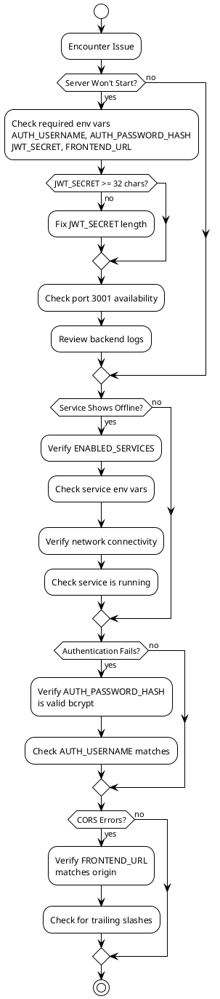
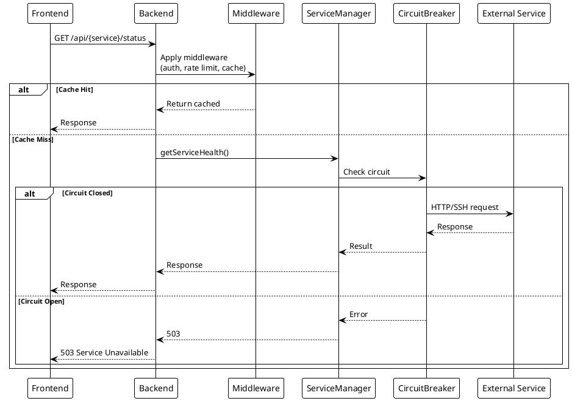

# Troubleshooting

> [!abstract] Purpose
> Common issues and their solutions for Watchman development and deployment.

## Backend Issues

### Server Won't Start

**Symptom**: Process exits immediately with error.

**Solutions**:

- Check required environment variables are set: `AUTH_USERNAME`, `AUTH_PASSWORD_HASH`, `JWT_SECRET`, `FRONTEND_URL`
- Verify `JWT_SECRET` is at least 32 characters
- Check port 3001 is not in use: `lsof -i :3001`
- Review logs in `apps/backend/logs/`

### Service Shows Offline

**Symptom**: Service card displays "offline" status.

**Solutions**:

- Verify service is in `ENABLED_SERVICES` (or not excluded)
- Check service-specific env vars are set correctly
- Verify network connectivity to service host
- Check service is running and accessible
- Review backend logs for connection errors

### Authentication Fails

**Symptom**: Login returns "Invalid credentials".

**Solutions**:

- Verify `AUTH_PASSWORD_HASH` is a valid bcrypt hash
- Generate new hash: `node -e "console.log(require('bcrypt').hashSync('password', 10))"`
- Check `AUTH_USERNAME` matches your input

### CORS Errors

**Symptom**: Frontend requests blocked by CORS.

**Solutions**:

- Verify `FRONTEND_URL` matches the actual frontend origin
- In production, ensure `FRONTEND_URL` uses HTTPS
- Check for trailing slashes in URL

## Frontend Issues

### Dashboard Doesn't Load

**Symptom**: Blank page or loading spinner.

**Solutions**:

- Check browser console for errors
- Verify backend is running on port 3001
- Check network tab for failed API requests
- Verify WebSocket connection is established

### Service Cards Not Rendering

**Symptom**: Some service cards missing from dashboard.

**Solutions**:

- Check `ENABLED_SERVICES` configuration
- Verify service env vars are set
- Check frontend config endpoint: `GET /api/config/frontend`

## Deployment Issues

### Production Startup Fails

**Symptom**: Server exits in production mode.

**Solutions**:

- Verify `NODE_ENV=production`
- Ensure `FRONTEND_URL` uses HTTPS
- Verify `JWT_SECRET` is 32+ characters
- Check all required env vars are set

### WebSocket Connection Fails

**Symptom**: Real-time updates not working.

**Solutions**:

- Verify Nginx proxy passes WebSocket upgrade headers
- Check Nginx config has `proxy_set_header Upgrade $http_upgrade`
- Verify no firewall blocking WebSocket connections

## Development Workflow Issues

### `npm run generate:types` Fails

**Symptom**: `openapi-typescript apps/backend/openapi.yaml` command fails with `$ref` resolution errors.

**Cause**: The `openapi.yaml` spec contains unresolvable `$ref` pointers, most commonly in Philips Bridge pairing endpoints.

**Solution**:

- Fix referenced schema definitions in `apps/backend/openapi.yaml` to ensure all `$ref` paths point to valid `#/components/schemas/` definitions
- Verify no circular or external references that the generator cannot resolve
- Once fixed, `npm run generate:types` will generate `apps/frontend/src/types/generated.ts` for frontend TypeScript sync

**Future CI**:

A Vision-style `verify-generated` CI job will be added once the spec is fixed, to ensure generated types remain in sync with the spec on every commit.

## Performance Issues

### Slow Response Times

**Solutions**:

- Check external service response times
- Verify caching is working (30s health, 60s stats TTL)
- Check circuit breaker isn't causing delays
- Review performance monitor logs

### High Memory Usage

**Solutions**:

- Check cache size (in-memory, unbounded)
- Monitor WebSocket connection count
- Consider Redis for shared caching in multi-instance

## Related

- [[docs/common-tasks.md|Common Tasks]]
- [[docs/guides/setup|Setup Guide]]
- [[docs/guides/deployment|Deployment Guide]]

## PlantUML Diagrams

### Debug Flowchart

### Request Flow for Debugging

